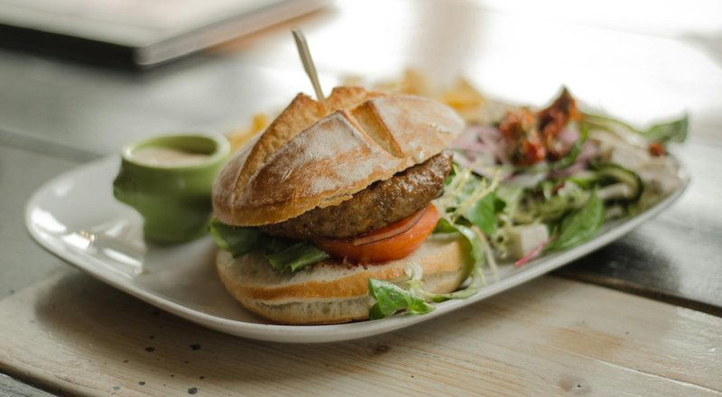

# Greek Lamb Burger

*Charred lamb fragrant with oregano and garlic, salty pockets of feta melting through the patty, and cool tzatziki running down the side of a warm bun. It tastes like a summer taverna, smoke and lemon drifting off the grill.*

**Serves:** 4

**Prep Time:** 25 minutes

**Cook Time:** 12 minutes

## Overview
This burger borrows from the souvlaki and bifteki tradition of mainland Greece, where minced lamb or a lamb-beef mix is seasoned with dried oregano, garlic and a slug of red wine vinegar, then grilled over charcoal until the outside is dark and the inside still blushes pink. Crumbling feta directly into the mince is a home-cook trick: as the cheese melts it leaves salty, creamy seams through the patty rather than sitting flat on top. The result is much more interesting than a beef burger dressed up with Mediterranean toppings. The supporting cast is straightforward and traditional: a quick tzatziki of strained yoghurt, cucumber, garlic and dill; a sharp tomato and cucumber relish loosened with olive oil; and either toasted pita or a soft brioche bun, depending on whether you want this to lean Greek street food or backyard barbecue. Lamb is forgiving on the grill because its fat is so flavourful, but it can taste muttony if overcooked, so aim for an internal temperature around 60 to 63 degrees. Difficulty is low. The only thing to watch is keeping the mince loose: if you pack the patty tightly it goes dense and rubbery, so handle it just enough to hold together. Serve with a glass of something cold and resinous.

## Ingredients

### Patties
- 600 g minced lamb shoulder
- 1 red onion (small), finely grated
- 2 garlic cloves, finely grated
- 1 tbsp dried oregano, ideally Greek
- 1 tsp ground cumin
- 1 tbsp red wine vinegar
- 100 g feta, crumbled
- 1 tsp flaky salt
- ½ tsp black pepper

### Tzatziki
- 250 g thick Greek yoghurt
- ½ cucumber, grated and squeezed dry
- 1 garlic clove, grated
- 1 tbsp lemon juice
- 1 tbsp olive oil
- 1 tbsp chopped dill

### Tomato cucumber relish
- 2 ripe tomatoes, deseeded and diced
- ¼ cucumber, diced
- 2 tbsp finely chopped red onion
- 1 tbsp olive oil
- 1 tbsp red wine vinegar
- Pinch of dried oregano

### To assemble
- 4 brioche buns (or 4 large pita)
- Handful of cos lettuce leaves
- Olive oil for brushing

## Method

### Stage 1 - Tzatziki
1. Grate the cucumber, then squeeze it hard in a clean cloth to remove as much water as possible.
2. Mix with yoghurt, garlic, lemon, olive oil, dill and a pinch of salt. Chill.

### Stage 2 - Relish
1. Combine all the relish ingredients in a bowl and leave to macerate at room temperature.

### Stage 3 - Patties
1. In a wide bowl, gently combine the lamb, grated onion, garlic, oregano, cumin, vinegar, salt and pepper using your fingertips. Do not knead.
2. Scatter the crumbled feta over the surface and fold in with two or three light turns, leaving visible chunks.
3. Divide into 4 portions and shape into patties about 2 cm thick. Press a small dimple into the centre of each so they cook flat.
4. Rest in the fridge for 15 minutes.

### Stage 4 - Cook
1. Heat a charcoal grill or heavy griddle to high. Brush the patties lightly with olive oil.
2. Grill 3 to 4 minutes per side for medium, until charred outside and just blushing in the centre.
3. In the last minute, warm the buns or pita on the cooler side of the grill.

### Stage 5 - Build
1. Spread a thick layer of tzatziki on the bottom bun.
2. Add lettuce, patty, then a heaped spoon of tomato-cucumber relish.
3. Cap and serve. If using pita, fold the bread around the patty and toppings.

## Notes
- **Lamb fat:** ask for shoulder mince with at least 20% fat. Leg mince is too lean and turns dry.
- **Feta seams:** keep the cheese in 5 mm crumbles so it stays distinct after cooking.
- **Resting:** let cooked patties rest 2 minutes before assembling so the juices redistribute.
- **Pita option:** for street-food style, split the pita and stuff with patty and salads rather than building like a burger.

## Storage
- Uncooked patties keep 24 hours in the fridge, well covered. Tzatziki keeps 3 days. The tomato relish is best the day it is made, as the tomatoes weep.
