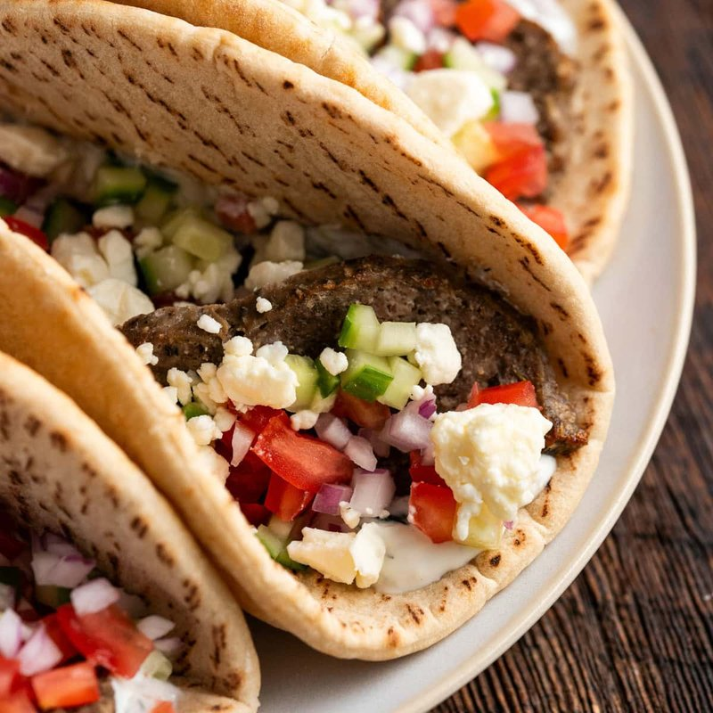

# Lamb Gyros

*Greek street-food wrap: thinly sliced lamb shawarma-style, served in a pita with tomato, onion, tzatziki and a few chips. Restaurant gyros come off a vertical spit; the home version uses ground lamb pressed into a loaf and sliced thin after cooking.*

**Serves:** 6

**Prep Time:** 20 minutes

**Cook Time:** 1 hour 10 minutes

## Overview
This is the home-cook version of the lamb gyros every Greek kebab stand carves off a vertical spit, a seasoned lamb mince loaf roasted in a tin and sliced thin for pan-crisping. The mince blends with grated onion, garlic, dried oregano, cumin and a small spoon of breadcrumb until you have a stiff paste. Press the mixture tight into a loaf tin so there are no air pockets (any air pocket goes mushy in the oven), then roast at 180°C for an hour until the surface is deep brown and the centre is just cooked. Cool fully so the loaf firms up; slice very thin with a sharp knife. Pan-crisp the slices in a hot dry skillet so the edges char and the surface crisps, mimicking the shawarma-style crust. Serve in toasted pita with tzatziki, sliced tomato, onion and a generous squeeze of lemon.

## Ingredients

### Gyros loaf
- 800 g lamb mince
- 1 onion (small, very finely grated, juice squeezed out)
- 4 garlic cloves (crushed)
- 1 tablespoon dried oregano
- 1 teaspoon ground cumin
- 1 teaspoon ground coriander
- ½ teaspoon ground allspice
- 2 teaspoons salt
- ½ teaspoon black pepper
- 30 g fine breadcrumbs

### To pan-crisp
- 2 tablespoons olive oil

### To serve
- 6 pita breads (warmed)
- [Tzatziki](side-dishes/tzatziki.md)
- 1 red onion (small, very finely sliced)
- 2 tomatoes (sliced)
- A small handful of fresh oregano (or parsley)
- Optional: 200 g hot chips

## Method

### Stage 1 - Mix the lamb
1. Heat the oven to 175°C (155°C fan).
1. Combine all loaf ingredients in a bowl. Knead and beat for 5-6 minutes (this is what binds the loaf so it slices cleanly later).

### Stage 2 - Bake
1. Pack tightly into a 1 kg loaf tin (about 23 x 13 cm).
1. Place the tin in a deep roasting tray; pour boiling water into the outer tray (water bath; keeps the loaf moist).
1. Bake for 1 hour, until firm and an instant-read probe registers 75°C.
1. Cool 30 minutes (warm but firm enough to slice cleanly).

### Stage 3 - Slice and crisp
1. Turn the loaf out of the tin. Slice as thinly as you can manage with a sharp knife.
1. Heat the oil in a large frying pan over high heat.
1. Pan-crisp the slices in batches for 1-2 minutes a side until deep brown and crisp at the edges.

### Stage 4 - Build wraps
1. Warm the pitas. Smear with tzatziki.
1. Pile crisp gyros into the centre.
1. Top with sliced onion, tomato, fresh herbs and a few chips if using.
1. Roll up tightly; eat.

## Notes
- **Grated onion, juice squeezed:** Keeps the loaf firm. Chopped onion makes wet patches; grated and drained gives flavour without water.
- **Beat the mince:** 5 minutes of working it gives the springy, sliceable texture. Unworked mince crumbles.
- **Slice thin:** The thinner the slice, the crispier the pan-crisp. A serrated knife helps.

## Storage
- Whole loaf keeps 4 days refrigerated; slice and crisp as needed.
- Freezes well as a whole loaf 3 months; defrost overnight before slicing.
