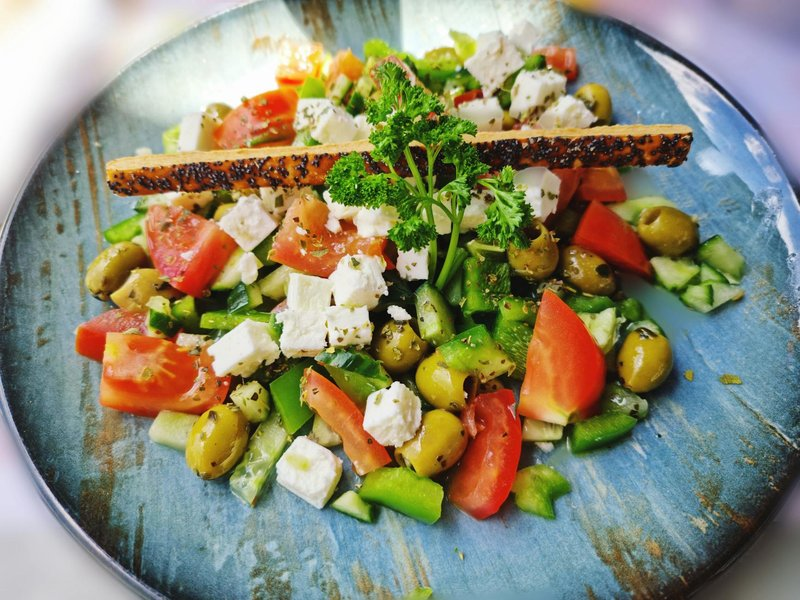

# Horiatiki (Greek Village Salad)

*The genuine Greek salad. Big rough chunks of ripe tomato, cucumber, green pepper, red onion, capers, kalamata olives, a whole slab of feta on top (never crumbled), drizzled with olive oil and a splash of red-wine vinegar, dusted with dried oregano. No lettuce, no lemon, no balsamic - these are the markers of an inauthentic taverna. The vegetables are the dish; the feta is the crown; the olive oil is dinner. Eats with crusty bread to soak up the tomato-and-oil pool at the bottom of the plate.*

**Serves:** 4

**Prep Time:** 15 minutes

**Cook Time:** 0 minutes

## Overview
Tomatoes cut into thick wedges, cucumber peeled in stripes and cut into chunky rounds, red onion sliced thin and soaked in cold water 5 minutes (mellows the bite), green bell pepper sliced into rings, kalamata olives stoned or whole at the cook's discretion. Pile in a shallow bowl. A whole slab of feta sits on top - uncrumbled, dignified. Olive oil pours over, red-wine vinegar splashes, oregano sprinkles. Rest 10 minutes before serving so the tomato juices mix with the oil.

## Ingredients
- 4 ripe medium tomatoes (about 600 g)
- 2 small cucumbers (about 300 g)
- 1 green bell pepper
- 1 small red onion
- 16 kalamata olives (pitted or whole, your call)
- 2 tablespoons capers in brine (drained)
- 200 g feta cheese (one slab, NOT pre-crumbled)
- 6 tablespoons extra virgin olive oil (good quality - this is the dressing)
- 1 ½ tablespoons red-wine vinegar
- 1 tablespoon dried Greek oregano (rigani)
- Salt and freshly ground black pepper

## Method

### Stage 1 - Prep
1. Cut the tomatoes into thick wedges (each tomato into 6-8 pieces).
1. Peel the cucumbers in stripes (alternating skin-on / skin-off strips, decorative); slice into thick rounds.
1. Deseed the bell pepper; slice into rings 5 mm thick.
1. Peel the red onion; slice into thin rings; soak in cold water 5 minutes; drain (this mellows the raw bite).
1. Pit the olives if preferred (Greeks often serve them whole).

### Stage 2 - Compose
1. In a shallow wide bowl, pile the tomatoes, cucumber, pepper rings and drained onion.
1. Scatter the olives and capers over.
1. Place the slab of feta on top - DO NOT crumble.

### Stage 3 - Dress
1. Drizzle the olive oil generously over the whole assembly (don't be shy - Greeks use a lot of oil).
1. Splash the red-wine vinegar over the vegetables (not the feta).
1. Sprinkle the oregano over everything - including the feta, which should look dusted.
1. Crack pepper over. A small pinch of salt over the vegetables (the feta is salty enough on its own).

### Stage 4 - Rest and serve
1. Rest 10 minutes at room temperature (tomato juices and olive oil emulsify; the feta absorbs a little dressing).
1. Serve with crusty bread to mop the bottom of the bowl.

## Notes
- **No lettuce. No lemon. No balsamic:** these are dead giveaways of an inauthentic Greek salad. The recipe is what it is.
- **Feta in a slab, never crumbled:** the crumb structure of feta is broken by crumbling and the cheese disappears into the salad. The slab keeps its identity and gets cut at the table.
- **Greek oregano (rigani) is different from Italian:** drier, sharper, more aromatic. Worth seeking out at a Greek grocer.
- **Big chunks, not bistro-fine dice:** the salad is rustic on purpose. Thick wedges hold more juice.
- **Buy the best olive oil you can afford:** with so few ingredients, it carries the dish.

## Storage
- Best eaten immediately.
- The salad weeps and the vegetables soften within an hour; not a make-ahead dish.
- Bread soaked in the bottom-of-the-bowl juices keeps 30 minutes and is excellent.
