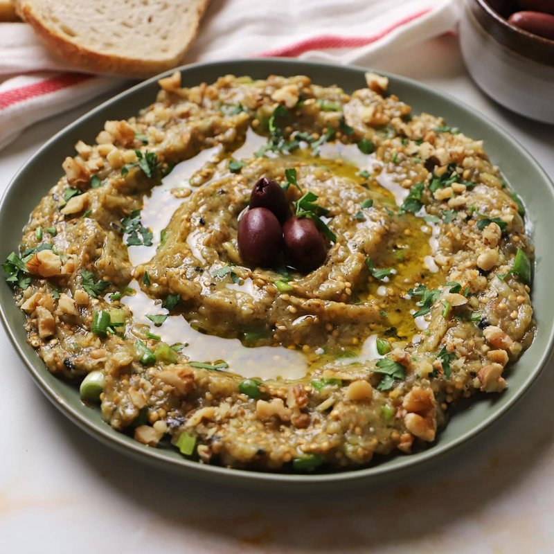

# Melitzanosalata (Greek Aubergine Dip)

*Greece's smoky aubergine dip: charred aubergine roughly mashed with garlic, lemon, olive oil and parsley. No tahini, no tomato.*

**Serves:** 4-6 (makes about 400 g)

**Prep Time:** 15 minutes

**Cook Time:** 25 minutes (mostly aubergine cooking)

## Overview
Whole aubergines char directly over flame or under a hot grill until the skin blackens and the inside collapses to softness. Cool, peel, drain on a sieve 15 minutes to release excess water. Roughly chop the flesh; mix with crushed garlic, lemon juice, olive oil, red-wine vinegar, chopped parsley, salt and pepper. Taste and balance. Serve in a wide bowl with a generous drizzle of olive oil.

## Ingredients
- 3 aubergines (medium, about 900 g total)
- 2 garlic cloves (very finely minced or grated)
- 3 tablespoons lemon juice (about 1 lemon)
- 4 tablespoons extra virgin olive oil (plus extra for drizzling)
- 1 tablespoon red-wine vinegar
- 30 g flat-leaf parsley (chopped, plus extra for garnish)
- 1 red onion (small, very finely diced, optional)
- 1 teaspoon salt
- ½ teaspoon ground black pepper

### To serve
- Warm pita (or country-style bread)
- A pinch of smoked paprika
- A handful of kalamata olives

## Method

### Stage 1 - Char the aubergines
1. **Flame method (best):** Place each aubergine directly on a gas burner over medium-high heat. Turn with tongs every 3-4 minutes. The skin should char black all over and the flesh inside collapse totally. Total time: 12-15 minutes per aubergine.
1. **Grill method:** Heat the grill to maximum. Lay aubergines on the grate; cook 6-8 minutes per side, turning, until charred and softened throughout.
1. Cool 10 minutes on a plate (they keep cooking).

### Stage 2 - Drain
1. Slice off the tops; halve lengthways; scoop the flesh into a sieve set over a bowl.
1. Press lightly with the back of a wooden spoon to release excess liquid.
1. Drain 15 minutes (this is non-negotiable - wet aubergine makes a watery dip).

### Stage 3 - Chop
1. Tip the drained flesh onto a chopping board.
1. Chop roughly with a chef's knife - keep some texture, don't reduce to mush.
1. Transfer to a bowl.

### Stage 4 - Mix
1. Stir in the minced garlic, lemon juice, olive oil, vinegar, chopped parsley and optional onion.
1. Season with salt and pepper.
1. Mash gently with a fork to incorporate (small lumps welcome).

### Stage 5 - Taste and balance
1. The salt should pop; the lemon should be brightly present; the olive oil should bind without dominating.
1. Adjust: more lemon if flat; more salt if dull; more oil if dry.
1. Rest 30 minutes at room temperature (the flavours fuse).

### Stage 6 - Serve
1. Spoon into a wide shallow bowl; smooth the surface with the back of a spoon.
1. Drizzle generously with olive oil.
1. Scatter extra parsley and a pinch of smoked paprika.
1. Surround with kalamata olives.
1. Serve with warm bread or pita.

## Notes
- **Char the aubergine fully:** under-cooked aubergine is bitter and spongy. The skin must be entirely blackened and the flesh feel totally soft when pressed.
- **Drain or fail:** the difference between excellent melitzanosalata and a watery letdown is the 15-minute drain. Don't skip.
- **Chop, don't blend:** a food processor turns this into baby food. The dip is meant to have visible aubergine texture.
- **No tahini, no yogurt:** these are the markers that distinguish melitzanosalata from babaganoush and from Cypriot variants.

## Storage
- Keeps 4 days refrigerated.
- Tastes better on day 2 (smoke flavour deepens, garlic mellows).
- Bring to room temperature 20 minutes before serving (cold dampens the aubergine flavour).
