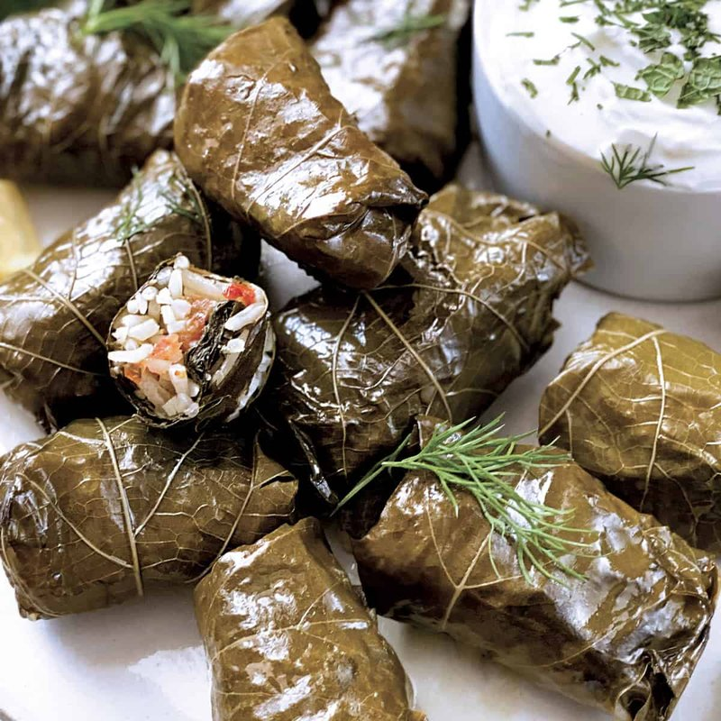

# Dolmadakia (Greek Stuffed Vine Leaves)

*Bite-sized vine-leaf rolls stuffed with rice, dill, mint, parsley, pine nuts and a hint of currant. The vegetarian Greek meze classic - served at room temperature, brushed with olive oil and a generous squeeze of lemon. Distinct from larger meat-filled dolmades: dolmadakia are about a finger-length, all-rice, eaten cold as a snack with a glass of ouzo. Made by the hundred for a name day or a Sunday lunch.*

**Serves:** Makes about 40 dolmadakia (serves 6-8 as meze)

**Prep Time:** 1 hour

**Cook Time:** 1 hour

## Overview
Brined vine leaves soak 20 minutes to leach the brine. Filling: short-grain rice par-cooks 10 minutes with onion in olive oil; off heat, dill, mint, parsley, pine nuts, currants and lemon zest stir through. Each leaf gets a teaspoon of cool filling; rolls into a tight cigar. Rolls pack tight in a heavy pot lined with broken / extra leaves. Olive oil + lemon juice + stock pours in to barely cover. Weighed down with an inverted plate. Slow simmer 50-60 minutes. Cool in the liquid; serve at room temperature.

## Ingredients

### Vine leaves
- 50 brined vine leaves (about 200 g) plus extras for lining the pot

### Filling
- 4 tablespoons olive oil
- 1 large onion (finely diced)
- 200 g short-grain rice (pudding rice or arborio)
- 30 g pine nuts (lightly toasted)
- 30 g currants
- 30 g fresh dill (chopped)
- 20 g fresh mint (leaves only, chopped)
- 30 g fresh flat-leaf parsley (chopped)
- Zest of 1 lemon
- 200 ml hot water
- 1 teaspoon salt
- ½ teaspoon ground black pepper
- ½ teaspoon ground allspice (optional)

### Cooking liquid
- 4 tablespoons olive oil
- 3 tablespoons lemon juice
- 400 ml hot water or light vegetable stock
- 1 teaspoon salt

### To serve
- Extra lemon wedges
- Greek yogurt (optional, on the side)
- Extra olive oil

## Method

### Stage 1 - Prep the leaves
1. Soak the vine leaves in warm water 20 minutes to remove brine.
1. Drain; pat dry.
1. Trim any tough stems.

### Stage 2 - Filling
1. Heat 4 tablespoons olive oil in a saucepan over medium heat.
1. Soften the diced onion 6-8 minutes until pale.
1. Stir in the rice; toast 2 minutes.
1. Pour in 200 ml hot water; cover; simmer on low 10 minutes (the rice should be half-cooked and the water absorbed).
1. Off the heat: stir in the pine nuts, currants, dill, mint, parsley, lemon zest, salt, pepper and allspice.
1. Cool 15 minutes (warm filling tears the leaves).

### Stage 3 - Roll
1. Lay a leaf shiny-side-down on the work surface; trim any tough stem.
1. Place 1 teaspoon of filling near the stem end (don't overfill - rice expands during cooking).
1. Fold the stem flap up over the filling.
1. Fold the two side flaps in over the filling.
1. Roll up tightly to a 5-6 cm cigar.
1. Lay seam-down on a plate; repeat for the rest.

### Stage 4 - Pack
1. Line the bottom of a heavy-based pot with any torn or imperfect leaves (sacrificial padding).
1. Pack the rolls seam-down in concentric circles, tight against each other.
1. Add a second layer perpendicular to the first.
1. Add a third if needed.

### Stage 5 - Cook
1. Whisk the cooking liquid ingredients in a jug.
1. Pour over the rolls until just covered.
1. Invert a small heatproof plate directly on top of the rolls (keeps them submerged and stops them unrolling).
1. Bring to a gentle simmer; cover; cook on low 50-60 minutes.

### Stage 6 - Cool
1. Remove from heat; leave the plate weight on; cool in the pot 1 hour.
1. The dolmadakia absorb the remaining liquid as they cool.

### Stage 7 - Serve
1. Lift the rolls onto a serving platter.
1. Brush with a little extra olive oil; arrange lemon wedges around.
1. Serve at room temperature with a small bowl of Greek yogurt for dipping.

## Notes
- **Half-cook the rice in the filling:** raw rice in the filling cooks unevenly and the dolmadakia split during steaming. Half-cooked rice expands gently inside the leaf.
- **Cool the filling before rolling:** warm filling steams the leaves and they tear.
- **Tight packing keeps them sealed:** loose rolls in a loose pot unfurl. Pack tight.
- **Eat at room temperature:** dolmadakia served straight from the fridge taste muted. Cold rice firms up; room temp brings out the herbs.

## Storage
- Keeps 4 days refrigerated in their cooking liquid.
- Bring to room temperature 30 minutes before serving.
- Freeze in their liquid 2 months; thaw overnight.
