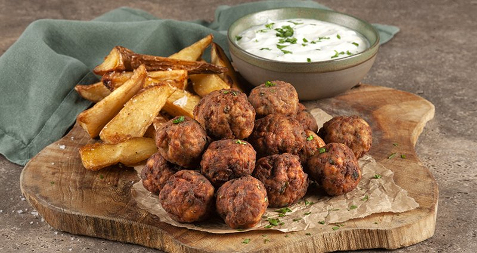

# Keftedakia (Greek Mini Meatballs)

*Greece's defining meze meatball: walnut-sized fried balls seasoned heavily with mint, oregano and grated onion. Eat with tzatziki and lemon.*

**Serves:** 6 as meze (makes about 30 keftedakia)

**Prep Time:** 25 minutes (plus 30 minutes resting)

**Cook Time:** 15 minutes (in batches)

## Overview
Keftedakia are the small Greek meatballs, the meze-platter staple seasoned with dried mint and ouzo (or red wine) and pan-fried golden, served with tzatziki for dipping. A grated onion (squeeze the juice out, otherwise the mince goes wet) folds into beef or beef-and-pork mince with bread soaked in milk and squeezed dry, an egg, a generous amount of dried mint and oregano, fresh parsley, garlic, salt and pepper. A tablespoon of ouzo or red wine adds the Greek depth. The mixture rests for thirty minutes so the bread fully absorbs and the flavours mingle. Roll into walnut-sized balls, dust in flour, pan-fry in olive oil for six to eight minutes, turning often, until deep brown and cooked through. Serve hot with tzatziki and lemon wedges.

## Ingredients

### Meatballs
- 500 g beef mince (or 50/50 beef and pork)
- 1 onion (large, grated, then squeezed dry through a tea towel - keep the juice for the pan)
- 60 g day-old white bread (crusts off, soaked in 100 ml milk, then squeezed dry)
- 1 egg (large)
- 3 garlic cloves (finely minced)
- 2 tablespoons fresh flat-leaf parsley (chopped)
- 1 tablespoon dried Greek oregano
- 2 teaspoons dried mint (or 1 tablespoon fresh)
- 1 tablespoon ouzo (or red wine)
- 1 tablespoon red-wine vinegar
- 1 teaspoon salt
- 1 teaspoon ground black pepper
- ¼ teaspoon ground allspice
- ¼ teaspoon ground cinnamon

### Coating and frying
- 80 g plain flour (for dredging)
- 6 tablespoons olive oil
- 30 g butter

### To serve
- Lemon wedges
- [Tzatziki](../side-dishes/tzatziki.md) (or yogurt-and-lemon dip)

## Method

### Stage 1 - Squeeze the onion
1. Grate the onion on the fine side of a box grater into a bowl.
1. Tip into a clean tea towel; squeeze hard over a small bowl to capture the juice (reserve for the meat) and leave the pulp.

### Stage 2 - Soak the bread
1. Tear the bread into chunks; soak in 100 ml milk for 5 minutes.
1. Squeeze hard to remove excess milk.

### Stage 3 - Mix
1. In a wide bowl, combine the mince, squeezed onion pulp, onion juice, soaked-and-squeezed bread, egg, minced garlic, parsley, oregano, mint, ouzo, vinegar, salt, pepper, allspice and cinnamon.
1. Knead with clean hands 2-3 minutes until uniform and slightly tacky.

### Stage 4 - Rest
1. Cover; refrigerate 30 minutes minimum (1 hour is better).

### Stage 5 - Roll
1. With slightly damp hands, roll the mixture into balls the size of a large walnut (about 25 g each).
1. Spread the flour on a plate; roll each ball through the flour to coat lightly; shake off excess.

### Stage 6 - Fry
1. Heat the olive oil and butter together in a wide frying pan over medium-high heat.
1. Add the meatballs in a single layer (don't overcrowd - fry in 2-3 batches).
1. Cook 6-8 minutes, turning every 2 minutes, until deep brown on all sides and cooked through.
1. Lift onto a wire rack lined with kitchen paper.

### Stage 7 - Serve
1. Pile onto a warm platter.
1. Surround with lemon wedges.
1. Serve with tzatziki for dipping and warm pita on the side.

## Notes
- **Dry the onion, save the juice:** undrained onion makes the meat slippery and the keftedakia fall apart in the pan. The juice goes back into the meat for flavour.
- **Dried mint is correct:** Greek keftedakia use dried mint and dried oregano, not fresh. The dried herbs have a punchier flavour that survives the cooking.
- **Allspice and cinnamon, just a little:** these warm spices are the Greek signature. Skip them and you've made any other Mediterranean meatball.
- **Flour dredge for crust:** light flour coating gives the seared brown crust. Skip and the meatballs steam in their own juices instead of frying.

## Storage
- Keep 2 days refrigerated; reheat in a 160°C oven covered 12 minutes.
- Freeze cooked, 2 months; thaw overnight and reheat as above.
- The raw mixture keeps 1 day refrigerated; fry from cold.
