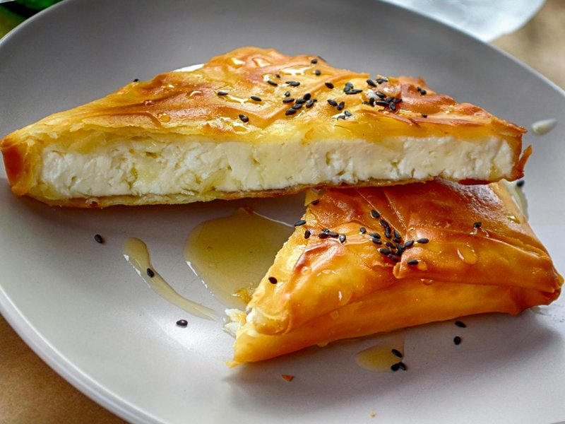

# Tyropita

*Greece's bakery pastry: buttery filo triangles wrapped around a creamy filling of feta, ricotta and egg. The eternal Greek travel food.*

**Serves:** Makes 16 triangles

**Prep Time:** 30 minutes

**Cook Time:** 25 minutes

## Overview
Feta crumbles into a bowl with ricotta, egg, dill, mint, nutmeg and black pepper. Filo sheets keep covered with a damp tea towel (they dry instantly). Each sheet halves lengthways. A spoon of filling sits at one end of each strip; the strip folds flag-style up and across to form a triangle, layer by layer. Triangles brush with melted butter; bake for 25 minutes at 180°C till deep gold and puffed.

## Ingredients

### Filling
- 250 g feta cheese (crumbled)
- 200 g ricotta cheese (drained if very wet)
- 50 g parmesan cheese (or kefalotyri, finely grated)
- 1 egg (large)
- 2 tablespoons fresh dill (chopped)
- 1 tablespoon fresh mint (chopped)
- ¼ teaspoon ground nutmeg
- ½ teaspoon ground black pepper
- (no extra salt - the feta is salty enough)

### Pastry
- 12 sheets filo pastry (about 30 × 25 cm each; thaw fully if frozen)
- 150 g unsalted butter (melted)

### Glaze
- 1 tablespoon sesame seeds
- 1 tablespoon nigella seeds (optional)

## Method

### Stage 1 - Filling
1. In a wide bowl, combine the crumbled feta, ricotta and grated parmesan.
1. Add the egg, chopped dill and mint, nutmeg and black pepper.
1. Mix with a fork until uniform and slightly sticky. The mixture should hold its shape when scooped.
1. Cover; refrigerate while you prep the filo.

### Stage 2 - Filo prep
1. Heat the oven to 180°C (160°C fan).
1. Line two baking trays with parchment.
1. Unroll the filo; cover the unused stack with a slightly damp tea towel (filo dries to brittle shards in minutes).
1. Melt the butter.

### Stage 3 - Shape
1. Take one filo sheet; lay it flat on the work surface.
1. Brush lightly with melted butter; lay a second sheet on top; brush again.
1. Cut the double-layer sheet lengthways into 4 strips, each about 7 cm wide.
1. Place 1 heaped tablespoon of filling at the near end of each strip.
1. Fold the bottom corner up over the filling to form a triangle (flag-fold style).
1. Continue folding up the strip, maintaining the triangle shape, until you reach the end.
1. Place seam-down on a baking tray.

### Stage 4 - Repeat
1. Continue with the remaining filo sheets, brushing-and-stacking each pair, cutting into strips, folding into triangles.
1. You should get 16 triangles from 12 sheets (4 strips × 3 pairs).

### Stage 5 - Bake
1. Brush the tops generously with melted butter.
1. Sprinkle with sesame and nigella seeds.
1. Bake 22-25 minutes until the triangles are deep golden and the filo is crisp.

### Stage 6 - Serve
1. Cool on the tray 3-4 minutes (the filling is molten straight from the oven).
1. Serve warm or at room temperature.

## Notes
- **Keep the filo covered:** dried-out filo cracks and tears. A damp tea towel is non-negotiable.
- **Two sheets per strip:** the double-thickness gives crispness without becoming pastry-heavy. A single sheet tears; three sheets goes leathery.
- **Drain wet ricotta:** if your ricotta is the very wet supermarket kind, sit it in a sieve 30 minutes before using. Wet filling leaks into the filo and the triangles go soggy at the seams.
- **Triangle fold direction:** the "flag fold" maintains a triangle as you walk up the strip. Each fold is a 45° flip.

## Storage
- Best within 4 hours of baking.
- Keep 2 days refrigerated; reheat in a 180°C oven 6-8 minutes (microwaving turns the filo gummy).
- Freeze unbaked triangles on a tray, then bag; bake from frozen at 180°C 28-30 minutes.
