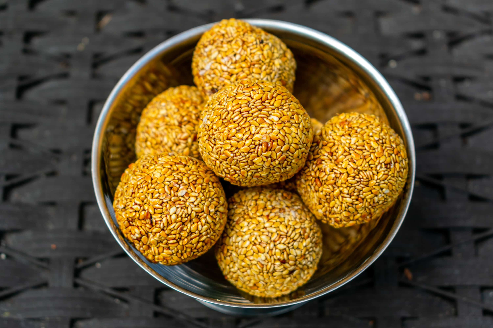

# Bene Balls

*Toasted sesame seeds bound in a dark brown-sugar caramel and rolled into firm chewy balls: the Caribbean's small sesame nougat, sold by the bag at every Grenadian market stall.*

**Serves:** Makes about 24 balls

**Prep Time:** 10 minutes

**Cook Time:** 15 minutes

## Overview
Bene is the West African word for sesame, carried across the Atlantic with the seeds themselves and now woven through the sweets of the southern Caribbean. Bene balls are the simplest expression: a deep dry-toasted handful of sesame seeds folded into a hot brown-sugar caramel scented with nutmeg, ginger and a squeeze of lime, then rolled into small balls while still warm. The texture sits somewhere between brittle and chewy depending on how far the caramel is taken: stop earlier for a chewy nougat, take it further for a crunchy brittle. Sold by the bag at every Grenadian roadside stall, packed in lunch boxes, and made at home in a pan in fifteen minutes. The taste is toasted-nut sweetness with a warm spice tail.

## Ingredients

- 250 g sesame seeds (white, hulled)
- 250 g soft dark brown sugar
- 100 ml water
- 1 tbsp golden syrup or molasses (helps the chew)
- 1 thumb fresh ginger, finely grated
- 0.5 tsp fresh-grated nutmeg
- A pinch of salt
- 1 tsp lime juice
- 1 tbsp vegetable oil (for shaping)

## Method

### Stage 1 - Toast the sesame
1. Heat a wide dry pan over medium heat.
2. Add the sesame seeds in a single layer.
3. Toast 4-5 minutes, shaking the pan constantly, until the seeds are pale gold and smell deeply nutty.
4. Tip onto a plate to stop them cooking; do not let them go dark brown.

### Stage 2 - Make the caramel
1. Combine the brown sugar, water, golden syrup and grated ginger in a heavy saucepan.
2. Heat slowly until the sugar dissolves.
3. Bring to a steady boil.
4. Cook 6-8 minutes without stirring (just swirl the pan) until the syrup thickens and turns deep mahogany.
5. Test: a small spoonful dropped into cold water should form a firm chewy ball that holds its shape between your fingers (about 120C for chewy, 140C for crunchy).

### Stage 3 - Combine
1. Off the heat, stir in the nutmeg, salt and lime juice.
2. Tip in the toasted sesame seeds all at once.
3. Stir hard with a wooden spoon until every seed is coated.
4. The mixture will thicken fast.

### Stage 4 - Shape
1. Rub a little oil onto your palms (and keep a bowl of cold water nearby).
2. Pinch off small lumps the size of a walnut.
3. Roll quickly between your palms into firm balls.
4. Place on greaseproof paper.
5. If the mixture stiffens too much, return the pan to low heat for 30 seconds to soften.

### Stage 5 - Set
1. Leave at room temperature 20 minutes to firm up.
2. Store in an airtight tin between sheets of greaseproof paper.

## Notes
- **Toast the seeds gently:** burnt sesame turns bitter; pale gold is the target.
- **Watch the caramel:** it goes from thick to burnt in 30 seconds; pull it the moment it reaches deep mahogany.
- **Oil your hands:** prevents the hot mixture sticking and burning.
- **Work quickly:** the caramel hardens fast; the rolling has to happen while the mixture is still warm.

## Variations
**With peanuts:** swap half the sesame for chopped roasted peanuts.
**With coconut:** stir in 60 g freshly grated coconut with the sesame.
**Brittle-style:** take the caramel to hard crack (140C); spread on a tray and snap into shards once cool.
**Spicier:** add a pinch of ground clove and a quarter teaspoon of cinnamon with the nutmeg.
**Honey bene:** swap the golden syrup for honey for a softer chewier ball.

## Serving
From a paper bag at the market · with afternoon tea · wrapped as a Grenadian gift · on the side of a strong black coffee · packed in a school lunch.

## Storage
- Keeps 3 weeks in an airtight tin at room temperature.
- Layer between greaseproof paper so the balls do not stick.
- Sugar absorbs moisture in damp weather; keep the tin sealed.

