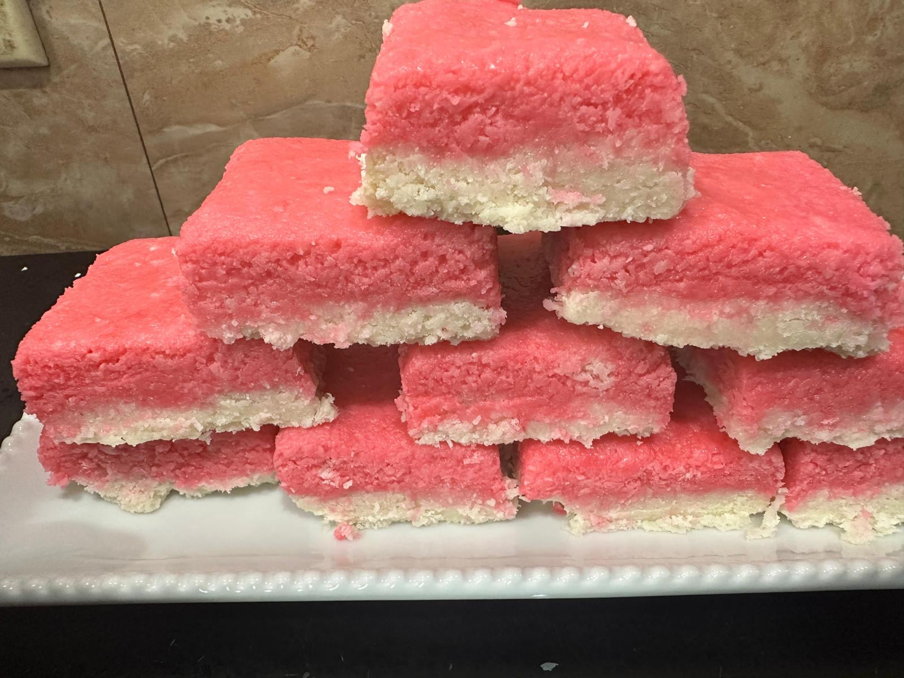

# Sugar Cake

*Pink-and-white shards of grated coconut bound with thickened brown-sugar syrup: the Grenadian school-fete sweet, set hard on greaseproof paper and broken into pieces.*

**Serves:** Makes about 20 pieces

**Prep Time:** 10 minutes

**Cook Time:** 20 minutes

## Overview
Sugar cake is the Caribbean's everyday coconut sweet, sold at every Grenadian school fete, bus stop and Saturday market in little pink-tinted shards wrapped in cellophane. The technique is wet-grated coconut cooked into a brown-sugar syrup until the syrup hits a soft-crack stage, then spooned into mounds on greaseproof paper to set. The Grenadian version is scented with fresh-grated nutmeg, cinnamon and a knot of ginger; some cooks colour the top half pink with a drop of cochineal to make the classic two-tone shard. The texture is somewhere between fudge and a coconut macaroon: dense, chewy, sweet, fragrant. The most reliable Grenadian recipe for using up a glut of coconuts and the easiest sweet for a beginner to learn.

## Ingredients

- 400 g freshly grated coconut (or unsweetened desiccated rehydrated with 100 ml water)
- 400 g soft dark brown sugar
- 200 ml water
- 1 thumb fresh ginger, sliced into coins
- 0.5 tsp fresh-grated nutmeg
- 0.5 tsp ground cinnamon
- 1 tsp vanilla extract
- A pinch of salt
- 2 drops cochineal or red food colouring (optional)

## Method

### Stage 1 - Make the syrup
1. Combine the brown sugar, water and ginger coins in a heavy saucepan.
2. Heat slowly until the sugar dissolves; do not stir hard, just swirl.
3. Once dissolved, bring to a steady boil.

### Stage 2 - Cook to soft crack
1. Boil 8-10 minutes without stirring until the syrup thickens.
2. Test: drop a small spoonful into a glass of cold water; it should form a soft pliable thread that snaps gently between your fingers (about 132C if you have a sugar thermometer).
3. Lift out the ginger coins and discard.

### Stage 3 - Add the coconut and spices
1. Stir the grated coconut into the hot syrup.
2. Add the nutmeg, cinnamon, vanilla and salt.
3. Stir hard over medium heat 3-4 minutes; the mixture will go thick, sticky and pull away from the sides of the pan.
4. Take off the heat.

### Stage 4 - Optional pink layer
1. Take a third of the mixture out into a separate small pan.
2. Stir in the cochineal until the colour is even.
3. Reheat 30 seconds to loosen.

### Stage 5 - Shape
1. Lay greaseproof paper on a tray.
2. Spoon heaped tablespoons of the white mixture into rough mounds.
3. While still warm, drop a smaller spoonful of the pink mixture on top of each mound.
4. Press down lightly with the back of a wet spoon so the pink layer sits on the white.

### Stage 6 - Set
1. Leave at room temperature 30-40 minutes until firm to the touch.
2. Peel off the paper carefully.
3. Store in an airtight tin between sheets of greaseproof paper.

## Notes
- **The syrup stage is the key:** under-cooked syrup gives a sweet that never sets; over-cooked goes brittle and burns.
- **Use fresh-grated coconut if you can:** desiccated works but loses some of the chew.
- **Work quickly off the heat:** the mixture sets fast once it leaves the pan.
- **Wet spoon:** stops the sticky mixture clinging.

## Variations
**Plain (no pink):** drop white mounds straight onto the paper, no second layer.
**With raisins:** stir 80 g raisins into the white mixture before shaping.
**With chopped almonds:** scatter chopped roasted almonds over the pink layer before it sets.
**Ginger-heavy:** double the ginger coins and add 0.5 tsp ground ginger to the coconut.
**Coconut and lime sugar cake:** add 1 tsp finely grated lime zest to the white mixture.

## Serving
At a Grenadian school fete · with afternoon tea · wrapped as a gift · on the side of a strong black coffee · with vanilla ice cream for a richer dessert.

## Storage
- Keeps 2 weeks in an airtight tin at room temperature.
- Layer between greaseproof paper so the pieces do not stick.
- Do not refrigerate (the sugar weeps in cold humid air).

