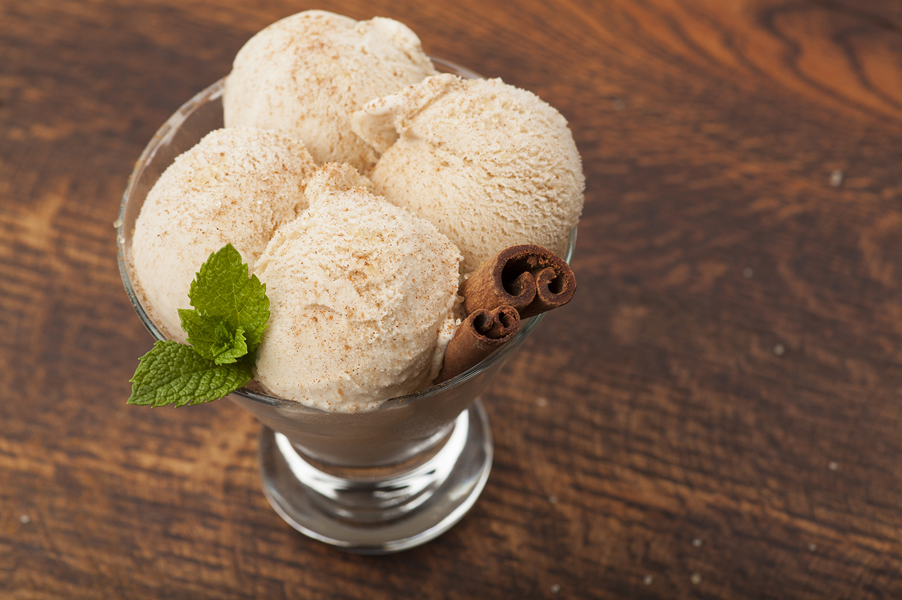

# Nutmeg Ice Cream

*The Spice Island signature: a slow-cooked egg custard heavy with fresh-grated Grenadian nutmeg, churned smooth and pale gold, served in a small glass with one more grate of nutmeg over the top.*

**Serves:** 6

**Prep Time:** 20 minutes (plus 4 hours chilling and churning)

**Cook Time:** 15 minutes

## Overview
Nutmeg is the spice that built modern Grenada (the island is the world's second-largest nutmeg producer after Indonesia), and nutmeg ice cream is the dessert the spice was made for. The recipe is a classic French-style egg custard (whole milk, double cream, egg yolks, sugar) carrying as much fresh-grated nutmeg as it will hold without going gritty. Whole nutmegs are toasted briefly, then grated straight into the warm cream so the oils bloom out into the dairy; the custard sits overnight to deepen, then churns into a pale gold ice cream with tiny dark flecks of nutmeg suspended through it. Served in small glasses with one more grate of nutmeg on top and a thin slice of mango on the side. Sweet, warm-spiced and unmistakably Grenadian.

## Ingredients

- 4 whole nutmegs (yes, whole ones; ground from a jar will not work)
- 500 ml whole milk
- 250 ml double cream
- 5 large egg yolks
- 150 g caster sugar
- 1 tsp vanilla extract
- A pinch of salt
- 1 tbsp dark rum (optional, helps the texture)

## Method

### Stage 1 - Toast the nutmegs
1. Crack 3 of the whole nutmegs lightly with the back of a knife.
2. Toast in a dry pan over low heat for 2 minutes until just fragrant; do not let them brown.
3. Reserve the fourth whole nutmeg for grating at the end.

### Stage 2 - Infuse the cream
1. Combine the milk and cream in a saucepan.
2. Add the toasted cracked nutmegs.
3. Heat to just below a simmer; small bubbles at the edges only.
4. Off the heat, cover, leave to infuse 30 minutes.
5. Strain out the nutmegs; return the cream to a clean saucepan.
6. Finely grate the equivalent of 2 toasted nutmegs back into the strained cream (use a fine microplane).

### Stage 3 - Make the custard
1. Whisk the egg yolks with the sugar until pale and thick.
2. Warm the nutmeg cream gently.
3. Pour the warm cream slowly into the yolks while whisking constantly.
4. Return everything to the saucepan; cook over low heat, stirring constantly with a wooden spoon, until the custard coats the back of the spoon and a finger drawn through leaves a clean line (about 8 minutes; do not let it boil).

### Stage 4 - Strain and chill
1. Strain through a fine sieve into a clean bowl.
2. Stir in the vanilla, salt and rum if using.
3. Cover with cling film pressed to the surface.
4. Refrigerate at least 4 hours, ideally overnight.

### Stage 5 - Churn
1. Pour the cold custard into an ice cream maker.
2. Churn 25-30 minutes until the texture is thick and the scoop holds its shape.
3. Transfer to a chilled container.
4. Freeze 4 hours to firm up.

### Stage 6 - Serve
1. Let the ice cream sit at room temperature 5 minutes before scooping.
2. Scoop into small glasses or bowls.
3. Grate the reserved whole nutmeg generously over the top.

## Notes
- **Fresh whole nutmegs are non-negotiable:** the oils flash off ground nutmeg within weeks of grating; jarred ground is dust.
- **Don't boil the custard:** any harder than a slow simmer scrambles the yolks.
- **Strain the custard:** catches any small curdled bits and gives a smooth final texture.
- **The rum is for texture:** alcohol lowers the freezing point and keeps the ice cream scoopable from the freezer.

## Variations
- **Nutmeg and mace:** add 0.5 tsp of ground mace alongside the nutmeg for a deeper layered version.
- **Rum raisin nutmeg:** fold in 80 g rum-soaked raisins at the end of churning.
- **Brown sugar nutmeg:** swap half the caster sugar for soft dark brown sugar.
- **No-churn version:** fold the cooled custard into 300 ml whipped cream and freeze 6 hours.
- **Coconut nutmeg:** swap half the milk for coconut milk for an island-creamier version.

## Serving
- In small glasses with a fresh grate of nutmeg · alongside hot rum cake · with a slice of ripe mango · with a black coffee · as the closing course of a Sunday lunch.

## Storage
- Keeps 2 weeks in the freezer in a sealed container.
- Press a sheet of cling film to the surface to prevent ice crystals.
- The texture improves on day 2 once the nutmeg flavour fully develops.

