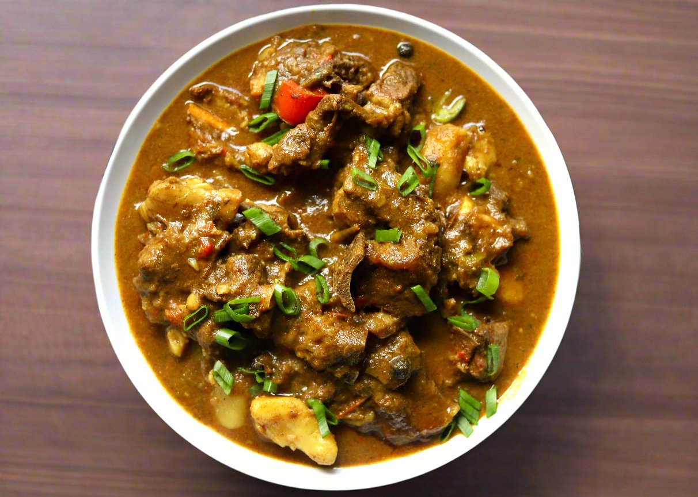

# Curried Goat Grenadian-Style

*Bone-in goat slow-braised in Caribbean curry, fresh-grated nutmeg and scotch bonnet until the meat falls from the bone and the gravy is glossy and almost black.*

**Serves:** 6

**Prep Time:** 20 minutes (plus overnight marinade)

**Cook Time:** 2 hours 30 minutes

## Overview
Curried goat is the Sunday meat of the Caribbean, and the Grenadian version separates itself with two things: a heavy hand with fresh-grated nutmeg (the spice the island is named for) and a slow proper brown of the curry paste before any liquid hits the pot. The goat is marinated overnight in green seasoning, then the bones are browned in dark hot oil, the curry powder is fried until it almost burns, and only then does water go in for the long braise. Two and a half hours later the meat slips off the bone, the gravy is thick and mahogany, and the kitchen smells of nutmeg, thyme and scotch bonnet. Eat with white rice or roti, with the bones on the side of the plate for picking. The most-asked-for plate at any Grenadian Sunday lunch.

## Ingredients

### For the marinade
- 1500 g bone-in goat shoulder or leg, cut into 4 cm pieces
- 6 garlic cloves, crushed
- 1 thumb ginger, grated
- 4 spring onions, chopped
- 1 tbsp fresh thyme leaves
- 2 tbsp chadon beni or coriander, chopped
- 2 tbsp green seasoning (or extra herbs above)
- 1 tbsp soy sauce
- 1 tbsp Worcestershire sauce
- Juice of 2 limes
- 2 tsp salt
- 1 tsp black pepper

### For the curry
- 4 tbsp vegetable oil
- 4 tbsp Caribbean [curry powder](../../base-ingredients/curry-powder/bir-curry-powder.md) (with amchar masala if possible)
- 2 tsp ground cumin
- 1 tsp turmeric
- 1 large onion, chopped
- 1 scotch bonnet, whole (or chopped for more heat)
- 1 tsp fresh-grated nutmeg
- 2 bay leaves
- 1 litre hot water
- 500 g waxy potatoes, peeled, cubed
- 1 tbsp brown sugar

## Method

### Stage 1 - Marinate
1. Combine the goat with all marinade ingredients in a large bowl.
2. Massage in; cover; refrigerate overnight (or at least 4 hours).

### Stage 2 - Bloom the curry
1. Heat the oil in a heavy pot over medium-high.
2. Mix the curry powder, cumin and turmeric with 4 tablespoons of water to a thick paste.
3. Add the paste to the hot oil; fry hard 3-4 minutes, stirring constantly, until very dark and almost smoking.
4. The paste should look black-brown and smell deeply roasted.

### Stage 3 - Brown the goat
1. Lift the goat pieces from the marinade (reserve the marinade liquid).
2. Add the goat to the hot curry; stir hard to coat every piece in the dark paste.
3. Sear over high heat 8-10 minutes until each piece is well browned.

### Stage 4 - Build the braise
1. Add the chopped onion and the reserved marinade; cook 5 minutes.
2. Pour in the hot water; add the whole scotch bonnet, nutmeg, bay leaves and brown sugar.
3. Bring to a boil; skim any scum.

### Stage 5 - Slow braise
1. Cover; drop the heat to a low simmer.
2. Cook 1 hour 30 minutes, stirring occasionally; top up with hot water if it gets too dry.

### Stage 6 - Add potatoes and finish
1. Add the potatoes; cook uncovered another 40 minutes.
2. The goat should fall from the bone, the potatoes should be soft, and the gravy should be glossy and thick.
3. Lift out the bay leaves and scotch bonnet (or stir the pepper in for serious heat).
4. Rest 10 minutes before serving.

## Notes
- **Bone-in is essential:** the bones release gelatin that thickens the gravy and carries the flavour.
- **Burn the curry properly:** under-cooked curry powder tastes raw and dusty; the deep frying is what makes the gravy black and rich.
- **Low and slow:** any boil and the goat goes stringy; a barely-bubbling simmer is the target.
- **Fresh nutmeg matters:** ground nutmeg from a jar has lost its oils; grate a whole nutmeg right into the pot.

## Variations
- **Curried mutton:** swap goat for mutton (older sheep); same method, 30 minutes longer.
- **Curried lamb:** use lamb shoulder; reduce cooking time to 1 hour 45 minutes total.
- **Curried chicken:** bone-in chicken thighs and drumsticks; cook 45 minutes total.
- **With pumpkin:** add 300 g cubed pumpkin with the potatoes; collapses into the gravy.
- **Trini-style:** add 2 tablespoons of mustard at the end (a Trinidadian crossover touch).

## Serving
- With white rice or pelau · with a Grenada roti · with sliced cucumber and tomato · with mango chutney · with pepper sauce passed at the table.

## Storage
- Keeps 4 days refrigerated; improves on day 2.
- Freezes 3 months; defrost overnight before reheating.
- Reheat gently with a splash of water to loosen the gravy.

