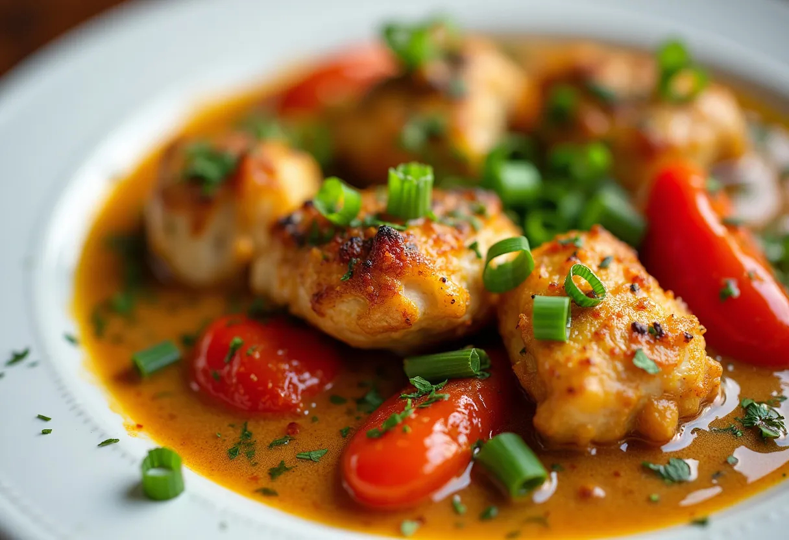

# Grenada Nutmeg Chicken

*Spice Island chicken: chicken thighs browned and braised with a generous grating of fresh Grenadian nutmeg, garlic, ginger, thyme and rum; a single scotch bonnet rides on top to perfume the gravy; served over rice with a slice of ripe plantain.*

**Serves:** 4

**Prep Time:** 15 minutes (plus 30 minutes marinade)

**Cook Time:** 50 minutes

## Overview
Grenada is "the Spice Isle" because the small Caribbean island produces around 40% of the world's nutmeg, traded out of the small port at St George's in distinctive wooden barrels. Nutmeg appears in nearly every Grenadian kitchen at every meal: in oildown, in rum punches, in baked sweets, but also, surprisingly, as the central spice in everyday savoury dishes. Grenada nutmeg chicken showcases that savoury use: chicken thighs are marinated briefly in lime, fresh-grated nutmeg, garlic, ginger, thyme and a slosh of dark rum; browned skin-side down till deeply caramelised; then braised in coconut milk with a whole scotch bonnet perched on top. The dish is rich but lifted; the nutmeg gives a haunting warmth rather than the heat you might expect.

## Ingredients

### Marinade
- 1 kg bone-in skin-on chicken thighs (8 thighs)
- 2 tablespoons fresh-grated nutmeg (whole nutmeg, microplane-grated; about 2 whole nutmegs)
- 6 cloves garlic (finely chopped)
- 2 cm fresh ginger (grated)
- 2 sprigs fresh thyme (leaves picked) + extra for serving
- Juice of 1 lime
- 2 tablespoons dark rum (Clarke's Court or any Grenadian rum)
- 1 tablespoon Worcestershire sauce
- 2 teaspoons fine sea salt
- 1 teaspoon coarsely cracked black pepper
- 1 teaspoon brown sugar

### Braise
- 2 tablespoons coconut oil (or vegetable oil)
- 1 large onion (finely sliced)
- 1 green bell pepper (finely diced)
- 1 tablespoon tomato paste
- 1 tin (400 g) chopped tomatoes
- 1 tin (400 g) coconut milk
- 200 ml chicken stock
- 1 whole scotch bonnet (left whole, do not pierce)
- 2 fresh bay leaves
- 1 small cinnamon stick
- 1 tablespoon dark rum (to finish)

### To serve
- A bowl of cooked white rice (about 200 g dry-weight)
- 2 ripe plantains (sliced and fried)
- A wedge of lime
- 1 small handful fresh coriander (chopped)
- A bottle of pepper sauce on the table

## Method

### Stage 1 - Marinate
1. In a large bowl, whisk the grated nutmeg, garlic, ginger, thyme leaves, lime juice, rum, Worcestershire, salt, pepper and brown sugar.
2. Add the chicken thighs; turn to coat thoroughly.
3. Cover; rest 30 minutes (longer is better; up to 4 hours in the fridge).

### Stage 2 - Brown the chicken
1. Heat the coconut oil in a wide heavy lidded pan over medium-high heat.
2. Lift the chicken out of the marinade (reserve the marinade liquor in the bowl).
3. Lay the thighs skin-side down in the pan; don't crowd.
4. Brown 6-8 minutes till the skin is deep mahogany and crisp.
5. Flip; brown another 3 minutes on the flesh side.
6. Lift onto a plate; set aside.

### Stage 3 - Aromatics
1. Drop the heat to medium.
2. Add the sliced onion and diced green pepper to the same pan; cook 6 minutes till soft.
3. Stir in the tomato paste; cook 2 minutes till it darkens.
4. Pour in the chopped tomatoes; simmer 5 minutes till thickened.

### Stage 4 - Braise
1. Pour in the coconut milk and the chicken stock.
2. Add the reserved marinade liquor.
3. Drop in the bay leaves and cinnamon stick.
4. Return the chicken thighs to the pan, skin-side up so the crisp skin stays above the liquid.
5. Sit the whole scotch bonnet on top of the chicken (don't pierce; it perfumes without dominating).
6. Bring to a gentle simmer.
7. Cover loosely with the lid; simmer 35 minutes till the chicken is tender and the sauce has thickened.

### Stage 5 - Finish
1. Fish out the scotch bonnet, bay leaves and cinnamon stick.
2. Stir in the final tablespoon of dark rum.
3. Check seasoning.
4. Grate one final pinch of fresh nutmeg over the surface.

### Stage 6 - Plate
1. Spoon a generous mound of cooked rice into the centre of each warm plate.
2. Lay 2 chicken thighs on top.
3. Ladle the nutmeg-coconut sauce over.
4. Tuck 2-3 slices of fried plantain alongside.
5. Scatter the chopped coriander and reserved thyme over.
6. Add a wedge of lime.
7. Pass the pepper sauce at the table.

## Notes
- **Fresh-grated whole nutmeg only:** pre-ground nutmeg is flat and dusty. A whole nutmeg keeps 5 years in a sealed tin; grate as you need.
- **Don't pierce the scotch bonnet:** the whole pepper perfumes the sauce; piercing makes the whole pot fiercely hot.
- **Brown the chicken hard before braising:** the crust survives the simmer and gives the finished dish its texture.
- **Skin-side up during braise:** keeps the crisped skin above the liquid line so it doesn't go soft.
- **Grenadian rum (Clarke's Court or Westerhall):** the dark aged rum complements the nutmeg. Substitute any dark Caribbean rum (Mount Gay, Appleton 12).

## Variations
- **With saltfish:** add 200 g flaked salt cod with the tomatoes for a richer, savoury-fish-and-nutmeg dish.
- **Grenada nutmeg pork:** swap the chicken for pork shoulder cubes; extend the braise to 75 minutes.
- **Drier nutmeg chicken:** halve the coconut milk and reduce the sauce harder for a lacquered dish closer to oildown's texture.
- **With saffron:** add 1/2 teaspoon saffron threads with the coconut milk for a yellow-tinted feast version.
- **Mild version:** skip the scotch bonnet; the dish still works on the nutmeg alone.

## Serving
- At a Grenadian Sunday lunch (the traditional setting) · with rice and plantain at a Saint George's beach restaurant · alongside callaloo greens · at a Caribbean wedding buffet · with a glass of Westerhall rum punch · at a Christmas-eve table with extra nutmeg grated over the rice.

## Storage
- Refrigerates 4 days in a sealed container; the flavour deepens.
- Reheat gently in a covered pan with a splash of stock or coconut milk.
- Freezes well 2 months; defrost in the fridge before reheating.
- The grated nutmeg fades over time; grate a fresh pinch over the plate before serving day 2.
