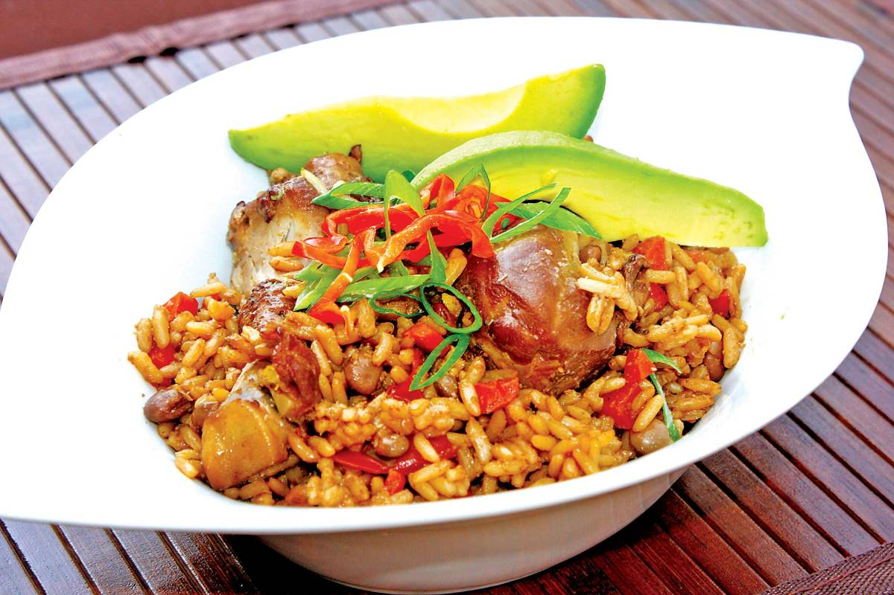

# Pelau Grenadian

*Caribbean one-pot rice: brown sugar caramelised dark in oil, chicken and pigeon peas dropped into the burning sugar, then rice and coconut milk simmered until every grain is mahogany and glossy.*

**Serves:** 6

**Prep Time:** 20 minutes (plus 30 minutes marinating)

**Cook Time:** 50 minutes

## Overview
Pelau is the great Sunday rice of the southern Caribbean, and Grenada's version sits between Trinidad's (drier, browner) and the rest of the islands'. The technique is the heart of the dish: brown sugar is melted in oil until it goes from amber to mahogany to almost black, then the seasoned chicken is dropped straight into the burning sugar so each piece caramelises on contact. Pigeon peas (gandules), rice and coconut milk go in next, and the whole pot simmers tight-lidded until the rice is tender and the bottom carries a faint sweet crust. The colour is deep brown; the flavour is smoky-sweet from the burnt sugar, rich from the coconut, and warm from thyme, scotch bonnet and a grating of fresh Grenadian nutmeg. One pot, one spoon, and everyone goes back for seconds.

## Ingredients

### For the chicken marinade
- 1 kg chicken thighs and drumsticks, bone-in, skin on
- 4 spring onions, chopped
- 4 garlic cloves, crushed
- 1 tbsp fresh thyme leaves
- 1 tbsp chadon beni or coriander, chopped
- 1 tsp salt
- 1 tsp black pepper
- 1 tbsp green seasoning (or extra herbs above)

### For the pot
- 3 tbsp vegetable oil
- 3 tbsp dark brown sugar
- 1 large onion, chopped
- 250 g pigeon peas (or 1 tin, drained)
- 400 g long-grain rice, rinsed
- 400 ml coconut milk
- 600 ml hot water or chicken stock
- 1 scotch bonnet pepper, whole
- 0.5 tsp fresh-grated nutmeg
- 2 sprigs thyme
- Salt to taste

## Method

### Stage 1 - Marinate the chicken
1. Toss the chicken pieces with all marinade ingredients.
2. Cover; refrigerate 30 minutes (or up to overnight).

### Stage 2 - Burn the sugar
1. Heat the oil in a heavy wide pot over medium-high heat.
2. Add the brown sugar; let it melt undisturbed.
3. Watch it carefully: it goes amber, then mahogany, then starts to smoke and turn almost black. This is when you act, not before.

### Stage 3 - Sear the chicken
1. Quickly add the chicken pieces to the burning sugar.
2. Stir hard to coat every piece in the dark caramel.
3. The sugar will hiss and seize; keep stirring 4-5 minutes until the chicken is deep brown all over.

### Stage 4 - Build the pot
1. Add the onion; cook 3 minutes until soft.
2. Add the pigeon peas; stir 1 minute.
3. Add the rinsed rice; stir 1 minute to coat each grain in the dark oil.
4. Pour in the coconut milk and hot water or stock.
5. Add the whole scotch bonnet, grated nutmeg, thyme and a good pinch of salt.

### Stage 5 - Simmer
1. Bring to a hard boil; stir once.
2. Drop the heat to low; cover tightly.
3. Cook 20-25 minutes undisturbed until the rice is tender and the liquid is gone.
4. Lift the lid: if there is still liquid at the bottom, cover and give it 5 more minutes.

### Stage 6 - Rest and fluff
1. Off the heat, leave covered 10 minutes.
2. Lift out the scotch bonnet.
3. Fluff with a fork; the rice should be deep brown and glossy.

## Notes
- **The sugar must go almost black:** if you stop at amber it tastes sweet; if you let it burn properly the bitterness balances the coconut.
- **Don't pierce the pepper:** the whole scotch bonnet flavours the rice without making it inedible.
- **Bone-in chicken is essential:** boneless thighs fall apart and dry out.
- **The bottom crust (bun-bun):** a slight crust at the bottom of the pot is prized; scrape it up and serve with the rice.

## Variations
- **Beef pelau:** use 1 kg stewing beef instead of chicken; simmer 1 hour 15 minutes.
- **Saltfish pelau:** soaked and flaked salt cod replaces the chicken.
- **Vegetarian pelau:** skip the meat, double the pigeon peas, add 200 g diced pumpkin in stage 4.
- **With coconut cream:** swap half the coconut milk for thick coconut cream for a richer pot.
- **With raisins:** add 50 g raisins in stage 4 (a Grenadian touch some cooks add at Christmas).

## Serving
- With coleslaw and avocado on the side · with a sweet plantain on top · with pepper sauce passed at the table · at a Sunday lunch · at a beach lime · with a cold Carib beer.

## Storage
- Keeps 3 days refrigerated.
- Reheat in a covered pan with a splash of water; the steam refreshes the rice.
- Freezes 2 months in portions.

