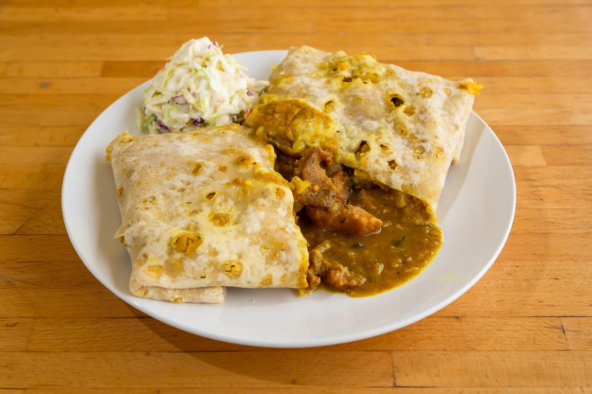

# Grenada Roti

*Soft thin dhalpuri flatbread wrapped around a hot curried-chickpea-and-potato filling: the lunch-counter staple of every Grenadian town, eaten standing up out of a square of greaseproof paper.*

**Serves:** 4 large rotis

**Prep Time:** 45 minutes (plus 1 hour resting)

**Cook Time:** 45 minutes

## Overview
Roti came to Grenada from Trinidad and India, carried by indentured Indian workers in the nineteenth century, and stayed to become one of the island's defining lunches. The Grenadian version is the dhalpuri-wrap roti: a thin soft flatbread layered with cooked seasoned split peas in the dough itself, then wrapped around a fragrant curry of chickpeas and potato (or curried chicken, or curried goat). The roti skin is the work: the dough is rested twice, stuffed with the ground split peas, rolled out paper-thin, and cooked on a flat tawa with a brush of oil until pale gold and puffed. Wrapped tight around a ladle of curry, the bread soaks up the gravy, the chickpeas stay whole, and the potato collapses around the spice. Eat hot, with pepper sauce, with both hands.

## Ingredients

### For the dough
- 500 g plain flour
- 2 tsp baking powder
- 1 tsp salt
- 1 tbsp vegetable oil
- 300 ml warm water

### For the split-pea filling
- 200 g yellow split peas, soaked 2 hours then drained
- 2 garlic cloves, crushed
- 1 tsp ground cumin
- 1 tsp salt
- 0.5 tsp turmeric

### For the chickpea curry
- 3 tbsp vegetable oil
- 1 large onion, chopped
- 4 garlic cloves, crushed
- 1 thumb ginger, grated
- 3 tbsp Caribbean curry powder
- 1 tsp ground cumin
- 1 tsp turmeric
- 1 scotch bonnet, finely chopped (deseed for less heat)
- 2 tins chickpeas (800 g), drained
- 500 g waxy potatoes, peeled, cubed
- 400 ml water
- 2 tbsp chadon beni or coriander, chopped
- Salt to taste

## Method

### Stage 1 - Make the dough
1. Whisk flour, baking powder and salt; add the oil.
2. Gradually add warm water until a soft dough forms; knead 5 minutes.
3. Cover; rest 30 minutes.

### Stage 2 - Cook the split peas
1. Boil the soaked split peas with garlic, cumin, salt and turmeric in 400 ml water until tender (25 minutes); the peas should be soft but not mushy.
2. Drain very well; spread on a tray to dry out 10 minutes.
3. Grind in a food processor to a coarse powder, like wet sand.

### Stage 3 - Stuff the dough
1. Divide the rested dough into 4 balls.
2. Flatten each into a disc; place a heaped tablespoon of ground split peas in the centre.
3. Pleat the edges over the filling to enclose it; pinch to seal.
4. Rest the filled balls 30 minutes, seam side down.

### Stage 4 - Cook the chickpea filling
1. Heat the oil in a heavy pan; cook onion 6 minutes until soft.
2. Add garlic and ginger; cook 1 minute.
3. Stir in curry powder, cumin, turmeric and scotch bonnet; toast 1 minute (add a splash of water if it sticks).
4. Add chickpeas, potatoes and water; stir well.
5. Simmer 25 minutes uncovered until the potatoes are soft and the gravy is thick.
6. Crush some chickpeas and potato pieces against the side of the pan to thicken further.
7. Stir in the chadon beni; salt to taste.

### Stage 5 - Roll the rotis
1. Flour the work surface lightly.
2. With a long thin rolling pin, roll each ball into a thin round about 30 cm wide; the split peas will speckle through the dough.
3. Brush both sides with oil.

### Stage 6 - Cook the rotis
1. Heat a flat tawa or large frying pan over medium-high.
2. Lay a roti on; cook 45 seconds until small bubbles appear.
3. Flip; brush with oil; cook another 45 seconds until pale gold spots appear.
4. Flip again briefly; stack under a clean tea towel to stay soft.

### Stage 7 - Wrap and serve
1. Lay a hot roti flat; ladle a generous spoonful of curry in the centre.
2. Fold the bottom up, fold the sides in, roll up tight.
3. Wrap in greaseproof paper.
4. Eat hot.

## Notes
- **Dry the split peas properly:** wet ground peas tear the dough when you roll.
- **The dough must be soft:** a stiff dough makes a heavy roti.
- **Roll thin:** the rotis should be almost translucent, about 2 mm thick.
- **Crush some chickpeas:** thickens the gravy and stops it leaking through the wrap.

## Variations
- **Chicken roti:** swap chickpeas for 600 g curried chicken thigh (bone-in, then shred off the bone).
- **Goat roti:** slow-cooked curried goat, the most prized filling.
- **Conch roti:** sliced curried conch, the seaside version.
- **Pumpkin roti:** add 300 g cubed pumpkin in stage 4; melts into the gravy.
- **With aloo pie sauce:** drizzle a thin tamarind-pepper sauce inside the wrap.

## Serving
- With Grenadian pepper sauce · with mango chutney on the side · with a Solo or Shandy soft drink · wrapped in paper for lunch on the go · at a Friday lime.

## Storage
- The cooked rotis keep 1 day; reheat briefly on a dry pan with a sprinkle of water.
- The curry filling keeps 4 days refrigerated and freezes 2 months.
- Do not pre-assemble: the gravy soaks the bread.

