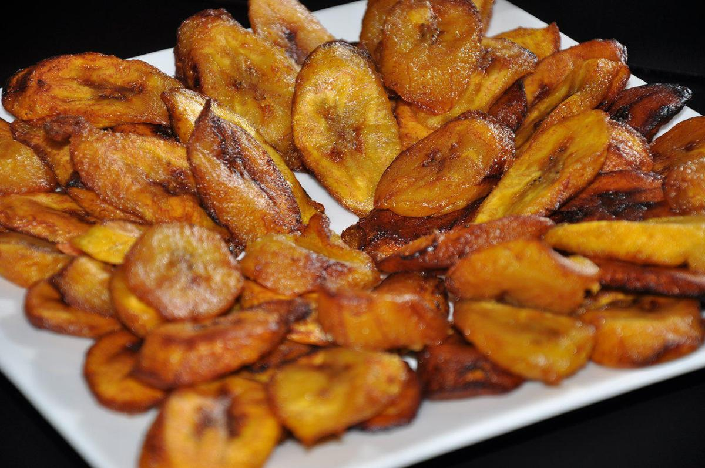

# Fried Plantain Grenada-Style

*Very ripe black-skinned plantains sliced thick on the bias and shallow-fried in hot oil until the edges caramelise mahogany and the centre stays soft and almost custardy.*

**Serves:** 4 as a side

**Prep Time:** 5 minutes

**Cook Time:** 10 minutes

## Overview
Fried plantain is the side that lands next to almost everything on a Grenadian plate: pelau, curried goat, oildown, stewed chicken. The Grenadian version uses very ripe plantains (skins black and yielding, the fruit beneath gold and soft) sliced thick on the diagonal so each piece has maximum surface for caramelisation. The slices are fried in shallow vegetable oil over a steady medium heat, not too fierce, until the edges are mahogany-brown and the centres are soft, sweet and almost custardy. A scatter of salt over the hot oil hits the sugar in the fruit and pulls out the flavour. Cheap to make, eaten daily, and the first thing a Grenadian cook teaches a beginner.

## Ingredients

- 3 very ripe plantains (skins mostly black with a few yellow patches)
- 4 tbsp vegetable oil (or coconut oil)
- 0.5 tsp salt
- Optional: a pinch of fresh-grated nutmeg

## Method

### Stage 1 - Peel and slice
1. Top and tail each plantain.
2. Score a slit lengthways through the skin, just deep enough to cut the peel.
3. Peel off the skin in strips; if it sticks, use a knife to lift it.
4. Slice each plantain on a sharp diagonal into pieces about 1.5 cm thick.

### Stage 2 - Heat the oil
1. Heat the oil in a wide heavy frying pan over medium heat.
2. The oil should shimmer but not smoke; test with one slice, it should sizzle gently on contact.

### Stage 3 - Fry
1. Lay the plantain slices in the pan in a single layer; don't crowd.
2. Fry 2-3 minutes until the underside is deep gold to mahogany.
3. Flip; fry another 2 minutes until both sides are caramelised and the centres are soft.
4. Drain on kitchen paper.

### Stage 4 - Finish
1. While hot, scatter with salt and a pinch of nutmeg if using.
2. Serve immediately.

## Notes
- **Plantains must be very ripe:** green or yellow plantains stay starchy and bitter; the skin should be at least three-quarters black for the right sweetness.
- **Cut thick:** thin slices burn before the centre softens.
- **Medium heat, not high:** too hot and the sugar burns before the centre cooks through.
- **Salt while hot:** the salt sticks to the warm oil and balances the sweetness.

## Variations
**Twice-fried tostones:** use green plantains, slice 2 cm thick, fry, smash flat, fry again.
**Plantain crisps:** slice yellow plantains very thin and fry in deep oil until crisp.
**With cinnamon sugar:** dust hot slices with a mix of cinnamon and brown sugar for a dessert version.
**In coconut oil:** swap vegetable oil for coconut oil for a deeper island flavour.
**Air-fried:** brush with oil, air-fry 200C for 10 minutes, flipping once.

## Serving
With pelau · with curried goat · with stewed saltfish · with rice and peas · with a fried egg for a Grenadian breakfast.

## Storage
- Eat the same day; plantains lose their texture overnight.
- Reheat briefly in a hot pan; the microwave makes them rubbery.
- Do not freeze.
