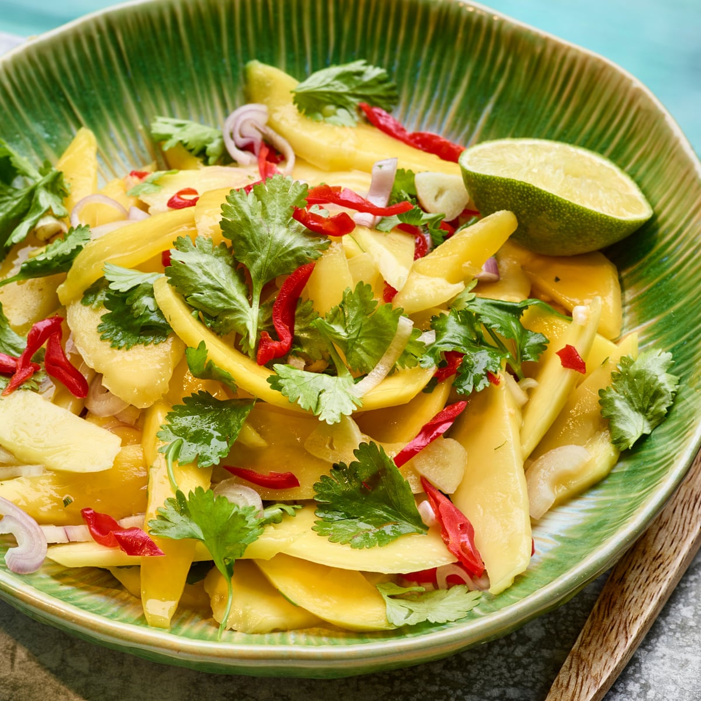

# Mango Chow

*Crisp green mango chunks tossed with lime juice, salt, scotch bonnet, garlic and chadon beni: the under-the-tree snack of every Grenadian childhood, eaten with the fingers from a folded bag.*

**Serves:** 4 as a snack

**Prep Time:** 10 minutes (plus 30 minutes resting)

**Cook Time:** None

## Overview
Mango chow is the Caribbean's hot-weather salad and back-yard snack, eaten from a paper bag or a small bowl with the fingers. The Grenadian version uses very green hard mangoes (the unripe ones that fall from the trees in the dry season), peeled, sliced into thumb-sized pieces, and tossed with a bright sharp dressing of lime juice, salt, finely chopped scotch bonnet, grated garlic and a great handful of chadon beni. It rests 30 minutes for the salt and lime to start softening the mango edges and pulling juice out of the fruit, then it goes onto the plate (or into a paper cone) with all the brine spooned over the top. Sweet, sharp, salty and burning hot. The taste of a Grenadian schoolyard afternoon.

## Ingredients

- 3 large green hard mangoes (about 1 kg)
- 4 limes, juiced (about 120 ml)
- 1 tsp sea salt
- 1 scotch bonnet, very finely chopped (deseed for less heat)
- 3 garlic cloves, very finely grated
- 1 large bunch chadon beni or coriander, finely chopped
- 0.5 tsp black pepper
- Optional: 1 tsp brown sugar (if mangoes are very sour)

## Method

### Stage 1 - Prep the mangoes
1. Peel each mango thinly with a sharp peeler.
2. Slice the flesh away from the stone in two cheeks, then cut what is left around the stone.
3. Cut the flesh into thumb-sized chunks about 2 cm thick.
4. The mango should be hard and crisp, the flesh pale green to cream.

### Stage 2 - Make the dressing
1. Combine the lime juice, salt, scotch bonnet, garlic, chadon beni and pepper in a wide bowl.
2. Whisk together; taste, it should be sharp, salty and hot.
3. Add the sugar if your mangoes are very sour.

### Stage 3 - Toss
1. Add the mango chunks to the dressing.
2. Toss hard with your hands or a spoon so every piece is coated.

### Stage 4 - Rest
1. Cover; leave at room temperature 30 minutes.
2. The mango will start to release juice; the brine will go cloudy and aromatic.

### Stage 5 - Serve
1. Stir once.
2. Spoon into small bowls with plenty of brine, or into folded paper bags for eating standing up.
3. Eat with the fingers.

## Notes
- **Very green mangoes are essential:** ripe mangoes go mushy in the lime; the chow needs the crunch.
- **Chop the scotch bonnet by hand:** a grated pepper is too even and dissolves; small chopped pieces give heat bursts.
- **Use real limes:** bottled juice tastes flat.
- **Eat the same day:** the mango softens after a few hours and loses its crunch.

## Variations
**Pineapple chow:** swap the mango for very firm pineapple chunks.
**Pommecythere (golden apple) chow:** the classic Trinidadian version with green pommecythere.
**Cucumber chow:** with crunchy cucumber chunks (peel the skin in stripes).
**Five-fruit chow:** mango, pineapple, pommecythere, cucumber and green apple all in one bowl.
**Sour-and-sweet chow:** add 1 tablespoon of cane vinegar for sharper bite.

## Serving
From a paper cone at the beach · in a bowl by the road · as a side with grilled fish · with a cold beer · at a Grenadian family lime.

## Storage
- Best eaten within 2 hours.
- Keeps 1 day refrigerated; the mango softens significantly.
- Do not freeze.

