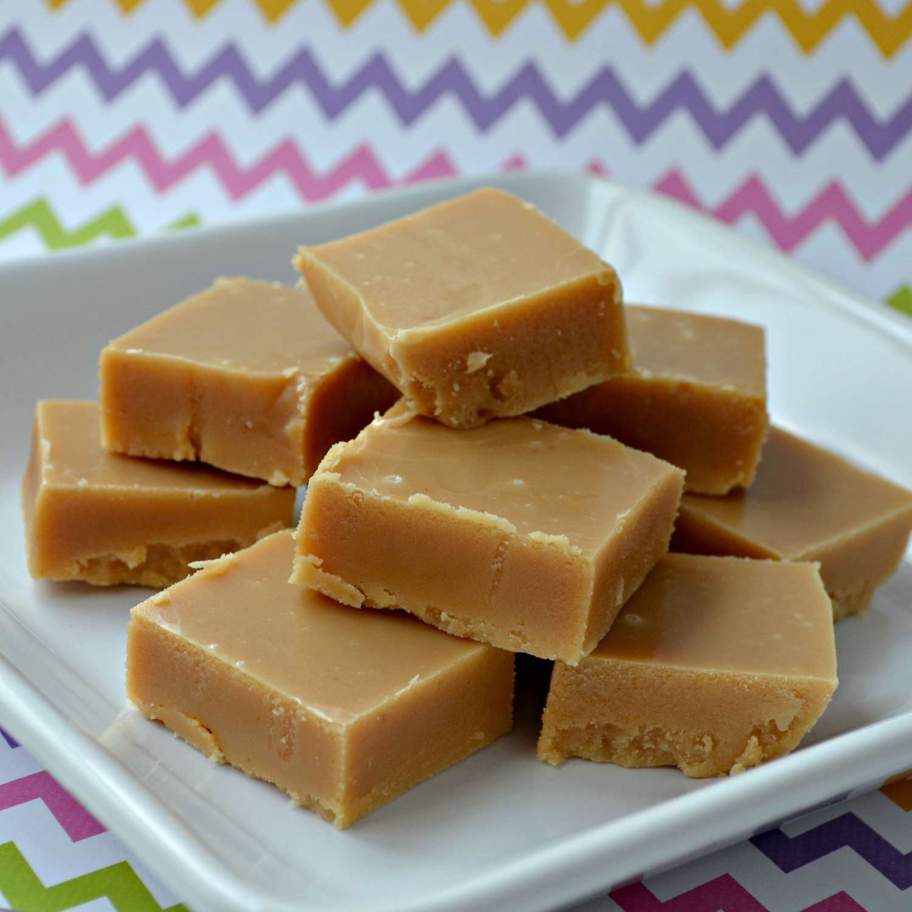

# Coconut Fudge Grenadian

*Freshly grated coconut cooked into condensed milk, brown sugar and butter until the mixture pulls away from the pan in a thick fudgy slab, scented with fresh nutmeg and cut into small squares.*

**Serves:** Makes about 30 small squares

**Prep Time:** 10 minutes

**Cook Time:** 25 minutes

## Overview
Coconut fudge is the heavier richer cousin of sugar cake: where sugar cake is wet-grated coconut bound in a brown-sugar syrup, fudge uses sweetened condensed milk, butter and brown sugar to make a dense buttery slab that sets like a soft caramel. The Grenadian version is scented with fresh nutmeg and a pinch of cinnamon, and (in the right kitchen) a knot of fresh ginger added at the start of the cook for warmth. The mixture is cooked low and slow, stirred continuously until it pulls clean from the pan, then poured into a buttered tin and cut into small squares once cool. Sweet, dense, deeply coconutty, and a permanent fixture in the cake-stand glass jar of every Grenadian living room.

## Ingredients

- 300 g freshly grated coconut (or unsweetened desiccated rehydrated with 100 ml water)
- 1 tin sweetened condensed milk (397 g)
- 200 g soft dark brown sugar
- 100 ml whole milk
- 60 g unsalted butter
- 1 thumb fresh ginger, finely grated
- 1 tsp fresh-grated nutmeg
- 0.5 tsp ground cinnamon
- 1 tsp vanilla extract
- A pinch of salt

## Method

### Stage 1 - Combine
1. Line a small square tin (about 20 cm) with greaseproof paper; butter the paper lightly.
2. Combine the condensed milk, brown sugar, whole milk, butter and grated ginger in a heavy saucepan.

### Stage 2 - Melt and dissolve
1. Heat over low heat, stirring with a wooden spoon, until the sugar dissolves and the butter melts.
2. Bring to a gentle simmer.

### Stage 3 - Add the coconut
1. Stir in the grated coconut, nutmeg, cinnamon and salt.
2. Cook over low-medium heat, stirring almost constantly, for 18-22 minutes.
3. The mixture will darken to a deep caramel colour, thicken steadily, and begin to pull away cleanly from the sides of the pan.
4. Test: drop a small spoonful onto a cold saucer; it should set into a firm fudgy mound within a minute.

### Stage 4 - Finish
1. Off the heat, stir in the vanilla.
2. Beat hard with the wooden spoon for 1 minute; this aerates the fudge and gives the right grain.

### Stage 5 - Set
1. Pour into the prepared tin.
2. Smooth the top with a wet spoon.
3. Leave at room temperature 1 hour to set.
4. For a cleaner cut, refrigerate 30 minutes before cutting.

### Stage 6 - Cut and serve
1. Lift out by the greaseproof paper.
2. Cut into small squares (about 3 cm).
3. Store in an airtight tin between sheets of greaseproof paper.

## Notes
- **Stir constantly:** the milk solids catch and burn at the bottom in seconds if you stop.
- **Low heat:** any harder than a gentle simmer and the fudge scorches and tastes bitter.
- **Test the set:** the pan-pull test (clean sides) is more reliable than time alone.
- **Beat after the heat is off:** the brief beating makes the grain finer and the fudge less sticky.

## Variations
**Plain coconut:** skip the ginger and cinnamon for a pure coconut-nutmeg version.
**With raisins:** stir in 80 g raisins at the end of cooking.
**With rum:** add 1 tablespoon of dark rum with the vanilla.
**Chocolate coconut:** stir in 50 g chopped dark chocolate as the mixture comes off the heat.
**With chopped nuts:** add 60 g chopped roasted almonds or peanuts with the coconut.

## Serving
With afternoon tea · cut small and packed as a gift · with a strong black coffee · at Sunday lunch · sliced thin alongside vanilla ice cream.

## Storage
- Keeps 2 weeks in an airtight tin at room temperature.
- Refrigeration keeps it 4 weeks but firms the texture; bring to room temperature before eating.
- Layer between greaseproof paper so the squares do not stick.
