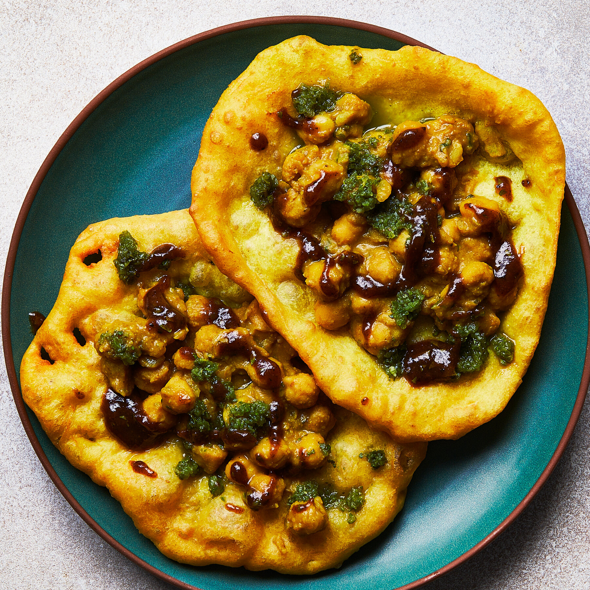

# Doubles Grenada

*Two soft fried turmeric flatbreads (bara) wrapped around a spoonful of curried chickpea (channa): the Trinidadian street snack that crossed to Grenada and became a breakfast institution.*

**Serves:** 4 (makes 8 doubles)

**Prep Time:** 30 minutes (plus 1 hour 30 minutes rising)

**Cook Time:** 30 minutes

## Overview
Doubles originated in Trinidad and migrated to Grenada with the Indian-Caribbean community, and the Grenadian version stays close to the original: two thin turmeric-tinted yeasted flatbreads (bara), fried until pillow-soft, with a spoonful of curried chickpea (channa) tucked between them and topped with cucumber chutney, scotch bonnet pepper sauce and tamarind. The bara dough is yeasted, scented with turmeric and cumin, and rested twice for a soft chewy texture. The chickpea filling is cooked down with onion, garlic, cumin and chadon beni until the chickpeas hold their shape but the gravy is thick. Wrapped in greaseproof paper, eaten in two bites, and never with a fork. Breakfast, late lunch, midnight food. The most-eaten street snack in the southern Caribbean.

## Ingredients

### For the bara
- 500 g plain flour
- 2 tsp instant yeast
- 1 tsp sugar
- 1 tsp salt
- 2 tsp ground turmeric
- 1 tsp ground cumin
- 1 tsp baking powder
- 300 ml warm water
- Vegetable oil for shallow frying

### For the chickpea filling
- 2 tins chickpeas (800 g), drained
- 3 tbsp vegetable oil
- 1 large onion, chopped
- 4 garlic cloves, crushed
- 1 tbsp ground cumin
- 1 tsp turmeric
- 1 tsp [curry powder](../../../base-ingredients/curry-powder/bir-curry-powder.md)
- 1 scotch bonnet, whole
- 1 tbsp chadon beni or coriander, chopped
- 400 ml water
- Salt to taste

### For the chutney
- 1 cucumber, finely grated, squeezed dry
- 2 tbsp tamarind pulp mixed with 4 tbsp warm water (strained)
- 1 scotch bonnet pepper sauce (to taste)

## Method

### Stage 1 - Make the bara dough
1. Whisk the flour, yeast, sugar, salt, turmeric, cumin and baking powder.
2. Add the warm water gradually; mix to a soft sticky dough.
3. Knead 5 minutes (the dough should remain tacky).
4. Cover; rise 1 hour 30 minutes until doubled.

### Stage 2 - Cook the chickpeas
1. Heat the oil in a heavy pan; cook the onion 6 minutes until soft.
2. Add the garlic; cook 1 minute.
3. Stir in cumin, turmeric and curry powder; toast 1 minute.
4. Add the chickpeas, whole scotch bonnet and water.
5. Simmer 25 minutes uncovered until the gravy is thick.
6. Crush some chickpeas against the side of the pan to thicken further.
7. Stir in chadon beni; salt to taste.
8. Lift out the scotch bonnet.

### Stage 3 - Make the chutney
1. Combine the squeezed cucumber with a pinch of salt and a splash of the tamarind water.
2. Keep the pepper sauce, tamarind water and cucumber chutney in three small bowls.

### Stage 4 - Shape the bara
1. Knock back the dough.
2. Divide into 8 balls; flatten each into a thin disc about 12 cm wide.
3. Rest 5 minutes (lets them puff slightly when fried).

### Stage 5 - Fry the bara
1. Heat 2 cm of oil in a wide pan over medium heat.
2. Slide a bara in; fry 30 seconds, flip, fry another 30 seconds.
3. The bara should puff slightly and turn deep gold; do not overcook (they need to stay soft and pliable).
4. Drain on kitchen paper.

### Stage 6 - Assemble
1. Lay one bara flat.
2. Spoon a generous tablespoon of curried chickpea in the centre.
3. Add a small spoon of cucumber chutney, a drizzle of tamarind water and a small drop of pepper sauce.
4. Lay the second bara on top.
5. Wrap loosely in greaseproof paper; squash gently to seal.

## Notes
- **The bara must stay soft:** over-fried bara turns into a crisp and the wrap won't close.
- **The chickpea gravy must be thick:** runny gravy soaks the bara.
- **Tamarind is essential:** without it the dish loses its signature sour note.
- **Eat fresh:** doubles are a 5-minute food; assemble to order.

## Variations
- **Roti-shop style:** add a spoon of mango kuchela (spicy mango pickle) inside the wrap.
- **Aloo doubles:** add 200 g cubed cooked potato to the chickpeas.
- **With pepper sauce only:** for serious heat seekers, skip the chutney and add more scotch bonnet sauce.
- **Saheena variation:** swap chickpea filling for spinach-and-split-pea fritters.
- **Egg doubles:** add a sliced boiled egg on top of the channa (a Grenadian local touch).

## Serving
- For breakfast at a roadside stall · as late-lunch wrapped in paper · with a Solo grapefruit soft drink · at 2am after a Friday lime.

## Storage
- The chickpea filling keeps 4 days refrigerated.
- The cooked bara keeps 1 day; refresh briefly in a hot pan.
- Do not pre-assemble; the gravy soaks through.

