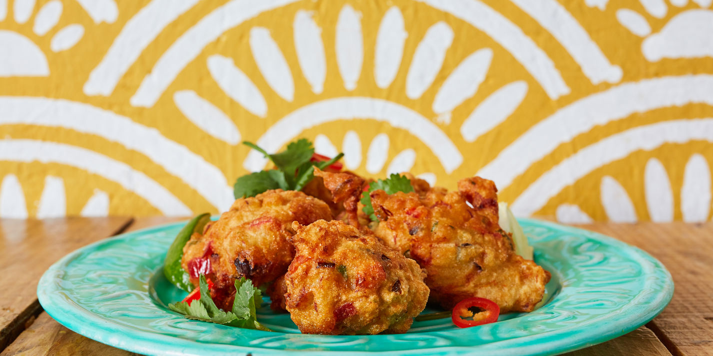

# Saltfish Accras

*Bite-sized salt cod fritters spiked with scotch bonnet, spring onion and thyme: the Friday lime snack and the Grenadian bar-counter staple, served hot from the fryer with a small bowl of pepper sauce.*

**Serves:** 4 to 6 as a starter (makes about 24 fritters)

**Prep Time:** 20 minutes (plus overnight soak)

**Cook Time:** 15 minutes

## Overview
Accras (from the West African akara) are the deep-fried fritters that travelled from the Yoruba kitchen across the Atlantic and into every Caribbean cooking. The Grenadian accra uses salt cod (saltfish, soaked overnight to draw out the salt and then flaked into a thick batter), thyme, spring onion, scotch bonnet and a heavy hand with the chadon beni. The batter rests 20 minutes for the flavours to mingle, then small spoonfuls are dropped into hot oil and fried until the outsides are deep gold and the centres are light and steamy. Eaten very hot from the fryer with a small bowl of homemade pepper sauce. The Friday after-work snack, the Saturday market snack, the beach bar snack.

## Ingredients

- 300 g salt cod (saltfish), soaked overnight, water changed twice
- 250 g plain flour
- 1 tsp baking powder
- 0.5 tsp salt (taste the saltfish first)
- 0.5 tsp black pepper
- 1 large onion, very finely chopped
- 4 spring onions, finely chopped
- 4 garlic cloves, crushed
- 1 tbsp fresh thyme leaves
- 2 tbsp chadon beni or coriander, finely chopped
- 1 scotch bonnet, deseeded and finely chopped
- 1 tomato, deseeded and finely chopped
- 1 tsp turmeric (for a faint gold colour)
- 300 ml cold water (approximately)
- Vegetable oil for deep-frying

## Method

### Stage 1 - Prepare the saltfish
1. Drain the soaked saltfish.
2. Place in a pot, cover with fresh water, boil 15 minutes.
3. Drain; let cool 10 minutes.
4. Flake with two forks, removing any skin and bones.
5. Taste a small piece: it should be pleasantly salty, not aggressive. If still too salty, rinse the flaked fish once more in fresh water and squeeze.

### Stage 2 - Build the batter
1. Whisk the flour, baking powder, salt, pepper and turmeric in a wide bowl.
2. Add the flaked saltfish, onion, spring onion, garlic, thyme, chadon beni, scotch bonnet and tomato.
3. Pour in the cold water gradually, stirring with a wooden spoon, until you have a thick batter that drops from the spoon in heavy ribbons.
4. Cover; rest 20 minutes.

### Stage 3 - Heat the oil
1. Pour vegetable oil into a deep heavy pan to a depth of 5 cm.
2. Heat to 180C; test with a small spoonful of batter, it should bubble up and rise to the surface within 5 seconds.

### Stage 4 - Fry
1. Drop heaped teaspoons of batter into the hot oil; don't crowd.
2. Fry 3-4 minutes, turning once, until each accra is deep gold all over.
3. Lift onto kitchen paper.

### Stage 5 - Serve
1. Serve very hot, with a small bowl of pepper sauce on the side.

## Notes
- **The overnight soak matters:** under-soaked saltfish is inedible; over-soaked is bland; 12 hours with two water changes is the right range.
- **Taste the fish before salting the batter:** the saltiness of cod varies; the batter only needs a small extra pinch.
- **The right batter consistency:** thick enough to hold its shape when dropped, loose enough to puff up in the oil.
- **Eat very hot:** accras lose their crisp edge within minutes; fry to order.

## Variations
**Lobster accras:** swap saltfish for chopped poached lobster meat for a luxe version.
**Conch accras:** chopped boiled conch in place of saltfish.
**Pumpkin accras:** add 200 g grated cooked pumpkin to the batter.
**Vegetarian accras:** swap saltfish for grated courgette and feta cheese.
**With grated callaloo:** stir in 100 g blanched chopped callaloo for a green flecked accra.

## Serving
With Grenadian pepper sauce · with tamarind dipping sauce · at a Friday lime · at a beach bar · alongside cold Carib beer.

## Storage
- Eat the day they are fried; accras lose their texture overnight.
- The batter keeps 1 day refrigerated; fry to order.
- Do not freeze cooked accras.

