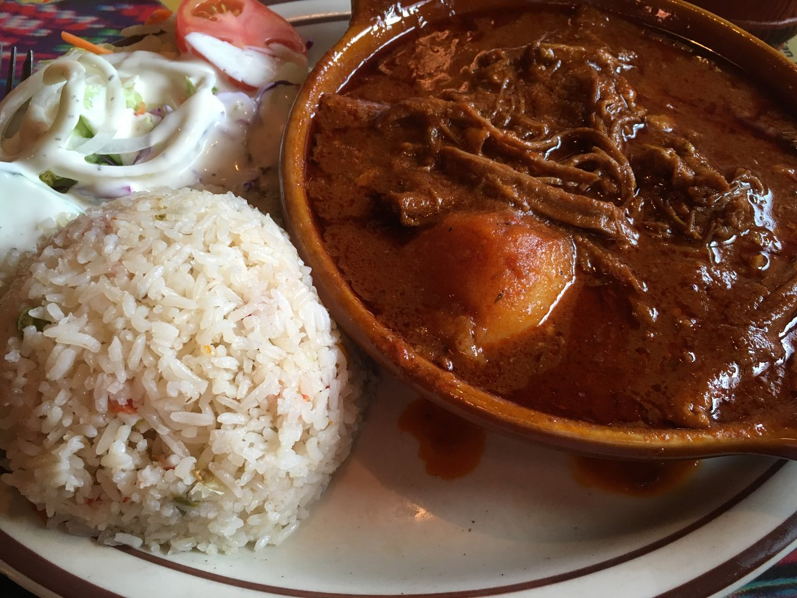

# Hilachas

*Shredded beef simmered in a tangy tomato-and-tomatillo sauce with potato and güisquil. The name means "rags" for the wispy strands of beef; a Sunday-table guisado from the Guatemalan highlands.*

**Serves:** 6

**Prep Time:** 25 minutes

**Cook Time:** 2 hours 30 minutes

## Overview
Hilachas (literally "rags") is the Guatemalan beef stew named for the way the slow-cooked flank or skirt pulls apart into hair-thin shreds. Beef is simmered low and long in a salted broth until it surrenders, then shredded by hand. A sauce of charred tomatoes, tomatillos, onion, garlic, dried guaque chilli and warming spices is blended smooth, sieved, and brought to a simmer with chunks of waxy potato and güisquil (chayote). The shredded beef goes back in to finish, soaking up the brick-red sauce. Brothy enough to eat with rice and corn tortillas, thick enough to spoon. The Sunday-comedor staple of Antigua and Quetzaltenango.

## Ingredients

### For the beef
- 1 kg beef flank or skirt steak (one piece)
- 2 litres water
- 1 onion, halved
- 4 garlic cloves
- 2 bay leaves
- 1 tbsp salt

### For the sauce
- 6 large ripe tomatoes
- 8 tomatillos (husked)
- 1 large white onion, halved
- 6 garlic cloves, skin on
- 3 dried guaque chillies (seeded; ancho substitutes)
- 1 dried pasa chilli (or pasilla)
- 1 cinnamon stick (5 cm)
- 4 whole cloves
- 1 tsp coriander seeds
- 1 tsp black peppercorns

### For finishing
- 500 g waxy potatoes, peeled and cut into 3 cm chunks
- 2 güisquil (chayote), peeled and cut into 3 cm chunks
- 2 tbsp lard or vegetable oil
- 1 tsp salt (more to taste)
- 1 small bunch coriander, leaves chopped

## Method

### Stage 1 - Simmer the beef
1. Combine the beef, water, onion, garlic, bay and salt in a heavy pot.
2. Bring to a simmer over medium-high heat, skim the foam.
3. Drop to low and simmer for 1 hour 45 minutes until the beef pulls apart with a fork.
4. Lift the beef out, cool 10 minutes, then shred into thin strands with your fingers or two forks. Strain the broth and reserve.

### Stage 2 - Char the sauce vegetables
1. Heat a dry comal or heavy pan over medium-high heat.
2. Char the tomatoes, tomatillos, onion halves and garlic cloves until blistered and blackened, about 8 to 10 minutes. Peel the garlic.
3. Toast the dried chillies briefly, 8 seconds a side, then soak in 250 ml warm broth for 10 minutes.
4. Toast the cinnamon, cloves, coriander seeds and peppercorns briefly.

### Stage 3 - Blend and sieve
1. Combine the soaked chillies and their liquid, the charred vegetables, the toasted spices and a further 250 ml broth in a blender.
2. Blend smooth, about 90 seconds. Pass through a coarse sieve.

### Stage 4 - Build the stew
1. Heat the lard in a clean heavy pot over medium heat. Pour in the sieved sauce; it spits.
2. Fry the sauce for 8 to 10 minutes, stirring, until it darkens to brick-red and the fat beads on top.
3. Add 750 ml of the reserved beef broth, the potato and güisquil chunks. Bring to a simmer.
4. Cook 20 to 25 minutes until the potatoes are tender at the centre.
5. Slide the shredded beef back in. Simmer 10 more minutes for the sauce to coat the strands.
6. Taste and salt. Stir in the coriander. Serve hot over rice or with warm corn tortillas.

## Notes
- **Beef flank or skirt** gives the right long-grained shred. Brisket can be substituted but pulls apart into chunks rather than strands.
- **Two stocks at once.** The beef broth doubles as the sauce-thinning liquid, so do not throw it out.
- **Güisquil** is the Guatemalan word for chayote (mirliton, cho-cho). The flesh stays firm when stewed and absorbs the sauce.
- **Fry the sauce before adding broth.** This step (sofreír el recado) is what makes the colour brick-red instead of orange, and concentrates the flavour.
- **Sieve the sauce** to remove the chilli skins and tomato seeds; hilachas should be smooth-sauced.

## Variations
- **With carrot:** add 2 carrots in chunks alongside the potato.
- **Spicier:** add a dried chile cobanero or 2 dried chiles de árbol to the soaking chillies.
- **Pork hilachas:** swap the beef for pork shoulder, simmered the same way.
- **With rajas:** stir in strips of roasted pepper at the finish.
- **Drier version:** reduce the sauce further at the end for a thicker, taco-fillable consistency.

## Serving
With white rice · warm corn tortillas · sliced avocado · chirmol · lime wedges · pickled jalapeños

## Storage
- Keeps 4 days refrigerated and freezes 3 months
- The sauce deepens overnight
- Reheat gently over low heat with a splash of broth to loosen
