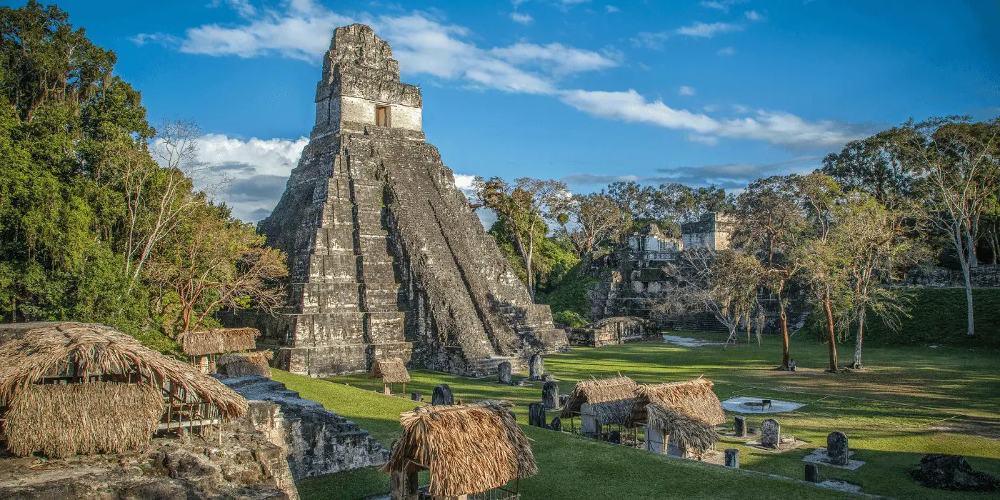

# Guatemalan Cuisine

Guatemalan food is the most Mayan-rooted cuisine in the Americas, with k'ak'ik, pepián and tamales colorados standing as the patrimonial dishes that anchor the table from Antigua to Cobán. The highland Maya cooks of Quiché and Alta Verapaz and the Caribbean Garifuna of Lívingston shape regional difference, while achiote, toasted pumpkin seed, sesame, dried chillies (guaque, pasa, zambo) and the smoky depths of recados (toasted spice pastes) anchor the spice palette across both traditions.
