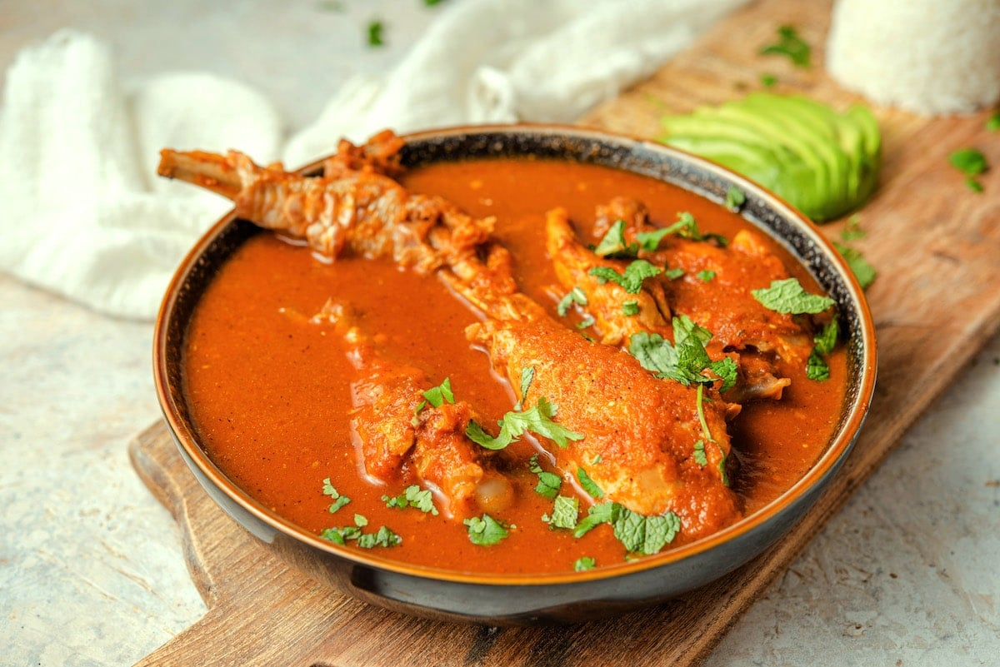

# Kak'ik

*The Q'eqchi' Maya turkey soup of Alta Verapaz: a clear red broth thickened with achiote, tomato and dried chillies, fragrant with mint, coriander and samat. UNESCO Intangible Heritage and a Cobán wedding-table fixture.*

**Serves:** 6 to 8

**Prep Time:** 30 minutes

**Cook Time:** 2 hours 30 minutes

## Overview
Kak'ik (the Q'eqchi' word means "red") is the ceremonial turkey soup of the Q'eqchi' Maya of Alta Verapaz, declared part of Guatemala's Intangible Cultural Heritage in 2007. A whole turkey is jointed and simmered until the broth turns gold, then a paste of achiote seed, dried guaque and chile cobanero chillies, charred tomatoes, garlic, mint, coriander and samat (a wild Verapaz herb related to coriander) is stirred in, turning the broth a deep red. The result is brothy rather than stewed, fragrant with the herb top-notes and lifted by mint. Served with the turkey piece sitting in the bowl, white rice on the side, and tamalitos blancos to dip. The wedding-and-feast soup of Cobán.

## Ingredients

### For the turkey and broth
- 1 small turkey (about 4 kg) jointed into 8 pieces (or use turkey thighs and drumsticks, 2.5 kg)
- 3 litres water
- 1 onion, halved
- 1 head of garlic, halved across
- 2 bay leaves
- 2 tsp salt

### For the red paste
- 3 tbsp achiote seeds (annatto)
- 4 dried guaque chillies (seeded; ancho substitutes)
- 2 dried chile cobanero (or chile de árbol for a spicier swap; or 1 tsp smoked paprika)
- 4 large ripe tomatoes
- 6 tomatillos
- 1 large white onion, halved
- 6 garlic cloves, skin on
- 1 cinnamon stick (5 cm)
- 4 whole cloves
- 1 tsp black peppercorns
- 1 tsp ground allspice

### For the herb finish
- 1 small bunch fresh mint
- 1 small bunch fresh coriander
- 4 spring onions (whole, white and green)
- 2 tsp salt (more to taste)

## Method

### Stage 1 - Build the turkey broth
1. Combine the turkey pieces, water, onion, garlic head, bay and 2 tsp salt in a large heavy pot.
2. Bring to a simmer over medium-high heat, skim the foam.
3. Drop to low and simmer gently for 1 hour 30 minutes until the turkey is tender and the broth tastes of bird.
4. Lift the turkey out and keep warm. Strain the broth and discard the solids.

### Stage 2 - Bloom the achiote
1. Heat a dry small pan over medium-low. Add the achiote seeds with 4 tablespoons of the warm broth.
2. Steep gently for 10 minutes; the broth turns deep orange-red. Strain, discarding the seeds. Reserve the achiote infusion.

### Stage 3 - Char the vegetables and toast the spices
1. Heat a dry comal or heavy frying pan over medium-high heat.
2. Char the tomatoes, tomatillos, onion halves and garlic cloves until blistered and blackened in spots, about 8 minutes. Peel the garlic; leave the tomato skins on for body.
3. Briefly toast the dried chillies on the comal, 8 seconds a side, until pliable; soak in 250 ml warm broth for 10 minutes.
4. Toast the cinnamon, cloves, peppercorns and allspice for 30 seconds.

### Stage 4 - Blend the red paste
1. Combine the soaked chillies and their liquid, the charred vegetables, the toasted spices and the achiote infusion in a blender.
2. Blend on high until smooth, about 90 seconds. Pass through a coarse sieve.

### Stage 5 - Bring the soup together
1. Return the strained broth to a clean pot. Stir in the red paste.
2. Slide the turkey pieces back in.
3. Bring to a gentle simmer over medium-low heat for 30 minutes; the broth turns deep red and the surface beads with achiote oil.
4. Bunch the mint, coriander and spring onions together with kitchen string; drop into the pot for the last 10 minutes (the herbs perfume without breaking up).
5. Taste and salt. Lift out the herb bundle.
6. Ladle into deep bowls: a turkey piece, plenty of red broth over the top. Serve with white rice and tamalitos blancos.

## Notes
- **Samat is the soul herb** of kak'ik (a Verapaz wild herb in the coriander family). Outside Guatemala, a generous bunch of coriander with a few mint leaves is the closest stand-in.
- **The broth is brothy.** Kak'ik is a soup, not a stew. The paste colours and seasons but should not thicken it past a clear red broth.
- **Achiote is the colour, not the spice.** It blooms in fat or warm liquid to release its orange-red dye; on its own it tastes faintly peppery and earthy.
- **Turkey thighs and drumsticks** give better flavour than the breast (which dries out at this length of cooking).
- **The herb bundle goes in last** so the mint stays bright and does not turn medicinal.

## Variations
- **Kak'ik de gallina:** with a free-range hen instead of turkey, the everyday weekday version.
- **With güisquil:** chayote chunks added in the last 30 minutes for a heartier bowl.
- **Spicier Cobán style:** double the chile cobanero for a fierier broth.
- **With epazote:** a leaf of epazote in the herb bundle for a different earthiness.
- **In a clay pot:** traditional Q'eqchi' kak'ik is cooked in a clay olla over a wood fire; the smoke note is part of the dish.

## Serving
With white rice · tamalitos blancos · sliced avocado · lime wedges · the turkey piece sitting in the bowl

## Storage
- Keeps 4 days refrigerated and freezes 3 months (the broth freezes better than the turkey, which can go stringy)
- The colour deepens overnight as the achiote settles
- Reheat gently; do not boil hard or the herb top-notes burn off
