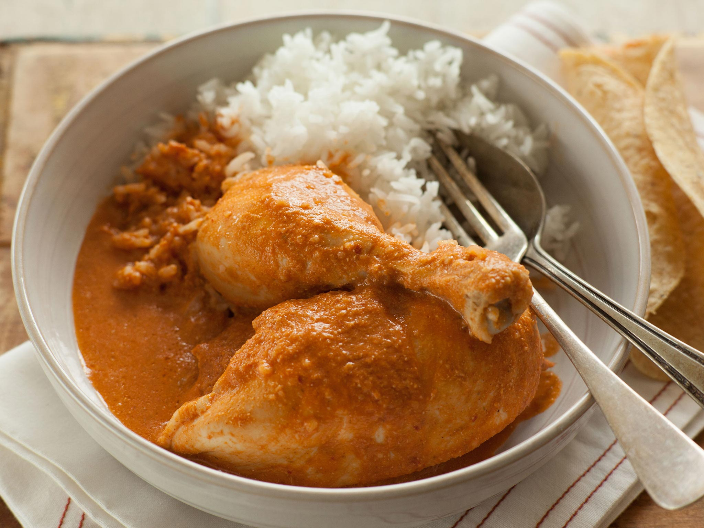

# Pepián

*Guatemala's national dish: chicken simmered in a deep, brick-red sauce thickened with toasted pumpkin and sesame seeds, dried guaque and pasa chillies, fire-roasted tomatoes and warming spices. A Mayan-rooted stew with Spanish-era cinnamon and coriander folded in.*

**Serves:** 6

**Prep Time:** 30 minutes

**Cook Time:** 1 hour 30 minutes

## Overview
Pepián (pepián rojo) is the patrimonial dish of Guatemala, traceable to the Kaqchikel Maya of the central highlands and elevated by the Spanish-era addition of cinnamon, cloves and coriander. The body of the sauce comes from seeds: pumpkin (pepitoria) and sesame, dry-toasted on a comal until they pop and crack, then ground with a fistful of dried guaque and pasa chillies that have been seeded and toasted alongside. Tomatoes, tomatillos, onion and garlic are charred whole on the same comal until their skins blister, then blended with the seed paste into a thick brick-red sauce. Chicken simmers in the sauce until the meat falls off the bone and the sauce darkens. Eaten over rice, with tamalitos blancos and chirmol on the side.

## Ingredients

### For the chicken
- 1500 g chicken (cut into 6 pieces, bone in, skin on)
- 1 onion, halved
- 4 garlic cloves
- 2 bay leaves
- 1 tsp salt
- 2 litres water

### For the seed and chilli paste
- 100 g raw pumpkin seeds (pepitas)
- 50 g raw sesame seeds
- 4 dried guaque chillies (seeds removed; ancho is the closest substitute)
- 2 dried pasa chillies (seeds removed; pasilla works)
- 1 dried chipotle (optional, for smoke)

### For the sauce base
- 4 large ripe tomatoes
- 6 tomatillos (husked)
- 1 large white onion, halved
- 6 garlic cloves (skin on)
- 1 cinnamon stick (5 cm)
- 4 whole cloves
- 1 tsp coriander seeds
- 2 corn tortillas (stale is fine), torn into pieces
- 1 tsp salt (more to taste)

## Method

### Stage 1 - Poach the chicken
1. Combine the chicken, onion, garlic, bay leaves and salt in a heavy pot.
2. Cover with the water and bring to a simmer over medium-high heat.
3. Skim the foam, drop to low and simmer gently for 35 to 40 minutes until the chicken is tender. Lift the chicken out and reserve. Strain and keep the broth.

### Stage 2 - Toast the seeds and chillies
1. Set a dry comal or heavy frying pan over medium heat.
2. Toast the pumpkin seeds, stirring constantly, until they puff and start to pop, 3 to 4 minutes. Tip into a bowl.
3. Toast the sesame seeds the same way until pale gold, about 2 minutes. Add to the bowl.
4. Open the dried chillies flat, press them onto the hot comal for 8 to 10 seconds a side until they smell sweet and pliable (do not burn or they go bitter). Add to the seed bowl with the cinnamon, cloves and coriander seeds, toasted briefly on the comal.

### Stage 3 - Char the vegetables
1. On the same comal, char the tomatoes, tomatillos, onion halves and garlic cloves, turning often. The skins should blister and blacken in patches over 8 to 10 minutes.
2. Peel the garlic. Leave the tomato and onion skins on for body.
3. Soak the toasted chillies in 250 ml of hot chicken broth for 10 minutes to soften.

### Stage 4 - Build the sauce
1. Combine the soaked chillies (with their soaking liquid), the toasted seeds and spices, the charred tomatoes, tomatillos, onion, garlic and the torn tortillas in a blender.
2. Add 500 ml of the reserved chicken broth.
3. Blend on high for 90 seconds until smooth and thick, like a loose porridge. Pass through a coarse sieve back into the rinsed pot, pressing the solids through.

### Stage 5 - Simmer and serve
1. Bring the sauce to a gentle simmer over medium-low heat, stirring often (it spits).
2. Cook for 20 minutes, adding more chicken broth as needed to keep it a pourable thick gravy.
3. Slide the chicken pieces back in, baste with the sauce, and simmer 15 more minutes for the flavours to come together.
4. Taste and salt. Serve hot over white rice, with tamalitos and chirmol.

## Notes
- **Toast the seeds dry, not in oil.** Oil softens them; you want the popped, brittle texture that grinds into a fine paste.
- **The sieve is non-optional.** Pepián's body comes from the seeds, but the husks need to be strained out for the right velvet texture.
- **Guaque and pasa** are the Guatemalan dried chilli pair. If you cannot find them, ancho and pasilla are the closest Mexican equivalents (sweet-fruity and dark-raisiny respectively).
- **The colour** should be a deep terracotta brick-red, never brown. Burned chillies turn it brown and bitter.
- **Pepián verde** exists too (no dried chillies, more tomatillo, with coriander and mint), but the red version is the patrimonial one.

## Variations
- **Pepián de res:** swap the chicken for beef shin, simmered 2 hours until tender.
- **Pepián de marrano:** with pork shoulder; richer, sweeter.
- **Pepián verde:** drop the dried chillies, double the tomatillos, add a bunch of coriander at the end.
- **With potato and güisquil:** add chunks of waxy potato and chayote in the last 20 minutes.
- **Pepián blanco:** without tomato or chilli; pale gold from seeds alone, a Cobán variation.

## Serving
- With white rice · tamalitos blancos · chirmol · sliced avocado · warm corn tortillas · a wedge of lime

## Storage
- The sauce keeps 4 days refrigerated and freezes 3 months
- The flavour deepens overnight, like all chilli-and-seed stews
- Reheat slowly over low heat with a splash of broth; the seeds can scorch on high heat

