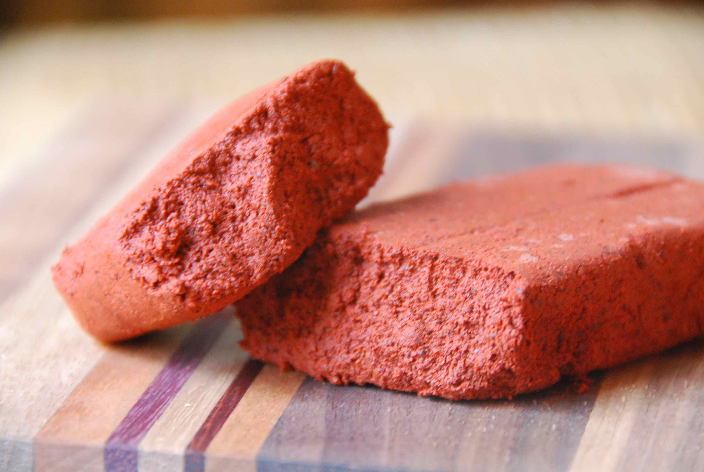

# Recado Rojo

*The brick-red spice paste that anchors Guatemalan cooking: toasted dried chillies, achiote, charred tomato and warming spices ground into a thick paste. The base of tamales colorados, hilachas and the red recados of the highlands.*

**Serves:** Makes about 350 g paste (enough for two dishes)

**Prep Time:** 15 minutes

**Cook Time:** 25 minutes

## Overview
Recado rojo (the Guatemalan kind, not to be confused with the Yucatecan recado of the same name) is the toasted spice paste at the heart of half the country's stews. Dried guaque and pasa chillies are seeded and pressed onto a hot comal until they smell sweet; achiote is bloomed in warm broth; tomatoes, tomatillos, onion and garlic are charred whole. Everything is blended with toasted cinnamon, cloves and coriander seed into a thick brick-red paste, sieved smooth, then optionally fried in lard until it darkens and the fat separates. Used as the base for tamales colorados, hilachas, jocón rojo and the red recados of Cobán and Antigua. Make a big batch and freeze in portions.

## Ingredients

### For the chilli paste
- 4 dried guaque chillies (seeded; ancho substitutes)
- 2 dried pasa chillies (seeded; pasilla works)
- 1 dried chile cobanero (or chile de árbol, optional, for heat)

### For the achiote
- 2 tbsp achiote seeds (annatto)
- 100 ml warm chicken or vegetable broth

### For the base
- 4 large ripe tomatoes
- 4 tomatillos, husked
- 1 large white onion, halved
- 6 garlic cloves, skin on
- 1 cinnamon stick (5 cm)
- 4 whole cloves
- 1 tsp coriander seeds
- 1 tsp black peppercorns
- 1 tsp ground allspice
- 1 stale corn tortilla, torn
- 1 tsp salt

### For frying (optional, for finished paste)
- 2 tbsp lard or vegetable oil

## Method

### Stage 1 - Bloom the achiote
1. Combine the achiote seeds and warm broth in a small pan over very low heat.
2. Steep for 10 minutes until the broth turns deep orange-red.
3. Strain, discarding the seeds. Reserve the red infusion.

### Stage 2 - Toast the chillies
1. Set a dry comal or heavy frying pan over medium heat.
2. Open the dried chillies flat. Press onto the comal for 8 to 10 seconds a side until pliable and fragrant. Do not let them blacken or the paste turns bitter.
3. Tear into pieces and soak in 250 ml warm water for 15 minutes to soften.

### Stage 3 - Char the vegetables
1. On the same hot comal, char the tomatoes, tomatillos, onion halves and garlic cloves, turning often, until the skins blister and blacken in patches, 8 to 10 minutes.
2. Peel the garlic. Leave the tomato and onion skins on.

### Stage 4 - Toast the spices
1. Briefly toast the cinnamon stick (broken into pieces), cloves, coriander seeds and peppercorns on the comal for 30 to 45 seconds until they smell fragrant. Cool, then grind to a powder in a spice mill or mortar.

### Stage 5 - Blend
1. Combine the soaked chillies and their soaking liquid, the charred vegetables, the achiote infusion, the ground spices, the allspice, the torn tortilla and the salt in a blender.
2. Blend on high for 90 seconds until smooth and thick, like a loose tomato paste. Add a splash more broth if it will not blend.
3. Pass through a coarse sieve, pressing the solids through, to remove the chilli skins and tomato seeds.

### Stage 6 - Fry the paste (optional)
1. Heat the lard in a heavy pan over medium heat.
2. Pour in the sieved paste; it spits.
3. Fry for 8 to 10 minutes, stirring constantly, until it darkens to brick-red and the fat beads on top. This is the step that turns a sauce into a recado.
4. Cool, then store.

## Notes
- **Toast, don't burn.** A toasted chilli smells sweet and grassy; a burned one smells acrid and turns the paste bitter. 8 seconds a side is plenty.
- **Sieve for texture.** The recado is meant to be smooth and silky. Chilli skins and tomato seeds are the texture-killers.
- **Bloom achiote in fat or broth.** Dry-ground achiote stays gritty; the colour and flavour need a warm liquid to release.
- **The frying step concentrates everything.** Unfried paste is sharper and brighter; fried paste is deeper and more savoury. Both have a place.
- **Make a big batch.** It freezes brilliantly in 100 g portions; each portion is enough for one dish for 4 people.

## Variations
- **With sesame and pumpkin seed:** add 50 g toasted pumpkin seed and 30 g sesame to the blend for the recado of pepián or kak'ik.
- **Recado negro:** double the chillies and toast them until almost black (the burnt note is intentional in negro), for tamales negros.
- **Sweeter:** add 50 g dark chocolate to the fried paste for a mole-style recado.
- **Smokier:** add a chipotle in adobo to the soaked chillies.
- **Drier paste:** reduce on the heat further after frying for a tamal-stuffing consistency.

## Serving
- As the base of pepián, hilachas, tamales colorados, kak'ik · stirred into rice · spread on tortillas for tacos rápidos · simmered with chicken or pork

## Storage
- Refrigerates 2 weeks in a sealed jar with a film of oil on top
- Freezes 6 months in 100 g portions
- Thaw overnight in the fridge before using

