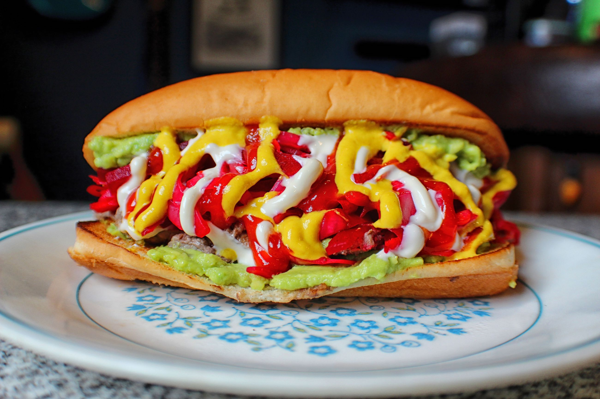

# Shucos (Guatemalan Hot Dog)

*Guatemala City's avocado-wrapped hot dog: a bacon-wrapped hot dog tucked into a corn tortilla smeared with smashed avocado, layered with shredded raw cabbage, chopped tomato, chopped onion and mayo, then rolled like a soft taco. The Guatemalan street-corner standard; the dog dressed in green avocado from end to end.*

**Serves:** 4

**Prep Time:** 25 minutes

**Cook Time:** 15 minutes

## Overview
The shuco is Guatemala's national hot dog and a fixture of Guatemala City street corners, particularly the famous shuco stands along the Avenida La Reforma, where vendors have been making them since the 1950s. The name "shuco" derives from a Guatemalan slang word for "dirty", referring to the messy eating experience, not anything about cleanliness. The construction is distinctive: instead of a bread bun, the hot dog sits inside a soft corn tortilla (Guatemalan corn tortillas are made from masa harina, smaller and softer than Mexican tortillas, more like a flatbread). The tortilla is generously smeared with smashed avocado (the central ingredient, avocado coats the inside of the tortilla like a sauce). A grilled hot dog wrapped in bacon is laid down the centre. Topped with shredded raw cabbage (cool and crunchy), chopped tomato, chopped white onion, a stripe of mayonnaise, and optionally a chopped Guatemalan ají chilli or jalapeño for heat. Rolled into a soft handheld tube.

## Ingredients

### Dogs and bacon
- 4 hot dogs (any quality pork-and-beef frankfurter)
- 8 strips streaky bacon (2 per dog)
- Wooden toothpicks

### Tortillas
- 8 medium soft corn tortillas (Guatemalan-style or Mexican corn tortillas, about 15cm wide); or substitute with soft flour tortillas

### Smashed avocado
- 4 ripe avocados (peeled, stoned)
- Juice of 2 limes
- 1 small bunch fresh cilantro (chopped fine)
- 1 ½ teaspoons fine sea salt
- 1 garlic clove (crushed; optional)

### Toppings
- 300 g white cabbage (very finely shredded)
- 2 medium tomatoes (chopped)
- 1 small white onion (finely chopped)
- 1 fresh red chilli or jalapeño (chopped; optional)
- 4 tablespoons mayonnaise
- 4 tablespoons ketchup
- 4 tablespoons yellow mustard
- 2 tablespoons crumbled queso fresco (optional)

### To serve
- A cold Gallo (Guatemalan beer)
- Or a freshly-squeezed lime juice (limonada)
- Hot sauce on the side for those who want extra heat

## Method

### Stage 1 - Wrap dogs in bacon
1. Take each hot dog; wrap two strips of streaky bacon around it in a tight spiral.
2. Secure both ends with toothpicks.

### Stage 2 - Make smashed avocado
1. In a bowl, mash the avocados with a fork.
2. Add lime juice, chopped cilantro, salt, garlic (if using).
3. Mix till slightly chunky-creamy (not fully smooth; the texture is part of the experience).
4. Cover with cling film pressed onto the surface (prevents browning) till assembly.

### Stage 3 - Grill the bacon-wrapped dogs
1. Heat a barbecue, grill pan, or wide cast-iron pan to medium-high.
2. Cook the bacon-wrapped dogs 6-8 minutes, turning, till the bacon is deeply browned and crispy and the dog is heated through.
3. Remove toothpicks.

### Stage 4 - Warm the tortillas
1. Heat a dry pan or comal over medium heat.
2. Warm each tortilla 30 seconds per side till soft and pliable, slightly toasted but not crispy.
3. Stack in a clean kitchen towel to keep them soft.

### Stage 5 - Build the shuco
1. Lay a warm tortilla flat on a board.
2. Spread a generous layer of smashed avocado across the centre of the tortilla (about a 4cm-wide strip down the middle).
3. Place a bacon-wrapped dog along the avocado strip.
4. A heap of shredded raw cabbage piled on top of the dog.
5. A scatter of chopped tomato.
6. A scatter of chopped onion.
7. Optional: chopped chilli for heat.
8. A zigzag of mayonnaise, ketchup, and mustard.
9. Optional: crumbled queso fresco.

### Stage 6 - Roll
1. Fold one end of the tortilla up over the bottom of the filling.
2. Fold one long side over the top of the filling.
3. Continue rolling tightly into a soft burrito-style tube.
4. Optional: wrap in foil to hold the shape.

### Stage 7 - Serve immediately
1. Eat with both hands.
2. A cold Gallo or limonada.
3. Hot sauce on the side.

## Notes
- **Corn tortilla, not bread:** the Guatemalan structural signature.
- **Avocado smeared inside:** the traditional green coating; not optional.
- **Bacon-wrapped dog:** the Tijuana/Sonoran influence; Guatemala adopted it.
- **Roll tight:** loose rolls fall apart when eaten.

## Variations
**Shuco mixto:** add a chorizo + a hot dog together inside the same tortilla (the "mixed shuco").
**Shuco con longaniza:** swap the hot dog for grilled Guatemalan longaniza sausage.
**Shuco con queso:** add a slice of melted queso fundido inside.
**Spicier:** add Guatemalan ají chilli sauce (similar to Mexican salsa roja).
**Vegetarian:** swap the dog for grilled portobello strips; keep the avocado and toppings.

## Serving
At a Guatemala City street stand on Avenida La Reforma at lunch; at a Quetzaltenango fair; at an Antigua food market; at home with a cold beer.

## Storage
- Smashed avocado refrigerates 1 day (press cling film onto the surface to prevent browning).
- Cooked bacon-wrapped dogs refrigerate 3 days.
- Tortillas: best fresh; freeze 1 month.
- Don't assemble in advance.
