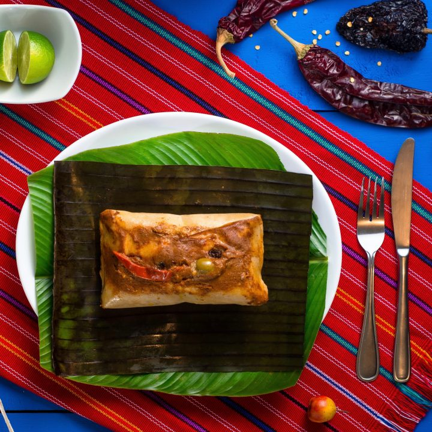

# Tamales Colorados

*The red Christmas tamales of Guatemala: corn masa wrapped around a piece of chicken in achiote-and-tomato sauce, dotted with raisin, olive and sweet pepper, then steamed in banana leaves. The Christmas Eve table from Cobán to the coast.*

**Serves:** Makes 12 tamales

**Prep Time:** 1 hour

**Cook Time:** 2 hours

## Overview
Tamales colorados are the red Christmas tamales of Guatemala, distinct from their Mexican cousins in shape (squarer, fatter parcels in banana leaves rather than corn husks), in the masa (fresh nixtamalised maize with lard, salted but not seasoned with chilli), and in the sauce (a brick-red recado of achiote, tomato, dried guaque, sesame and pumpkin seed). A piece of chicken is bathed in the sauce, set into a bed of masa, garnished with a raisin, a pitted green olive, a strip of red pepper and a chickpea, then folded up tight in banana leaf and steamed. The Christmas Eve dish, made in batches of fifty by the abuelas of the family. Eaten at midnight after mass, with a mug of ponche.

## Ingredients

### For the chicken
- 1 kg chicken thighs, bone in skin on
- 1.5 litres water
- 1 onion, halved
- 1 head garlic, halved
- 2 bay leaves
- 1 tbsp salt

### For the red recado
- 4 large ripe tomatoes
- 4 tomatillos
- 1 onion, halved
- 6 garlic cloves, skin on
- 3 dried guaque chillies (seeded; ancho substitutes)
- 2 dried pasa chillies (or pasilla)
- 2 tbsp achiote seeds (annatto)
- 50 g pumpkin seeds
- 30 g sesame seeds
- 1 cinnamon stick (5 cm)
- 4 whole cloves
- 1 tsp coriander seeds
- 1 stale corn tortilla, torn
- 1 slice bread, torn
- 1 tsp salt

### For the masa
- 1 kg fresh corn masa (or 500 g masa harina mixed with 750 ml warm broth)
- 200 g lard, melted (or vegetable shortening)
- 2 tsp salt
- 250 to 350 ml reserved chicken broth (as needed)

### To assemble
- 12 banana leaf squares (30 x 30 cm), warmed over a flame to soften
- 24 pitted green olives
- 24 raisins
- 24 cooked chickpeas
- 12 strips of red bell pepper (roasted or tinned pimento)
- Kitchen string for tying

## Method

### Stage 1 - Poach the chicken
1. Combine the chicken, water, onion, garlic, bay and salt in a heavy pot. Bring to a simmer over medium-high heat, skim.
2. Drop to low and simmer gently for 35 minutes until cooked through. Lift out and cool. Strain and reserve the broth.
3. Cut the chicken into 12 pieces, leaving the bones in.

### Stage 2 - Make the recado
1. Bloom the achiote in 4 tablespoons warm broth for 10 minutes; strain, reserving the red liquid.
2. Toast the pumpkin seeds and sesame seeds on a dry comal until they pop and turn pale gold, 3 to 4 minutes. Tip into a bowl.
3. Char the tomatoes, tomatillos, onion and garlic on the comal until blistered, 8 minutes. Peel the garlic.
4. Toast the dried chillies for 8 seconds a side; soak in 250 ml warm broth for 10 minutes.
5. Toast the cinnamon, cloves and coriander seeds briefly.
6. Blend the soaked chillies and liquid, the charred vegetables, toasted seeds and spices, the achiote infusion, the torn tortilla and bread with another 250 ml broth until smooth. Sieve.
7. Bring the sauce to a simmer in a wide pan with the chicken pieces. Cook 15 minutes; the sauce thickens and the chicken takes on the red. Lift the chicken out; reserve sauce separately.

### Stage 3 - Mix the masa
1. Whisk the melted lard into the masa with the salt, working it in by hand for 5 minutes until light and fluffy.
2. Add warm broth, 50 ml at a time, until the masa is the texture of soft mashed potato that holds its shape.
3. The masa should taste salted but be otherwise neutral.

### Stage 4 - Assemble
1. Lay a softened banana leaf shiny-side up.
2. Spoon a heaped 100 g of masa into the centre and spread to a 12 cm square, about 1.5 cm thick.
3. Set a piece of chicken in the middle; spoon over 2 tablespoons of the red sauce.
4. Top with 2 olives, 2 raisins, 2 chickpeas and a strip of pepper.
5. Fold the bottom of the leaf up, the top down to overlap, then the sides in to make a square parcel.
6. Tie with string in both directions. Repeat for all 12.

### Stage 5 - Steam
1. Stand the tamales upright in a large steamer over plenty of boiling water (or layer flat in a tall pot).
2. Cover and steam at a steady boil for 1 hour 30 minutes. Top up the water as needed.
3. Test one: the masa should pull cleanly from the leaf and feel firm but tender. If sticky, steam 15 more minutes.
4. Rest 10 minutes before unwrapping at the table.

## Notes
- **Banana leaves perfume the masa.** They are not interchangeable with corn husks for this dish; the flavour is part of the recipe. Warm over a gas flame for 5 seconds a side to make them pliable and bring out the perfume.
- **Fresh masa** is ideal (from a Latin tortilleria); masa harina mixed with broth works but lacks the same toothy bounce.
- **The garnishes matter.** The olive, raisin, chickpea and pepper strip are not decoration; they are the marker that distinguishes a Guatemalan colorado from any other tamal.
- **Rest before unwrapping.** Hot tamales tear; 10 minutes of rest lets the masa firm up.
- **Cobán style** uses pork instead of chicken and adds a slice of hard-boiled egg.

## Variations
- **Tamales negros:** the sweet version, with chocolate and prunes in the sauce, served at Christmas dessert.
- **Tamales de chipilín:** with chipilín herb folded into the masa, no meat, an everyday version.
- **Tamales de iguana:** the coastal Petén version with iguana meat (when permitted).
- **Paches:** the Quetzaltenango cousin, made with potato instead of corn masa.
- **Chuchitos:** smaller, drier tamales in dried corn husk; an everyday street snack.

## Serving
With ponche · hot chocolate · a cup of black coffee · pickled chillies on the side · the family around the table on Christmas Eve

## Storage
- Steamed tamales keep 4 days refrigerated and freeze 3 months in their leaves
- Re-steam from the fridge for 15 minutes or from frozen for 35 minutes
- Do not microwave in the leaf (steam buildup splits the wrap); unwrap onto a plate first
