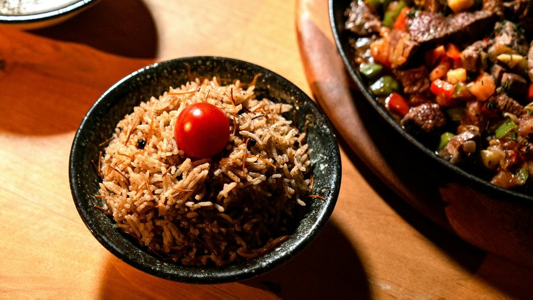

# Diri Ak Djon Djon

*Slate-black celebration rice from northern Haiti. Long-grain steeped in wild djon djon mushroom broth, with peas folded through.*

**Serves:** 6

**Prep Time:** 15 minutes (plus 30 minutes soaking)

**Cook Time:** 45 minutes

## Overview
Dried djon djon mushrooms are soaked in hot water for 30 minutes; the inky black soaking liquid is strained and reserved (the mushrooms themselves are mostly discarded or used minimally). Aromatics, shallot, garlic, thyme, parsley, Scotch bonnet, épis, are sweated in oil, then green peas and lima beans are added, then long-grain rice is stirred in to coat. The djon djon broth is poured over the rice; the pot is covered and steamed gently until the rice is tender and slate-black. Garnished with parsley and served as the centrepiece of any meal it appears in.

## Ingredients

### Djon djon broth
- 50 g dried djon djon mushrooms (about 1 cup loose)
- 1 litre hot water

### Rice
- 4 tablespoons vegetable oil (or 2 tablespoons oil and 30 g butter)
- 1 shallot (large, finely chopped)
- 6 garlic cloves (finely chopped)
- 1 Scotch bonnet (whole, pierced; remove before serving)
- 2 sprigs fresh thyme
- 2 tablespoons épis (Haitian green seasoning - see Notes)
- 100 g frozen green peas
- 100 g cooked lima beans (or butter beans)
- 400 g long-grain rice (basmati or jasmine)
- 1 ½ teaspoons salt
- ½ teaspoon black pepper
- 2 cloves
- 1 small bunch parsley (chopped, to finish)

### To serve
- Griot or stewed chicken
- Pikliz
- Sliced avocado

## Method

### Stage 1 - Steep the djon djon
1. Rinse the dried djon djon mushrooms briefly under cold water to remove grit (they often come with stalks attached).
1. Tip into a heatproof bowl. Pour over the litre of hot water.
1. Steep 30 minutes, pressing the mushrooms down once or twice. The water will turn deep black.
1. Strain through a fine sieve (or coffee filter / muslin) into a measuring jug. You should have around 750-800 ml of inky black broth. Top up with hot water if needed.
1. Discard most of the spent mushrooms; you can keep a tablespoon of the softened ones to scatter through the finished rice if you like.

### Stage 2 - Aromatics
1. Heat the oil (and butter if using) in a heavy lidded pot over medium heat.
1. Add the shallot; cook 3-4 minutes until softened.
1. Add the garlic, thyme sprigs and cloves; stir 30 seconds.
1. Add the épis; stir 1 minute until fragrant.
1. Add the peas and lima beans; stir to coat.

### Stage 3 - Toast the rice
1. Add the rice to the pot. Stir thoroughly so every grain is coated in the oil and aromatics. Cook 1-2 minutes - this is the toasting step that keeps the grains separate.
1. Add the salt and pepper.

### Stage 4 - Steam
1. Pour in the djon djon broth (use 750 ml for slightly drier rice, 800 ml for softer). Lay the pierced Scotch bonnet on top.
1. Bring to a vigorous boil, uncovered, until the level of liquid drops below the surface of the rice - around 3-4 minutes.
1. Reduce heat to the lowest setting. Cover tightly (a folded tea towel under the lid helps trap steam).
1. Cook 18-20 minutes without lifting the lid.
1. Turn off the heat. Leave covered another 10 minutes to finish steaming.

### Stage 5 - Finish
1. Remove and discard the Scotch bonnet and thyme stems.
1. Fluff the rice gently with a fork. The grains should be slate-black, separate and tender.
1. Scatter chopped parsley over the top.

### Stage 6 - Serve
1. Spoon onto warmed plates as the base for griot or stewed chicken, with pikliz and avocado on the side.

## Notes
- **Djon djon substitute:** the real mushroom is hard to find outside Haitian groceries. A fair fallback: 25 g dried porcini steeped the same way, plus 1 teaspoon squid ink (or 1 sachet of cuttlefish ink) stirred into the strained broth for colour. The flavour is not identical but the deep earthy savouriness is close, and the colour is right. Some cooks add a pinch of activated charcoal for purely cosmetic black, but it adds no flavour.
- **Strain the broth carefully:** djon djon mushrooms grow on dead wood and shed grit when soaked. Strain through a fine sieve, then again through muslin or a coffee filter for the cleanest broth.
- **The mushrooms themselves are not really eaten:** they are flavouring agents, like tea leaves. Most are discarded after steeping. A tablespoon of softened mushrooms scattered through the finished rice is optional.
- **Pierced Scotch bonnet:** the whole pepper on top of the rice infuses gentle heat without breaking and overwhelming the dish. If it bursts during cooking, the rice becomes very hot. Pierce a couple of small holes only.
- **Épis:** see the griot recipe for the standard épis paste, or use any Caribbean green seasoning.

## Variations
**Diri djon djon ak kribich:** with prawns or shrimp stirred through the rice for the last 5 minutes of cooking - a coastal Cap-Haïtien variant.
**With crab:** small whole crabs (or large crab claws) are simmered briefly in the broth before the rice goes in - common at weddings.

## Serving
Serve with: griot (the classic pairing), stewed chicken (poul nan sòs), pikliz, sliced avocado, fried plantains. Almost always part of a larger Haitian Sunday spread rather than a stand-alone meal.

## Storage
- Keeps 3 days refrigerated; reheat in a covered pan with a sprinkle of water, or in the microwave covered.
- Freezes 2 months but rice texture is best fresh. Thaw overnight in the fridge; reheat with a little added water.
