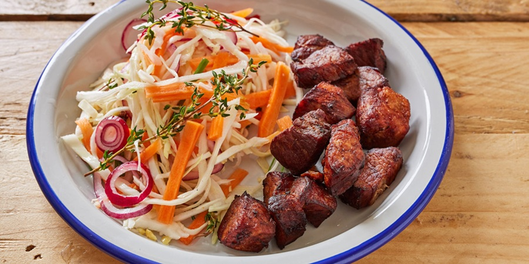

# Griot

*Haiti's Sunday-dinner pork: shoulder steeped in épis, simmered slow, then fried until it crackles. Served with sharp pikliz slaw.*

**Serves:** 6

**Prep Time:** 20 minutes (plus overnight marinating)

**Cook Time:** 1 ½ hours

## Overview
Pork shoulder is cubed and marinated overnight in a punchy mixture of épis, bitter orange juice, lime juice, garlic, Scotch bonnet, thyme and salt. The next day the pork simmers in its own marinade until tender (the meat goes in cold and comes up to a slow simmer; the marinade reduces almost entirely as it cooks). Once the pork is fork-tender and the liquid has cooked down to a sticky glaze, the cubes are drained dry and deep-fried in hot oil for 5-7 minutes until the outsides crackle and brown. Served piping hot with pikliz, rice, beans and plantains.

## Ingredients

### Pork and marinade
- 1 ½ kg pork shoulder (boneless, cut into 4 cm cubes - leave some fat on)
- 4 tablespoons épis (Haitian green seasoning); recipe in Notes
- 1 shallot (large, finely chopped)
- 6 garlic cloves (crushed)
- 1 Scotch bonnet (deseeded and chopped; a whole one if you want serious heat)
- 4 sprigs fresh thyme (leaves stripped)
- 2 tablespoons fresh parsley (chopped)
- 4 spring onions (sliced)
- 2 limes (juice)
- 2 oranges (use bitter seville orange if possible; otherwise a regular orange plus a splash more lime, juice)
- 2 tablespoons white vinegar
- 1 tablespoon tomato paste
- 1 ½ teaspoons salt
- 1 teaspoon freshly ground black pepper

### For frying
- 1 litre vegetable oil (for deep-frying)

### To serve
- Pikliz (Haitian pickled slaw with Scotch bonnet)
- Diri ak pwa (rice and red beans)
- [Fried Plantains](../jamaican/side-dishes/fried-plantains.md)
- Lime wedges

## Method

### Stage 1 - Marinate (the day before)
1. Trim heavy fat caps off the pork but leave some fat for flavour. Cut into 4 cm cubes.
1. Rinse the pork in cold water with a splash of vinegar and the juice of 1 lime; pat dry. This is a Haitian habit (lave vyann) that you can skip if you prefer.
1. Combine in a large bowl: épis, shallot, garlic, Scotch bonnet, thyme, parsley, spring onions, lime juice, orange juice, vinegar, tomato paste, salt and pepper.
1. Add the pork; toss thoroughly so every cube is coated.
1. Cover and refrigerate at least 8 hours, ideally overnight.

### Stage 2 - Slow simmer
1. Tip the pork and all the marinade into a heavy wide pot (a Dutch oven is ideal).
1. Bring to a gentle boil over medium-high heat. Reduce to medium-low.
1. Cook uncovered 1 hour 15 minutes, stirring every 10 minutes, until the pork is fork-tender and the marinade has reduced to a thick, sticky glaze coating the cubes. If the liquid threatens to dry out before the pork is tender, add a splash of water; if there is still loose liquid at the end, raise the heat to reduce it.
1. Lift the pork onto a tray; spread out and let cool 10-15 minutes so the surfaces dry. Reserve any sticky residue from the pan for spooning over the finished dish.

### Stage 3 - Deep-fry
1. Heat the oil in a deep heavy pot to 180°C / 360°F.
1. Working in 3 or 4 batches (do not crowd), lower the pork cubes in.
1. Fry 5-7 minutes per batch, turning, until the surfaces are deep amber and crackled.
1. Lift onto a wire rack lined with kitchen paper. Sprinkle with a pinch of salt immediately.
1. Keep warm in a low oven (90°C) while you fry the rest.

### Stage 4 - Serve
1. Pile the griot on a warm serving plate.
1. Drizzle over any reserved sticky glaze from the simmering pan.
1. Serve with a generous mound of pikliz on the side, rice and beans, fried plantains and lime wedges.

## Notes
- **Épis is the heart of Haitian cooking:** the green seasoning paste made by blitzing parsley, scallion, garlic, bell pepper, thyme, lime juice and oil. Most Haitian households keep a jar in the fridge. Blitz a small bunch of parsley, 6 spring onions, 1 green bell pepper, 8 garlic cloves, 4 thyme sprigs, juice of 1 lime, 2 tablespoons olive oil, salt and pepper into a coarse paste. Keeps 2 weeks refrigerated.
- **Bitter orange (sour orange) is the right citrus:** in Haiti, zoranj si (bitter Seville orange) is the marinating acid. If you can find Seville oranges, use them. The widely available substitute is a mix of orange juice and lime juice; the lime brings the missing bitterness.
- **Two-stage cook is non-negotiable:** the simmer cooks the meat through and infuses it; the fry crackles the surface. Skipping the simmer gives tough fried pork; skipping the fry gives a flat, soft, stewed pork. Both stages matter.
- **Pikliz, not coleslaw:** the dish is built around the contrast with pikliz, a vinegar-and-Scotch-bonnet slaw that has been steeping in the fridge for at least 24 hours. A pile of pikliz on each plate is mandatory.
- **Dry the cubes before frying:** wet pork will spit violently in hot oil. Spread on a tray and let the surfaces dry for at least 10 minutes after the simmer; pat with kitchen paper if needed.

## Variations
**Griot bourjwa:** the "bourgeois" version, with a slick of caramelised sugar added during the simmer for extra colour and sweetness.
**Tasso pork:** for true street vendors, the pork is sliced thinner and dried slightly before frying, giving a more jerky-like texture; the dish is then often called tasso kabrit when made with goat.

## Serving
Serve with: pikliz (mandatory), diri ak pwa (rice and red beans), diri ak djon-djon (black mushroom rice for special occasions), fried sweet plantains (banann peze), avocado slices and lime wedges. A glass of Barbancourt rum on the side if you are properly Haitian about it.

## Storage
- Keeps 3 days refrigerated. The fry crust softens overnight; reheat in a hot oven (200°C) on a wire rack for 10 minutes to re-crisp.
- Freezes 2 months. Thaw overnight; reheat in a hot oven; the texture will be slightly less crackled but flavour is preserved.
