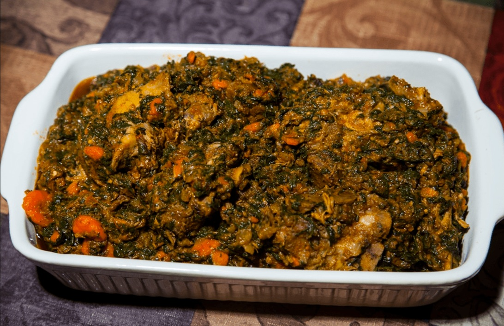

# Legume

*Haiti's mixed-vegetable stew: cabbage, watercress, eggplant, chayote, carrot and spinach simmered together with epis (the green seasoning paste), Scotch bonnet and beef or crab till the vegetables collapse into a thick savoury stew. Eaten with rice on every Haitian Sunday table.*

**Serves:** 6

**Prep Time:** 30 minutes

**Cook Time:** 1 hour 15 minutes

## Overview
Legume is Haiti's mixed-vegetable Sunday stew, the dish that turns up on every Haitian family table at least once a week and at every fete and celebration: a thick deeply savoury stew of finely chopped cabbage, watercress, eggplant, chayote, carrot, spinach and any other green vegetable in season, simmered with epis (the Haitian green seasoning paste), Scotch bonnet, tomato paste and either beef or crab till the vegetables collapse into a thick rust-coloured stew. Epis is the flavour foundation: a fresh paste of parsley, scallion, garlic, bell pepper, thyme, lime and oil that every Haitian kitchen keeps in a jar to use across every dish. The long cook matters; after an hour of slow simmering the vegetables collapse into a single thick mass where individual ones disappear. The Scotch bonnet floats whole and unpierced in the pot for aroma and gentle heat; jalapeño or milder chillies miss the soul of Haitian heat.

## Ingredients

### Vegetables
- 400 g green cabbage (finely shredded)
- 200 g spinach or watercress (washed, stems removed, roughly chopped)
- 1 medium aubergine (cut into 2 cm cubes)
- 1 chayote or 2 small courgettes (peeled, deseeded, cut into 2 cm cubes)
- 2 medium carrots (peeled, cut into 1 cm rounds)
- 1 small turnip (optional, peeled, cut into 2 cm cubes)
- 200 g pumpkin or butternut squash (peeled, cut into 2 cm cubes; optional but traditional)

### Aromatics
- 3 tablespoons epis (Haitian green seasoning paste; or make a quick version by blending 4 spring onions, 4 garlic cloves, 1 green pepper, large handful flat-leaf parsley, 4 sprigs thyme, juice of 1 lime, 3 tablespoons olive oil)
- 1 large onion (finely chopped)
- 4 garlic cloves (crushed)
- 2 tablespoons tomato purée

### Protein
- 500 g beef shin or stewing beef (cut into 2 cm cubes; or 300 g picked white crab meat + 200 g pumpkin substituted for crab if vegetarian)

### Liquid and heat
- 1 whole Scotch bonnet chilli (left whole, not pierced; or 2 if you want serious heat)
- 1 litre beef stock (or water)
- 1 tablespoon vegetable oil

### Seasoning
- 2 teaspoons fine sea salt
- 1 teaspoon ground black pepper
- 1 sprig fresh thyme
- 1 lime (juice; added at the end)

### To serve
- Boiled white rice or [diri kole ak pwa](side-dishes/diri-kole.md) (rice and beans)
- [Pikliz](side-dishes/pikliz.md) (pickled cabbage relish)

## Method

### Stage 1 - Brown the beef (if using meat)
1. Heat the tablespoon of vegetable oil in a wide heavy casserole over medium-high heat.
2. Pat the beef cubes dry, season with half the salt and pepper, and brown in batches for 3-4 minutes per batch till deeply caramelised on most sides. Don't crowd the pan.
3. Tip the browned beef into a bowl and set aside.
4. (Skip this step entirely if making the crab version.)

### Stage 2 - Build the aromatic base
1. Reduce the heat to medium. In the same pan, add the chopped onion (no need for extra oil; the beef fat is plenty) and sweat for 5-6 minutes till soft and gold.
2. Stir in the crushed garlic and tomato purée; cook 2 minutes till the tomato darkens.
3. Add the epis and stir for a minute; the kitchen will smell green and herbal as the epis hits the hot pan.

### Stage 3 - Add the beef and tough vegetables
1. Return the browned beef to the pan along with any resting juices.
2. Add the carrots, turnip (if using) and pumpkin/butternut squash (if using).
3. Pour in the beef stock; the liquid should just cover the meat.
4. Tuck the whole Scotch bonnet into the stew (left whole; don't pierce it).
5. Add the thyme sprig.
6. Bring to a simmer, cover, and cook 45 minutes till the beef begins to tenderise.

### Stage 4 - Add the softer vegetables
1. After 45 minutes, add the aubergine, chayote (or courgette) and shredded cabbage to the pot.
2. Stir well; the pot will look full but the cabbage collapses rapidly.
3. Cover and continue simmering for another 25-30 minutes till everything is properly tender and starting to collapse together. Stir every 10 minutes.

### Stage 5 - Add the greens
1. Add the spinach or watercress.
2. If using crab instead of beef, add the picked crab meat now too.
3. Cook another 5-7 minutes till the greens wilt and the crab heats through.

### Stage 6 - Finish
1. Remove the whole Scotch bonnet (carefully; the skin is fragile and breaking it releases dangerous heat into the stew). Discard.
2. Discard the thyme sprig.
3. Stir in the remaining salt and pepper.
4. Squeeze in the lime juice and stir.
5. Taste and adjust salt. The legume should be a thick chunky stew, not a soup; if it's too liquid, simmer uncovered for 5 minutes more to reduce.

### Stage 7 - Serve
1. Spoon over hot rice or rice-and-beans in deep bowls.
2. Top each portion with a generous spoonful of pikliz on the side.
3. Provide an extra Scotch bonnet at the table for those who want serious heat (warning: only those who know what they're doing).

## Notes
- **Epis is the foundation:** Haitian cooking starts with epis, the green seasoning paste blended fresh weekly and kept in a jar in the fridge. If you cook Haitian regularly, make a big batch once a week. The classic recipe: blend 4 bunches of flat-leaf parsley, a head of garlic peeled, 6 spring onions, 1 green pepper, 1 onion, 1 hot chilli, large bunch of thyme, juice of 2 limes and 100 ml olive oil to a coarse paste. Keeps 2 weeks refrigerated.
- **Add vegetables in stages:** the tough vegetables (carrot, turnip, pumpkin) need the full 45 minutes; the medium ones (cabbage, aubergine, chayote) need 25-30; the greens need only 5. Adding them in stages gives you everything properly cooked but not collapsed to mush.
- **Whole Scotch bonnet is the right approach:** an unpierced Scotch bonnet floating in the stew infuses fruit-flavoured heat without making the whole pot fierce. Diners who want more heat can pierce the chilli on their own plate. Pierce the chilli in the pot and the whole stew goes blazing hot.
- **Long cook is what makes it legume, not just stew:** properly cooked legume has lost the distinctness of individual vegetables; everything has collapsed into a single thick chunky stew with deep meld flavours. If you can still tell carrot from cabbage from aubergine, you haven't cooked long enough.
- **Crab version is brilliant in summer:** when crab is in season, the crab version is a celebration dish. Use picked white crab meat (not shredded sticks) added in the last 5 minutes so it doesn't toughen.

## Variations
**Legume kribich (with shrimp):** swap beef for 400 g of large peeled prawns added in the last 5 minutes; quick weeknight version.
**Vegetarian legume:** skip the meat entirely; the vegetables and epis carry the dish. Add 200 g of pumpkin and a small can of butter beans for protein and body.
**Lalo legume:** add 200 g of finely shredded jute leaves (lalo, the slightly slippery green) at the same stage as the cabbage; the lalo adds a distinctive mucilaginous texture that's loved in Haitian cooking. Lalo is found in West African and Caribbean grocers.

## Serving
Spooned over hot rice or rice and beans, with a generous mound of pikliz alongside. The pikliz is non-negotiable; its sharp pickled cabbage and chilli is the crucial acidic counter to the rich slow-cooked legume. A glass of cremas (Haitian rum-and-coconut drink) for a celebration meal, or cold water and lime for everyday.

## Storage
- Keeps refrigerated 4 days; the flavour deepens significantly. Day-after legume is genuinely better than day-of.
- Freezes 3 months. Defrost in the fridge overnight and reheat gently over low heat.
- Don't microwave; the texture goes mushy.
