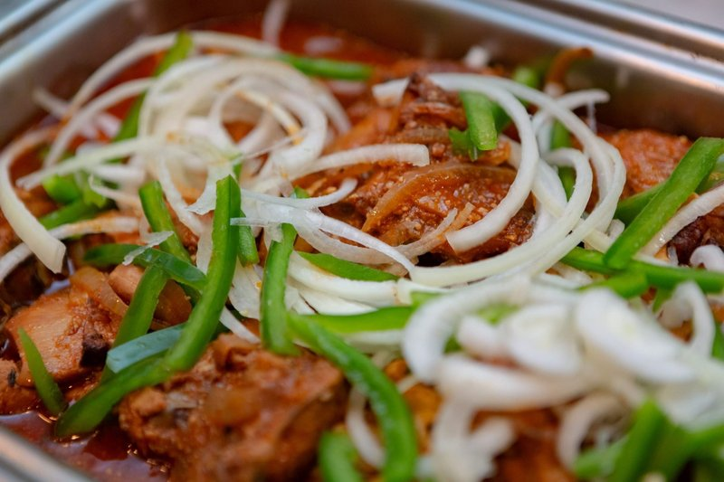

# Poul Ak Nwa

*Haiti's north-coast Sunday dish: chicken leg quarters braised in a tomato-and-cashew gravy, toasted cashew halves scattered through.*

**Serves:** 4

**Prep Time:** 30 minutes (plus 3-4 hours marinating)

**Cook Time:** 45 minutes

## Overview
A Sunday dish from Cap-Haïtien on Haiti's north coast where cashews have been a regional cash crop since colonial times. The name translates as "chicken with cashews" and the nut is everywhere: ground into powder and whisked into the gravy as a thickener (the technique parallels almond and walnut gravies in West African and Levantine cookery), and added whole-toasted near the end for texture. The flavour is unexpectedly creamy, like a cashew-cream sauce that happens to be tomato-based; mellow, sweet, faintly nutty, sat over a base of Haitian épis. A whole habanero in the bouquet garni adds quiet heat. The bouquet garni technique (wrapping herbs in cheesecloth) gives a clean, herb-free finished sauce. Served on the north coast over white rice with sliced avocado on the side; the cashew sweetness and the buttery avocado are the pairing that makes it.

## Ingredients

### Bouquet garni (wrap in cheesecloth)
- 6 sprigs thyme
- 4 sprigs parsley
- 2 scallions
- 1 habanero (whole)
- 1 teaspoon black peppercorns
- 4 cloves
- 4 garlic cloves

### Chicken and braise
- 4 chicken leg quarters (each cut into 2 pieces)
- 6 oz (~170 g) épis (Haitian green seasoning)
- Canola oil for searing
- 6 oz (~170 g) tomato paste
- 1 litre chicken stock (or broth)
- 2 tablespoons cashews (ground to powder)
- ½ cup toasted cashew halves
- ½ green bell pepper (julienned)
- ½ yellow onion (julienned)
- salt
- pepper

### To serve
- White rice
- Sliced avocado

## Method

### Stage 1 - Bouquet and marinate
1. Wrap the bouquet garni ingredients in a square of cheesecloth; tie with string.
1. Season the chicken pieces with the épis (Haitian green seasoning), salt and pepper.
1. Marinate 3-4 hours, overnight ideal.

### Stage 2 - Sear
1. Heat a generous slick of canola oil in a heavy pot over medium-high.
1. Sear the chicken in batches, 3 minutes per side, until deeply golden.
1. Set aside on a plate.

### Stage 3 - Tomato-cashew base
1. Reduce heat to low.
1. Add the tomato paste; cook 2-3 minutes, stirring constantly, until it darkens slightly.
1. Pour in the chicken stock; whisk to dissolve the paste.
1. Whisk in the ground cashew powder until smooth.

### Stage 4 - Braise
1. Return the chicken and any juices to the pot.
1. Add the bouquet garni.
1. Simmer covered 30 minutes until 75°C / 165°F internal.

### Stage 5 - Cashews and vegetables
1. Toast the cashew halves in a dry pan over medium heat 3-4 minutes until golden (or use pre-toasted).
1. Add the toasted cashew halves, julienned onion and bell pepper to the pot.
1. Cook uncovered 7 more minutes, stirring once or twice.

### Stage 6 - Serve
1. Discard the bouquet garni.
1. Taste; adjust salt.
1. Plate over white rice with sliced avocado on the side.

## Notes
- **Épis is the Haitian flavour base:** a fresh paste of parsley, scallion, garlic, bell pepper, thyme, lime juice and oil. Recipes online; or substitute Caribbean green seasoning.
- **Ground cashews thicken AND flavour:** the powder dissolves into the sauce as both a thickener and a flavour. Whole nuts at the end add texture but the powder does most of the work.
- **Bouquet garni for a clean sauce:** removing the aromatics in one bundle keeps the finished dish from being a herb-and-pepper hunt.

## Storage
- Keeps 3 days refrigerated; reheats well, the cashew sauce deepens overnight.
- Freezes 2 months. Thaw overnight; reheat gently.
