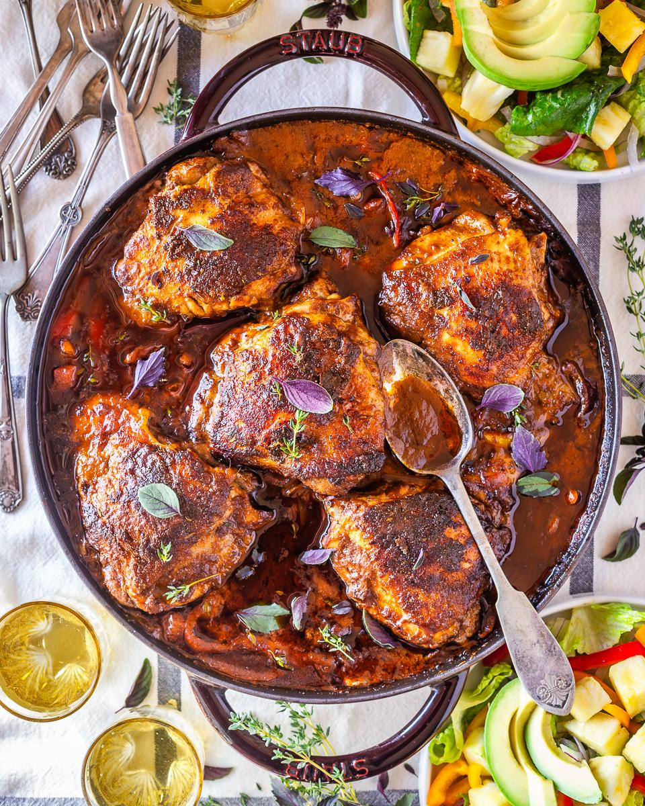

# Poulet Créole

*Haiti's creole chicken stew: bone-in chicken pieces marinated in epis, browned hard, then simmered in a thick tomato-and-pepper sauce with Scotch bonnet, olives and capers. The dish you'll find at every restaurant chrétien on a Sunday in Port-au-Prince.*

**Serves:** 4-6

**Prep Time:** 25 minutes (plus 4 hours marinating)

**Cook Time:** 1 hour

## Overview
Poulet créole is Haiti's everyday creole chicken stew, a deeply flavoured tomato-and-pepper-based braise of bone-in chicken that turns up at every restaurant chrétien (the small mid-range restaurants of Port-au-Prince) at lunch on Sundays: chicken thighs and legs marinated in epis and sour orange juice, browned hard till the skin crisps to mahogany, then simmered in a thick sauce of tomato, onion, bell pepper, Scotch bonnet, olives and capers till the chicken falls off the bone and the sauce reduces to a glossy crimson-orange coat. The dish carries clear French colonial inheritance (the olives, capers and tomato-base braising come from Provençal cooking) crossed with West African and Taino influences (the Scotch bonnet, the epis, the rice-and-beans plating). The epis-and-sour-orange marinade needs four hours minimum, overnight better. The chicken must be browned hard before simmering; the fond on the pan bottom becomes the base of the sauce. The sauce reduces uncovered at the end to a glaze, not a soup; a watery sauce is a sign the cook stopped too soon.

## Ingredients

### Chicken
- 8 bone-in chicken thighs (or 4 chicken legs cut into drumstick and thigh; about 1.5 kg total)

### Marinade
- 5 tablespoons epis (Haitian green seasoning paste)
- 3 tablespoons sour orange juice (or 2 tablespoons lime juice + 1 tablespoon bitter orange marmalade dissolved in 1 tablespoon hot water)
- 4 garlic cloves (crushed)
- 1 teaspoon fine sea salt
- 1 teaspoon ground black pepper

### For browning
- 3 tablespoons vegetable oil

### Sauce base
- 1 large onion (finely sliced)
- 1 large red bell pepper (deseeded and finely sliced)
- 1 large green bell pepper (deseeded and finely sliced)
- 4 garlic cloves (finely chopped)
- 1 (400 g) tin chopped tomatoes
- 2 tablespoons tomato purée
- 300 ml chicken stock

### Finishing
- 1 whole Scotch bonnet chilli (left whole, or 1 deseeded and finely chopped for serious heat)
- 50 g pitted green olives (rinsed and halved)
- 2 tablespoons capers (drained)
- 3 thyme sprigs
- 1 teaspoon dried oregano
- 1 lime (juice; added at the end)
- 2 tablespoons fresh parsley (chopped, to serve)

### To serve
- [Diri kole ak pwa](side-dishes/diri-kole.md) (rice and beans)
- [Pikliz](side-dishes/pikliz.md)
- Sliced ripe avocado (optional)

## Method

### Stage 1 - Marinate (do this several hours ahead or the night before)
1. Place the chicken pieces in a wide non-reactive bowl.
2. Mix the epis, sour orange juice, crushed garlic, salt and pepper in a small bowl, then pour over the chicken.
3. Toss with your hands to coat every piece thoroughly, getting the marinade into every crevice.
4. Cover with cling film and refrigerate at least 4 hours, ideally overnight.

### Stage 2 - Brown the chicken
1. Lift the chicken pieces from the marinade with tongs, letting excess drip back into the bowl. Reserve the marinade.
2. Pat the chicken skin dry with kitchen paper (essential for proper browning).
3. Heat the vegetable oil in a wide heavy casserole over medium-high heat till shimmering.
4. Lay the chicken pieces in skin-side down (in batches of 4 to avoid crowding).
5. Brown 5-6 minutes till the skin is deep mahogany, then flip and brown the underside another 3-4 minutes.
6. Lift the browned pieces onto a plate; repeat with any remaining pieces.

### Stage 3 - Build the sauce base
1. Reduce the heat to medium. Pour off all but 2 tablespoons of the oil from the casserole.
2. Add the sliced onion to the pan; cook 5-6 minutes till soft and starting to colour, scraping up the browned bits from the bottom as the onions release moisture.
3. Add the sliced bell peppers and chopped garlic; cook another 5 minutes till the peppers soften.
4. Stir in the tomato purée; cook 1 minute till it darkens.
5. Add the tinned tomatoes, scraping up any remaining fond from the bottom.
6. Pour in the reserved marinade and the chicken stock.

### Stage 4 - Simmer the chicken
1. Return the browned chicken pieces to the pan, nestling them into the sauce skin-side up.
2. Tuck the whole Scotch bonnet into the sauce (or stir in chopped if going for serious heat).
3. Add the thyme sprigs and dried oregano.
4. Bring to a gentle simmer.
5. Cover with the lid slightly ajar and cook 35-40 minutes till the chicken is cooked through and the meat just starts to pull from the bone.

### Stage 5 - Reduce and finish
1. Lift the lid off entirely and continue simmering for another 10 minutes till the sauce reduces and thickens to a glossy crimson-orange glaze that coats the chicken. Spoon sauce over the chicken as it reduces.
2. Stir in the olives and capers; cook 2 minutes more so they warm through and release their salty brine into the sauce.
3. Remove the whole Scotch bonnet (carefully, without piercing) and discard.
4. Squeeze the lime juice over the chicken; stir gently.
5. Taste; adjust salt (the olives and capers already add saltiness so go gently).

### Stage 6 - Serve
1. Spoon the chicken pieces onto a wide serving platter.
2. Spoon the thick crimson sauce over and around the chicken.
3. Scatter chopped parsley over the top.
4. Serve hot with rice and beans, pikliz on the side, and slices of ripe avocado around the edge of the platter.

## Notes
- **Bone-in skin-on chicken matters:** the bones add flavour to the sauce as they simmer, and the skin gives the dish its glossy lacquered crimson finish after the browning step. Boneless chicken breast in this dish is a missed opportunity.
- **Marinade overnight:** 4 hours is the minimum; the proper Haitian approach is overnight (or even a full 24 hours) so the epis penetrates every fibre.
- **Brown hard, don't rush:** the deep caramelisation on the chicken skin during the browning stage is what gives the finished sauce its complex flavour. Pale browned chicken makes a pale-tasting sauce. Take the time to get the skin properly mahogany; don't move the pieces around till they release naturally.
- **Reduce uncovered at the end:** the lidded simmer cooks the chicken; the lid-off reduction concentrates the sauce to a glaze. Don't skip the second stage. The proper finish is a thick sauce that coats a spoon, not a thin watery braising liquid.
- **Olives and capers add the colonial-French note:** the brine of green olives and capers is what makes this a creole dish rather than a generic chicken stew. Don't skip them; they're the bridge between West African and French influences that defines Haitian creole.
- **Scotch bonnet whole, removed at end:** infusion-style chilli use. Whole and unpierced in the pot gives gentle fruit-flavoured heat; pierced or chopped gives serious fierce heat. Choose based on your audience.

## Variations
**Poulet créole sec (dry):** the more reduced version where the sauce cooks down to almost-glaze thickness; the chicken pieces are then crisped under a hot grill for 3-4 minutes for a charred finish. Restaurant presentation.
**Poulet boukannen:** the grilled-then-braised version, where the chicken is first marinated, then grilled over charcoal till the skin chars, then finished in the tomato-pepper sauce for 20 minutes. More dramatic flavour from the smoke.
**Diri ak poul (rice with chicken):** the one-pot version where rice is added to the pan after the chicken is browned, then the sauce ingredients on top; everything cooks together with the rice absorbing the chicken juices. A weeknight one-pot meal.
**With cashews:** stir in 100 g of toasted cashews in the last 5 minutes; less authentic but lovely textural contrast. Connects to [poul ak nwa](poul-ak-nwa.md), the canonical Haitian chicken-with-nuts dish.

## Serving
On a wide platter at the centre of the table with rice and beans and pikliz alongside. Sliced avocado around the edge is the modern Port-au-Prince refinement. Drink: cold Prestige lager, a glass of cremas, or fresh lime juice with sugar.

## Storage
- Keeps refrigerated 4 days; the sauce deepens overnight and day-after poulet créole is wonderful.
- Freezes 3 months. Defrost in the fridge overnight and reheat gently over low heat.
- Don't microwave; the chicken goes rubbery and the sauce splits.
