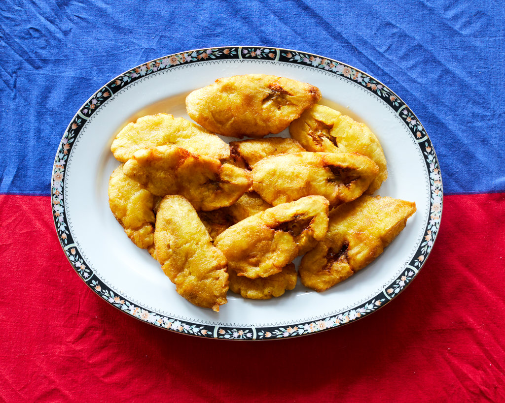

# Bannann Peze

*Haiti's twice-fried plantains: green plantain rounds fried gently till tender, smashed flat with a wooden press, then fried again at high heat till the edges go crisp and the centres stay tender. Eaten with pikliz at every meal and as a street snack on the side of every road.*

**Serves:** 4

**Prep Time:** 10 minutes

**Cook Time:** 15 minutes

## Overview
Bannann peze (also called tostones in the Spanish-speaking Caribbean) is Haiti's twice-fried plantain side, the crisp-edged tender-centred plantain discs that appear alongside almost every Haitian meal and as a street snack sold from carts on every Port-au-Prince street: green (unripe) plantain peeled, cut into thick rounds, fried gently in oil till the inside goes tender, lifted out and smashed flat between two wooden boards or with the bottom of a bottle, then fried again at higher heat till the smashed edges go properly crisp and gold and the centres stay yielding. The name translates as "pressed plantain"; the press is what defines the dish, distinguishing it from the simpler one-stage fried-plantain dishes of other Caribbean cuisines. Three details define proper bannann peze. First, green plantains. The plantain must be properly green (with maybe just the faintest yellow blush at the tips) for the right starchy not-sweet character; once a plantain ripens to yellow with black spots, it's gone over to sweet territory and is no longer suitable. Green plantain has a potato-like starchiness and faint vegetable flavour that's the canvas for the dish. Second, the two-fry technique. The first fry at lower heat (160 C) cooks the plantain through without browning much; the press flattens it; the second fry at higher heat (180-190 C) crisps the smashed edges. Skip either fry and you've made something different. Third, salt while hot. The smashed plantain absorbs salt much better while it's just out of the oil; scatter flaky sea salt over the rounds the moment they come out of the second fry, and the salt clings to the crisp edges where it should. Eat immediately while the crust is at its peak crispness; bannann peze does not wait.

## Ingredients

- 3 large green plantains (firm, unripe; with green skin and only the faintest yellow tinge at the tips)
- 500 ml vegetable oil (for frying)
- 1 ½ teaspoons fine sea salt (for the salt water dip)
- 250 ml warm water (for the dip)
- Flaky sea salt (for finishing)
- Lime wedges (to serve)

### To serve
- [Pikliz](pikliz.md)

## Method

### Stage 1 - Peel the plantains
1. Cut the ends off each plantain.
2. Run the knife lengthwise along the skin from cut end to cut end, scoring just through the skin and not into the flesh; do this in 3 separate cuts spaced evenly around the plantain.
3. Use your thumb to peel the skin away from the flesh in strips, working through each scored section. Green plantain skin is much tougher than ripe banana skin and won't peel as easily; persistence required.
4. Once peeled, cut each plantain into 2.5 cm thick rounds. You should get 6-7 rounds per plantain.

### Stage 2 - Prepare the salt water dip
1. In a wide bowl, dissolve the 1.5 teaspoons of fine sea salt in the warm water.
2. Set aside. This salt water bath is for the smashed plantains in the middle of the two-fry process; the brief dip seasons the plantain through and gives the second fry a more pronounced crisp finish.

### Stage 3 - First fry (the cook)
1. Heat the oil in a wide deep heavy pan to 160 C (medium heat; a small piece of bread dropped in should turn pale gold in 60 seconds).
2. Carefully lower the plantain rounds into the oil in 2 batches (don't crowd).
3. Fry each batch for 4-5 minutes, turning once with a slotted spoon, till the plantain is tender all the way through and pale gold but not deeply browned. To test, take one out and press; it should yield under gentle pressure with no resistance from the centre.
4. Lift onto a plate or rack lined with kitchen paper to drain.

### Stage 4 - Smash
1. Lay the fried plantain rounds on a chopping board.
2. Take a small flat-bottomed wooden press (called a tostonera in Spanish-speaking countries; the proper Haitian tool is similar), or simply the bottom of a heavy glass or a small clean board, and press each round firmly to about half its starting height. The plantain flattens to a round about 1 cm thick.
3. Don't smash so hard that the plantain breaks apart; you want it flattened but still in one piece.
4. Once flattened, dip each plantain briefly into the salt water bath (2-3 seconds), then place on a clean board.

### Stage 5 - Second fry (the crisp)
1. Raise the oil temperature to 180-190 C (medium-high; bread dropped in should turn deep gold in 30 seconds).
2. Working in batches, return the smashed and salt-dipped plantains to the hot oil.
3. Fry 2-3 minutes per side till the smashed flat surfaces go deeply gold and properly crisp at the edges. The plantain should look distinctly different from the first fry; gold, with crisp brown spots on the smashed surfaces.
4. Lift onto a fresh plate or rack lined with kitchen paper.

### Stage 6 - Salt and serve
1. While the plantains are still hot, scatter flaky sea salt generously over them; the salt clings to the crisp edges while they're hot.
2. Serve immediately, piled on a plate alongside the main dish, with pikliz and lime wedges on the side.

## Notes
- **Green plantains only:** yellow or yellow-with-black-spots plantains are sweet and ripe and don't work for this dish; they'd fry into the sweet caramelised maduros style instead. For bannann peze, the plantain must be properly green and firm. If you can only find yellow plantains, save them for sweet maduros and try a different supplier for the green ones.
- **The two-fry is the whole technique:** the first fry cooks the plantain through gently; the second fry crisps the smashed exterior. Skipping either stage gives you something that isn't bannann peze. The first fry on its own is just pan-fried plantain (still tasty but not the same dish); the second fry without the first gives you a raw centre with a burnt exterior.
- **Salt water dip is the secret crispness:** the very brief dip between the two fries does two things: it seasons the plantain through, and it puts a thin layer of moisture on the surface that flash-evaporates in the hot second fry, intensifying the crisp finish. Skip the dip and the bannann peze still works but the crust is slightly less pronounced.
- **Don't oversalt:** the dip already seasons the plantain. The flaky sea salt at the end is for that extra crisp-edge salt hit, not a heavy season. Go gently.
- **Eat immediately:** bannann peze loses its crispness within about 15 minutes of coming out of the oil. Don't try to hold them; serve straight from the pan. If you absolutely must hold them, lay on a wire rack in a low oven (90 C) for up to 10 minutes; longer and they go limp.

## Variations
**Bannann mi (sweet ripe plantain):** the sweet cousin. Use yellow-with-black-spot plantains, slice diagonally into 1.5 cm slices, and fry once at medium heat till golden-brown and caramelised. Sweet rather than savoury; a side for grilled meats and a breakfast standby.
**Banane pesée:** the French Creole name for the same dish, used in Martinique and Guadeloupe.
**Tostones:** the Spanish-Caribbean name; identical dish, found in Cuba, Puerto Rico, Dominican Republic and across Latin America.
**Larger format (tomate-tomahto):** instead of the standard 2.5 cm rounds, cut the plantain into longer 6-7 cm pieces; the same two-fry technique gives you larger flat plantain "patties" that you can use as a base for toppings (a Cuban favourite, plantains as a sandwich-bread substitute).

## Serving
Alongside the main, with pikliz on the side and a lime wedge for squeezing. Bannann peze with griot and pikliz is the classic Haitian trio. Also wonderful as a snack on its own with a small bowl of pikliz to dip into.

## Storage
- Eat immediately. Bannann peze does not store well; the crust collapses within 15-20 minutes of cooking.
- Day-old bannann peze can be revived briefly under a hot grill or in a 200 C oven for 3-4 minutes, but the result is never quite as good as fresh.
- Don't refrigerate or freeze; the plantain texture goes off.
- The first-fry stage (cooked but not yet smashed and second-fried) does keep refrigerated 2 days; you can prep the first fry ahead, then smash and second-fry just before serving.
