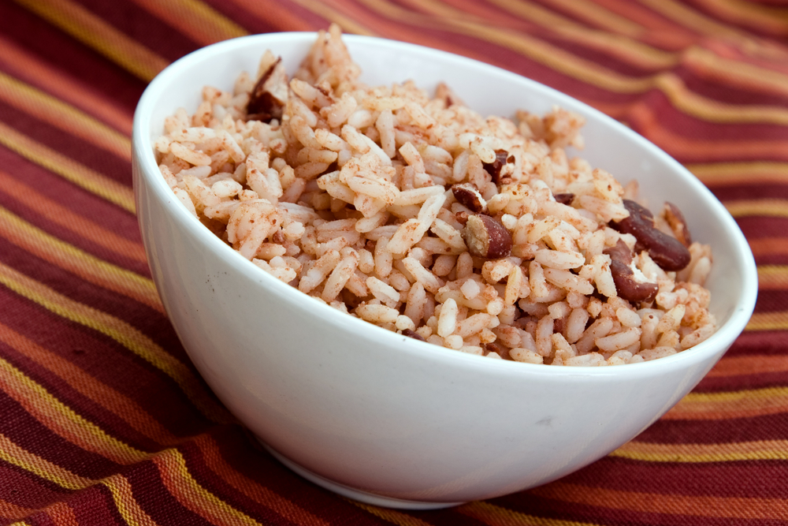

# Diri Kole ak Pwa

*Haiti's rice and beans: long-grain rice cooked together with red kidney beans in their own bean liquor, scented with epis, thyme, garlic and a knob of butter. The national starch staple that goes alongside every Haitian protein dish.*

**Serves:** 6

**Prep Time:** 15 minutes (plus overnight soaking for dried beans)

**Cook Time:** 1 hour 15 minutes (or 25 minutes if using cooked beans)

## Overview
Diri kole ak pwa is Haiti's national starch staple, the rice-and-beans combination that goes alongside almost every protein dish in the country: long-grain rice cooked with red kidney beans in their dark earthy cooking liquor, scented with epis, thyme, garlic and a generous knob of butter. The name translates as "rice stuck to beans" (kole = stuck, glued together), and the proper version has them bonded as a single dish rather than served as two separate piles, the rice taking on the pale-purple-brown colour of the bean liquor and the beans interspersed through every spoonful. Two ingredient details matter. Dried beans, not tinned; the dark cooking liquor is what gives diri kole its colour and depth, and tinned beans come in plain salty brine that lacks the proper flavour. And long-grain white rice for the right fluffy texture; short-grain or risotto rice goes sticky and creates a porridge. The bean liquor (around 600 ml) becomes the rice's cooking water; top up with plain water if needed.

## Ingredients

### Beans
- 250 g dried red kidney beans (or 1 large tin if you absolutely must; see notes)
- 1 ½ litres water (for cooking the beans; reserve)
- 1 small onion (peeled, halved)
- 2 garlic cloves (peeled, smashed)
- 3 thyme sprigs
- 1 bay leaf
- 1 teaspoon fine sea salt

### Rice base
- 400 g long-grain white rice (rinsed in cold water till the water runs clear)
- 2 tablespoons vegetable oil
- 1 small onion (finely chopped)
- 4 garlic cloves (finely chopped)
- 3 tablespoons epis (Haitian green seasoning paste)
- 2 thyme sprigs (fresh)
- 1 whole Scotch bonnet (left whole, unpierced)
- 1 teaspoon fine sea salt
- 2 tablespoons butter

### Liquid
- 600 ml reserved bean cooking liquor (top up with water to reach 600 ml if the beans have absorbed more)

## Method

### Stage 1 - Soak the beans (do this the day before)
1. Rinse the dried beans and tip into a wide bowl.
2. Cover with cold water by 10 cm.
3. Leave to soak overnight at room temperature; the beans should at least double in size.
4. Drain and rinse just before cooking.

### Stage 2 - Cook the beans
1. Tip the drained beans into a wide heavy saucepan.
2. Add the 1.5 litres of water, the halved onion, smashed garlic, thyme sprigs and bay leaf.
3. Bring to the boil over high heat, then reduce to a low simmer.
4. Cook 50-60 minutes till the beans are properly tender (you should be able to squash one between thumb and forefinger with just a little pressure). They should still hold their shape but yield easily.
5. Add the teaspoon of salt in the last 10 minutes of cooking (salting earlier toughens bean skins).
6. Drain through a sieve set over a measuring jug, catching every drop of the dark earthy bean broth.
7. Set the beans aside. Discard the onion, garlic and herbs.

### Stage 3 - Build the rice base
1. Heat the vegetable oil in a wide heavy lidded saucepan over medium heat.
2. Add the finely chopped onion and sweat 5-6 minutes till soft and gold.
3. Stir in the chopped garlic; cook 30 seconds till fragrant.
4. Add the epis and stir for a minute; the kitchen will smell green and herbal.

### Stage 4 - Toast the rice
1. Add the rinsed long-grain rice to the pan with the epis-onion base.
2. Stir for 2-3 minutes till every grain is coated in the oil and the rice goes faintly translucent at the edges. This toasting step gives the finished dish a slightly nuttier flavour.

### Stage 5 - Combine and cook
1. Measure out the reserved bean liquor (you need 600 ml; top up with water if you have less).
2. Pour the liquor into the pan with the rice. The liquid should be dark earthy brown.
3. Add the cooked beans, the thyme sprigs, the whole Scotch bonnet and salt.
4. Stir gently to distribute the beans evenly through the rice.
5. Bring to the boil, then immediately reduce to the lowest heat.
6. Cover with a tight-fitting lid and cook for 20 minutes without lifting the lid.

### Stage 6 - Rest and fluff
1. After 20 minutes, take the pan off the heat (still covered) and rest for 5 minutes.
2. Lift the lid. The rice should have absorbed all the liquid and look properly cooked, with the grains separate and tinted pale purple-brown from the bean liquor.
3. Carefully remove the Scotch bonnet and thyme sprigs.
4. Dot the butter over the top of the rice; replace the lid for 30 seconds to let the butter melt.
5. Fluff the rice with a fork, mixing the melted butter through.

### Stage 7 - Serve
1. Spoon onto warm plates alongside the protein (griot, tasso, poulet créole, legume, or any Haitian main).
2. The diri kole should sit in a heap, the rice grains distinct but coloured pale brown-purple, the beans visible throughout.
3. Add a spoonful of pikliz on the side.

## Notes
- **Use dried beans:** the cooking liquor from dried beans is dark, deeply flavoured and slightly viscous, and it's what gives diri kole its proper colour and depth. Tinned beans come in plain salty water that's nothing like the proper bean broth. If you must use tinned beans (1 large tin = roughly 200 g cooked weight), use 500 ml of plain water + 100 ml of the tin liquid for the rice cooking. The result is less authentic but workable.
- **Soak overnight:** dried kidney beans absolutely need overnight soaking (12-24 hours). Quick-soak methods (boil 1 minute, rest 1 hour) work in a pinch but the beans cook unevenly. Plan ahead.
- **Salt beans at the end:** adding salt early in the bean cooking can toughen the skins and slow the cooking. Add at the last 10 minutes for properly tender beans.
- **Rinse the rice:** rinsing the long-grain rice till the water runs clear removes excess surface starch that would make the finished dish gluey. Worth the 2 minutes.
- **Don't lift the lid during the 20-minute cook:** the rice cooks by steam in the covered pot. Every time you lift the lid, you lose steam and the rice cooks unevenly. Trust the timing.
- **Long-grain rice only:** basmati works beautifully; standard long-grain works; jasmine works at a push but goes slightly stickier than ideal. Short-grain or risotto rice (Arborio, etc.) gives you a porridge rather than diri kole.

## Variations
- **Diri ak djon djon:** swap the red beans for dried djon-djon mushrooms (the small dark Haitian mushrooms) soaked in hot water; use the dark soaking water as the rice liquid. The rice goes deeply purple-black and tastes of earthy mushroom. The fancy alternative to diri kole, served at celebrations.
- **With smoked turkey or pork:** add 100 g of diced smoked turkey or smoked pork to the onion-epis base at the start. Adds depth and turns the side into something approaching a main.
- **Riz djon djon kole:** combine djon-djon mushroom rice with red beans for the deluxe celebration version.
- **With coconut milk:** add 200 ml of coconut milk in place of 200 ml of the bean liquor; gives a richer Caribbean version that bridges to Jamaican rice-and-peas style.

## Serving
- Alongside any Haitian protein: griot, tasso, poulet créole, legume, fried fish. A spoonful of pikliz on the side is traditional. Drink: cremas (rum-coconut), Prestige lager, or simply cold water with lime.

## Storage
- Keeps refrigerated 3 days; reheat in a covered pan with a splash of water to refresh the moisture (microwave at low power works too).
- Freezes 2 months. Defrost in the fridge and reheat with extra water; the rice can get a bit gluey on the freezer-thaw cycle.
- The flavour deepens overnight; day-after diri kole is excellent in the morning with a fried egg on top.
