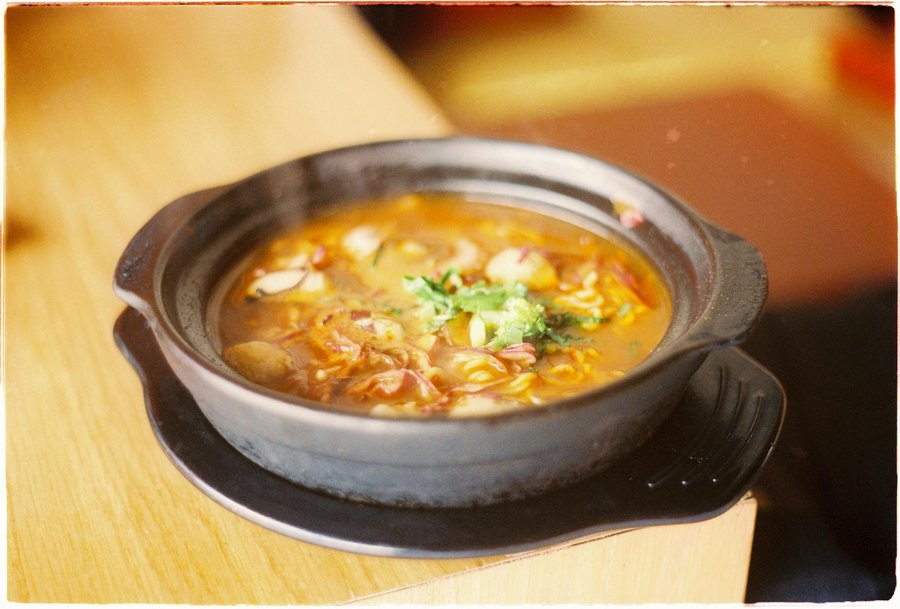

# Soup Joumou

*The pumpkin soup Haitians have eaten on New Year's morning since independence. Slow-simmered beef, vermicelli, a squeeze of lime.*

**Serves:** 8

**Prep Time:** 30 minutes (plus overnight marinating)

**Cook Time:** 2 ½ hours

## Overview
Soup joumou is the Haitian soup of independence, a slow-cooked beef-and-pumpkin broth eaten every January 1st to mark the day in 1804 when Haiti became the first Black republic in the world, and the day the formerly enslaved population could finally eat the soup their colonial masters had forbidden them. Beef shank or stewing beef marinates overnight in épis and citrus, then browns and simmers in beef broth for an hour. A whole calabaza pumpkin boils separately until soft, blends with some of the cooking liquid, and stirs back into the soup pot for the signature golden colour. Carrots, turnips, celery, cabbage, leeks and potatoes go in to simmer until tender; vermicelli noodles and a whole pierced Scotch bonnet add near the end. Lime juice, a knob of butter, fresh parsley and salt to finish. Served on January 1st by tradition; the rest of the year it's the family Sunday-soup of the Haitian diaspora.

## Ingredients

### Beef and marinade
- 1 kg beef shank (or stewing beef, cut into 4 cm cubes)
- 4 tablespoons épis (Haitian green seasoning - see griot recipe Notes)
- 2 limes (juice)
- 1 orange (juice)
- 4 garlic cloves (crushed)
- 1 teaspoon salt
- 1 teaspoon black pepper

### Pumpkin
- 1 ½ kg calabaza (or West Indian pumpkin, or kabocha squash; butternut as last resort)
- Water to cover

### Soup base
- 2 tablespoons olive oil
- 1 onion (large, finely chopped)
- 4 garlic cloves (crushed)
- 2 sprigs fresh thyme
- 2 bay leaves
- 4 cloves
- 1 ½ litres beef stock (or water)
- 1 tablespoon tomato paste

### Vegetables and pasta
- 3 carrots (peeled, cut into 2 cm chunks)
- 2 turnips (medium, peeled, cubed)
- 2 celery stalks (sliced)
- 2 leeks (white and pale green, sliced)
- ¼ small green cabbage (shredded)
- 2 waxy potatoes (medium, peeled, cubed)
- 100 g vermicelli (or thin spaghetti, broken into 3 cm lengths)
- 1 Scotch bonnet (whole, pierced; remove before serving)

### To finish
- 30 g butter
- 1 lime (juice)
- 1 small bunch parsley (chopped)
- salt
- pepper

## Method

### Stage 1 - Marinate the beef (the day before)
1. Rinse the beef in cold water with a splash of lime juice; pat dry.
1. Combine in a bowl with épis, lime juice, orange juice, garlic, salt and pepper.
1. Cover and refrigerate at least 8 hours, ideally overnight.

### Stage 2 - Cook the pumpkin
1. Cut the pumpkin into wedges; scrape out the seeds and stringy flesh.
1. Cut into 5 cm chunks (skin on is fine - it slips off after boiling).
1. Place in a large pot; cover with water; bring to the boil.
1. Boil 20-25 minutes until the flesh is very soft.
1. Drain, reserving 500 ml of the cooking water. Cool slightly, then peel away the skin (it lifts off easily).
1. Purée the pumpkin flesh in a blender with the reserved water until completely smooth. Set aside.

### Stage 3 - Brown the beef
1. Heat the oil in a large heavy stockpot over medium-high. Lift the beef out of its marinade (reserve the marinade).
1. Brown the beef in batches, 3-4 minutes per batch, on all sides. Set aside.

### Stage 4 - Build the broth
1. Reduce heat to medium. Add the onion to the pot; cook 5 minutes.
1. Add the garlic, thyme, bay, cloves and tomato paste; stir 1 minute.
1. Return the beef and any reserved marinade to the pot.
1. Pour in the beef stock; bring to a simmer.
1. Cover and simmer gently 1 hour, until the beef is tender.

### Stage 5 - Add the pumpkin and vegetables
1. Stir the pumpkin purée into the pot. The soup should now be thick and orange. If too thick, add up to 500 ml more stock or water.
1. Add the carrots and turnips; simmer 10 minutes.
1. Add the celery, leeks, cabbage and potatoes; simmer 15 minutes.
1. Lay the pierced Scotch bonnet on top of the soup.

### Stage 6 - Pasta and finish
1. Add the broken vermicelli; simmer 5-7 minutes more until the pasta is tender and the potatoes are soft.
1. Remove the Scotch bonnet, bay leaves and thyme stems.
1. Stir in the butter, lime juice and chopped parsley.
1. Taste; adjust salt and pepper. The soup should be thick enough to coat the back of a spoon, with chunks of beef and vegetables suspended in a deep-orange pumpkin broth.

### Stage 7 - Serve
1. Ladle into deep bowls; pass around with crusty bread and lime wedges.

## Notes
- **Calabaza is the right pumpkin:** giraumon in Haitian Creole, calabaza in Spanish-speaking Caribbean, West Indian pumpkin in English. It is denser, drier and sweeter than the Halloween-style pumpkin. Kabocha or Japanese pumpkin is the closest supermarket substitute. Butternut squash works but is a touch sweet and watery - if using, reduce the soup more at the end. Avoid orange field pumpkin (jack-o'-lantern types); too watery and bland.
- **The pumpkin is puréed, not chunky:** in some Caribbean pumpkin soups the pumpkin is left in chunks. Soup joumou is always smooth in its pumpkin base, with the other vegetables suspended in it.
- **Vermicelli, not rice:** the pasta is essential. Some families prefer macaroni, others spaghetti broken into pieces; vermicelli is the most common. Rice in the pot turns the soup gluey; serve rice on the side if you want it.
- **Pierced Scotch bonnet:** the whole pepper on top of the soup infuses gentle heat. Do not let it burst into the broth - the soup will become inedibly hot. Pierce a couple of small holes and lift it out before serving.
- **The political context matters:** soup joumou is more than a recipe; it is the dish that marks Haitian independence. On January 1st it is shared between neighbours, sent to friends, given to strangers. The cooking is the celebration.

## Variations
**Vegetarian soup joumou:** the meat is omitted and the broth built on a strong vegetable stock with extra dried mushrooms for depth. Less traditional but increasingly common in the diaspora.
**With goat:** in some Haitian households, soup joumou is made with goat instead of beef. Cook 30 minutes longer to tenderise.

## Serving
Serve with: crusty bread (Haitian pan creole or French baguette), lime wedges, and a small dish of pikliz on the side for anyone who wants a sharper bite. Drink water or a small glass of Haitian rum.

## Storage
- Keeps 4 days refrigerated; the flavour deepens overnight and day 2 is genuinely better than day 1.
- Freezes 3 months; the pasta will soften on thawing - if planning to freeze, leave the pasta out and add fresh vermicelli when reheating.
- Reheat gently on the hob, never microwaved on full power (the pumpkin separates).
