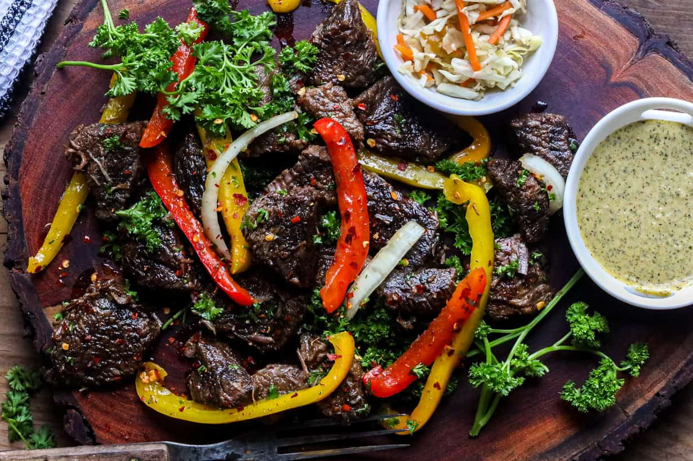

# Tasso

*Haiti's twice-cooked fried beef: cubes of beef marinated overnight in epis and sour orange, simmered till tender, then dried and deep-fried till the outside goes deep mahogany and the inside stays juicy. The beef cousin to griot, eaten with pikliz and bannann peze at every Haitian celebration.*

**Serves:** 6

**Prep Time:** 30 minutes (plus overnight marinating)

**Cook Time:** 1 hour 15 minutes

## Overview
Tasso is Haiti's twice-cooked fried beef, the beef counterpart to the more famous griot (twice-cooked pork): cubes of beef shoulder or chuck marinated overnight in epis (the Haitian green seasoning paste) and sour orange juice, then simmered till just tender, drained and dried, and finally deep-fried at high heat till the outside goes deep mahogany crisp and the inside stays juicy. It turns up at celebrations and Sunday lunches across the country, served with [pikliz](side-dishes/pikliz.md) (the pickled cabbage relish that's the canonical partner), [bannann peze](side-dishes/bannann-peze.md) (twice-fried plantains), and rice and beans. Three details separate proper tasso from generic fried beef. First, the overnight marinade in epis is non-negotiable. The fresh green seasoning paste seasons the meat through, and the sour orange juice (or lime juice with a splash of bitter orange marmalade as a substitute) tenderises the beef and adds the citrus brightness that defines Haitian protein dishes. Twelve hours minimum; 24 is better. Second, the two-stage cooking. Tough cuts of beef can't go straight to the fryer; they need a slow simmer first to break down the connective tissue, then the dry-and-fry stage to get the deep mahogany exterior. Going straight to the fryer gives you tough chewy beef bites; properly tasso-cooked beef pulls apart easily inside the crisp shell. Third, dry the simmered beef thoroughly before frying. Wet meat splutters violently in hot oil and the surface doesn't crisp; thoroughly dried meat (15 minutes on a wire rack) develops the deep crust that defines tasso. Skip the dry, get cardboard.

## Ingredients

### Beef
- 1.2 kg beef shoulder or chuck (cut into 4 cm cubes)

### Marinade
- 6 tablespoons epis (Haitian green seasoning paste; recipe in the legume notes)
- 4 tablespoons sour orange juice (or 3 tablespoons lime juice + 1 tablespoon bitter orange marmalade dissolved in 2 tablespoons hot water)
- 4 garlic cloves (crushed)
- 2 teaspoons fine sea salt
- 1 teaspoon ground black pepper
- 1 fresh Scotch bonnet chilli (deseeded and finely chopped; or use 1 whole for serious heat)
- 1 tablespoon dark rum (optional, traditional Haitian addition)

### For simmering
- 1 large onion (sliced thick)
- 4 garlic cloves (peeled, left whole)
- 4 thyme sprigs
- 4 bay leaves
- 1 ½ litres water (or beef stock for richer flavour)
- 1 ½ teaspoons fine sea salt

### For deep-frying
- 1 litre vegetable oil (or sunflower oil; needs to be deep enough to cover the beef)

### To serve
- [Pikliz](side-dishes/pikliz.md)
- [Bannann peze](side-dishes/bannann-peze.md)
- [Diri kole ak pwa](side-dishes/diri-kole.md)
- 1 lime (cut into wedges)

## Method

### Stage 1 - Marinate (do this the day before)
1. Combine the epis, sour orange juice, crushed garlic, salt, pepper, chopped Scotch bonnet and rum (if using) in a wide non-reactive bowl. Whisk to mix.
2. Add the cubed beef and toss to coat every piece thoroughly. Press the meat down into the marinade so it's mostly submerged.
3. Cover with cling film and refrigerate for at least 12 hours, ideally 24.
4. Bring the meat back to room temperature 30 minutes before cooking.

### Stage 2 - Simmer to tenderness
1. Tip the beef and all its marinade into a wide heavy casserole.
2. Add the sliced onion, whole garlic cloves, thyme sprigs and bay leaves.
3. Pour in the water (or beef stock) to just cover the meat.
4. Add the simmer-stage salt.
5. Bring to the boil over high heat, skimming any foam that rises.
6. Reduce to a gentle simmer, cover with the lid slightly ajar, and cook 60-75 minutes till the beef is fork-tender (a piece should pull apart with light pressure from a fork). The exact time depends on the cut; chuck takes 75, shoulder maybe 60.

### Stage 3 - Drain and dry
1. Lift the cooked beef cubes out of the cooking liquid with a slotted spoon onto a wire rack set over a tray.
2. Discard the aromatics (or strain and save the simmering liquid for a separate soup; it's properly flavoured stock).
3. Let the beef drain and dry on the rack for 15-20 minutes. The surfaces should look matte-dry rather than wet; this is essential for proper frying.

### Stage 4 - Deep-fry
1. Heat the oil in a wide deep heavy pan to 180 C. (Without a thermometer, drop a small cube of bread in; it should turn deep gold in 30-40 seconds.)
2. Fry the beef in 2 batches (don't crowd the oil; the temperature will drop and the meat will steam instead of crisp).
3. Fry each batch for 4-5 minutes, turning occasionally with tongs or a slotted spoon, till the outside is deeply mahogany-brown and crisp. The internal meat is already cooked from the simmer; you're just developing the exterior crust here.
4. Lift onto a fresh wire rack lined with kitchen paper to drain.
5. Repeat with the second batch.

### Stage 5 - Serve
1. Pile the hot fried tasso onto a serving platter.
2. Spoon a generous mound of pikliz alongside (the canonical partner; the sharp pickled cabbage cuts the rich fried beef beautifully).
3. Arrange bannann peze and rice and beans alongside.
4. Place lime wedges around the platter for diners to squeeze over.
5. Serve immediately while the crust is still properly crisp.

## Notes
- **Epis is the soul:** the fresh green seasoning paste defines Haitian cooking. If you don't have it made, do that first (see the recipe in the legume notes). Half a cup keeps in the fridge for two weeks; a fresh batch transforms every Haitian dish you make for the next fortnight.
- **Overnight marinating is non-negotiable:** twelve hours minimum, twenty-four better. The epis needs time to penetrate the meat; the sour orange juice needs time to tenderise. Speed-marinated tasso tastes flat and is tougher than properly marinated.
- **Sour orange substitute:** Caribbean sour oranges aren't always available outside the islands. The substitute that works best is lime juice with a small amount of bitter orange marmalade dissolved in hot water; the marmalade provides the bitter-orange aromatic notes that lime alone lacks.
- **Two-stage cooking is the whole point:** the simmer gives you tender meat; the fry gives you the crust. Skip either stage and you've made something that isn't tasso. The proper sequence (overnight marinade → 60-75 min simmer → 15 min drain → 4-5 min fry) takes time but the components stack to make the finished dish.
- **Dry the meat properly before frying:** wet meat in hot oil splutters dangerously and the moisture prevents crust formation. Fifteen minutes on a wire rack is the minimum drying time; longer is fine.

## Variations
**Tasso poul (chicken):** swap beef for bone-in chicken thighs; reduce simmer time to 30 minutes. The lighter version, common at weekday dinners.
**Tasso kabrit (goat):** the most prestigious version, made with goat shoulder; longer simmer time (90 minutes minimum because goat meat is tougher). Served at major celebrations and weddings.
**Tasso baked instead of fried:** for a lighter version, after the simmer-and-dry stage, brush the beef with vegetable oil and bake at 220 C for 15-20 minutes till the outside is deep brown. Less crisp than fried but works for less indulgent occasions.

## Serving
With pikliz and bannann peze on a shared platter; lime wedges around the edge for squeezing. Rice and beans (diri kole ak pwa) on the side. Drink: cremas (the rum-and-coconut drink) or a cold Prestige lager.

## Storage
- Best eaten the day of cooking; the crust softens as it cools.
- Cooked tasso keeps refrigerated 2 days; reheat in a 200 C oven for 8-10 minutes to re-crisp. Don't microwave; the meat goes rubbery and the crust softens to nothing.
- Cooked-and-cooled tasso (before frying) keeps refrigerated 3 days; fry to order. This is actually a useful make-ahead approach for entertaining: simmer the day before, fry just before serving.
- The simmer liquid makes excellent soup if strained; save it.
