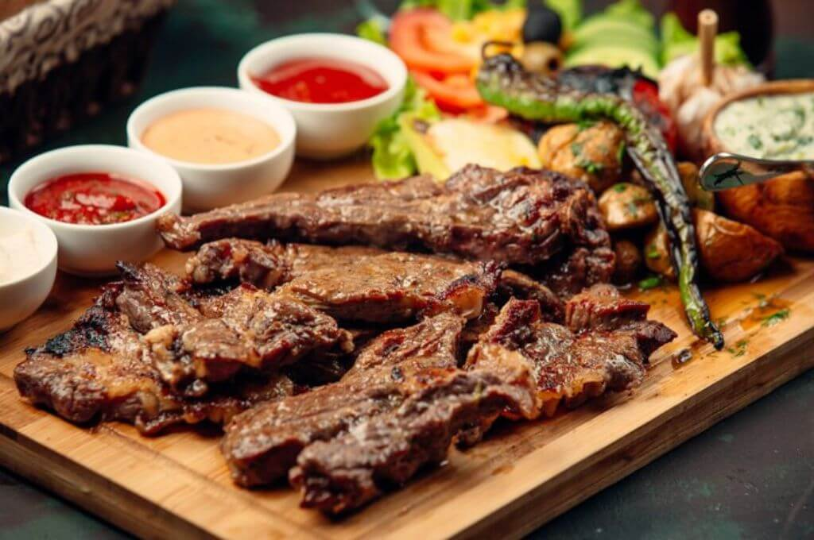

# Carne Asada Hondureña

*Honduras's grilled beef classic: thin slices of marinated flank or skirt steak marinated in citrus juice, garlic, cumin and oregano, grilled over charcoal till charred outside and pink inside, served with chimol salsa, fried plantains, rice and beans. The Honduran asado weekend meal across the country.*

**Serves:** 6

**Prep Time:** 25 minutes (plus 4 hours marinating)

**Cook Time:** 15 minutes

## Overview
Carne asada hondureña is Honduras's beloved grilled beef and a Sunday-asado staple across the country, distinct from but related to its Mexican cousin: thin slices of flank or skirt steak marinated for several hours in sour orange juice, garlic, cumin, oregano, salt and pepper, grilled over hot charcoal for just 2 to 3 minutes per side till charred outside and pink inside. Served on a wooden platter at the centre of the table with the traditional Honduran sides: chimol (the fresh tomato-onion-coriander salsa, close to Mexican pico de gallo but with green pepper added), tajadas (fried plantains), arroz blanco, frijoles fritos, tortillas, queso fresco and a green salad. Diners make their own taco-style portion. Sour orange (naranja agria) is the traditional citrus; lime plus orange juice substitutes. The beef must be sliced across the grain; flank and skirt have prominent fibres and slicing with the grain gives chewy meat. Hot grill, brief cook; longer than three minutes a side gives well-done beef, which is wrong for this dish.

## Ingredients

### Beef and marinade
- 1.2 kg flank steak or skirt steak (or both; about 2 cm thick)

### Marinade
- 120 ml fresh lime juice (about 4 limes)
- 120 ml fresh orange juice
- 6 tablespoons olive oil
- 8 garlic cloves (crushed)
- 1 tablespoon ground cumin
- 1 tablespoon dried oregano (Mexican oregano if available)
- 1 tablespoon Worcestershire sauce
- 2 teaspoons fine sea salt
- 1 ½ teaspoons ground black pepper
- 1 teaspoon ground coriander
- 1 teaspoon paprika
- 1 large white onion (finely sliced; goes into the marinade)
- 1 small handful fresh coriander (chopped)
- 1 fresh jalapeño or serrano chilli (deseeded, chopped; optional)

### Chimol (Honduran salsa)
- 4 large ripe tomatoes (finely diced)
- 1 large white onion (finely chopped)
- 1 medium green pepper (deseeded, finely chopped)
- 1 small fresh chilli (deseeded, finely chopped; optional)
- 1 large bunch fresh coriander (about 40 g; finely chopped)
- Juice of 2 limes
- 2 tablespoons olive oil
- 1 teaspoon fine sea salt
- ½ teaspoon ground cumin
- ½ teaspoon ground black pepper

### To serve
- Warm corn tortillas (or wheat tortillas)
- Fried plantains (tajadas; see existing tajadas recipe)
- Arroz blanco (Honduran white rice; see existing recipe)
- Frijoles fritos (refried red beans; see existing recipe)
- Queso fresco or feta (crumbled; 200 g)
- Sliced avocado
- Lime wedges
- Fresh green salad (lettuce, cucumber, radish)

## Method

### Stage 1 - Marinate the beef (the night before or 4 hours ahead)
1. Combine all marinade ingredients in a wide bowl; whisk to combine.
2. Place the beef in a wide flat container (or a large zip-lock bag).
3. Pour the marinade over; ensure the beef is well-coated.
4. Cover (or seal the bag); refrigerate 4-12 hours.
5. Don't go beyond 12 hours; the citrus can start to cure (break down) the beef and give a mushy texture.

### Stage 2 - Make the chimol
1. Combine the diced tomatoes, chopped onion, green pepper, chilli (if using) and chopped coriander in a wide bowl.
2. Add the lime juice, olive oil, salt, cumin and pepper.
3. Toss together; let stand 15 minutes for the flavours to marry.
4. Taste; adjust salt and lime.

### Stage 3 - Prepare the grill
1. Light a charcoal grill; let burn down to glowing embers (about 30 minutes).
2. Or heat a heavy ridged grill pan or cast-iron pan over high heat till smoking.
3. The grill should be properly hot; the beef should hiss aggressively when it hits.

### Stage 4 - Cook the beef
1. Take the beef out of the marinade; let any excess drip off briefly.
2. Don't pat dry; the marinade clinging to the surface helps the char.
3. Place the beef on the hot grill or pan.
4. Cook 2-3 minutes per side for medium-rare (pink in the centre); 3-4 minutes for medium.
5. Don't move the beef during the cook; let the surface char properly.
6. Lift onto a board; let rest 5 minutes (essential; the juices redistribute).

### Stage 5 - Slice across the grain
1. Look at the beef; identify the direction of the muscle fibres (the lines running through the meat).
2. Slice across the grain (perpendicular to the fibres) into thin slices about 5 mm thick.
3. Arrange on a wooden platter or serving plate.

### Stage 6 - Plate and serve
1. Place the platter of sliced beef at the centre of the table.
2. Surround with small bowls of: chimol, refried beans, rice, fried plantains, crumbled queso fresco, sliced avocado.
3. Warm tortillas wrapped in a cloth in a basket.
4. Lime wedges and the green salad alongside.
5. Diners assemble their own portions; the proper Honduran way is taco-style.

## Notes
- **Sour orange (naranja agria) is traditional:** the sour orange of Honduras has a distinctive sour-fragrant character. Outside Central America, the closest substitute is equal parts lime juice and orange juice; or lime juice with a small amount of orange zest.
- **4 to 12 hours, not longer:** the citrus marinade tenderises the beef but can over-tenderise. 4 hours minimum, 12 hours maximum; beyond that the beef goes mushy.
- **Slice across the grain:** the beef must be sliced perpendicular to the muscle fibres for tender slices. Look at the meat carefully before slicing.
- **Don't overcook:** thin sliced beef needs only 2-3 minutes per side. Longer gives well-done meat which is wrong for carne asada.
- **Charcoal gives the proper flavour:** charcoal grilling gives a smoky depth that's hard to replicate on a grill pan. If using a pan, get it as hot as possible and don't move the beef during the first 90 seconds.

## Variations
- **Chicken asada hondureña:** swap the beef for boneless skinless chicken thighs; reduce marinating time to 2 hours; cook 4-5 minutes per side. Common variation.
- **Pork chops asada:** swap the beef for pork chops (loin or shoulder); marinate the same way; grill 4-5 minutes per side. Excellent.
- **Spicier version:** add 2-3 chopped chillies to the marinade; add hot pepper sauce on the side. Common variation in coastal Honduras.
- **Beer marinade:** add 100 ml of light beer (Salva Vida or Imperial; Honduras's local beers) to the marinade; gives a slightly malty depth common in modern Honduran cooking.

## Serving
- On a wooden platter at the centre of the table for family-style assembly: tortilla in hand, layer beef, chimol, beans and a slice of avocado. With a cold Salva Vida or Imperial beer (Honduras's local beers), or a horchata, or fresh lemonade. As Sunday lunch, weekend cookout, or special-occasion family dinner.

## Storage
- The cooked beef keeps refrigerated 3 days; reheat gently in a hot pan with a splash of stock; or use cold in salads.
- The chimol keeps refrigerated 2 days; the texture stays good but the tomato releases more juice.
- The marinated raw beef keeps refrigerated 12 hours from the start of marinating; beyond that the citrus cures it too much.
- Don't freeze the chimol; the texture suffers.
- The cooked beef freezes 2 months in portions; defrost in the fridge and use in tacos or burritos.
