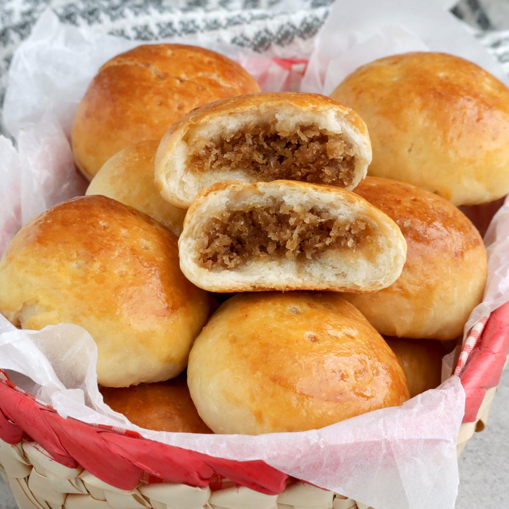

# Pan de Coco (Garifuna Coconut Bread)

*Honduras's Garifuna coconut bread: a soft enriched bun made with coconut milk, freshly grated coconut and a touch of sugar, kneaded, proven and baked till the outside goes deep golden and the inside stays moist and faintly tropical. The Honduran Caribbean coast staple bread, eaten with hot coffee at breakfast.*

**Serves:** 8 buns

**Prep Time:** 30 minutes (plus 2 hours rising)

**Cook Time:** 30 minutes

## Overview
Pan de coco is the traditional bread of the Garifuna communities of Honduras's Caribbean coast, shared with Belize, Guatemala and Nicaragua: a soft enriched bun made with coconut milk, freshly grated coconut, butter, eggs, sugar and yeast, baked till the outside goes deep golden and the inside stays moist and faintly tropical. Part of every Garifuna household: breakfast with sweet milky coffee, lunch with fried fish, dessert with a drizzle of honey, or a snack any time. Found beyond the Caribbean coast too, at bakeries in Tegucigalpa and San Pedro Sula, and across the Honduran-American diaspora. The Honduran-Garifuna version distinguishes itself from the wider Caribbean coconut-bread family with a less-sweet profile (more bread than cake). Coconut milk in the dough is essential (not water or regular milk); it gives the proper tropical richness. The coconut must be freshly grated or desiccated soaked in warm milk first; dry desiccated goes through the dough without rehydrating and gives a chewy texture.

## Ingredients

### Bread
- 600 g plain bread flour (or strong white bread flour)
- 10 g instant dried yeast (1.5 sachets)
- 80 g caster sugar
- 1 ½ teaspoons fine sea salt
- 60 g unsalted butter (softened)
- 1 large egg (plus 1 yolk for the dough; 1 more egg for the wash)
- 1 tin (400 ml) coconut milk (warm; aim for body temperature)
- 100 g grated fresh coconut (or 80 g desiccated coconut soaked in 100 ml warm milk for 20 minutes, then drained)

### Egg wash
- 1 large egg (beaten with 1 tablespoon milk)
- 2 tablespoons desiccated coconut (for sprinkling)

### Optional sweetened topping
- 2 tablespoons icing sugar (for dusting after baking)
- 1 tablespoon honey (drizzled while warm)

## Method

### Stage 1 - Soak the desiccated coconut (if using)
1. If using desiccated coconut: place in a small bowl; pour the 100 ml of warm milk over.
2. Let stand 20 minutes till the coconut is fully rehydrated.
3. Drain (gently squeeze out excess milk); the rehydrated coconut is ready for the dough.
4. If using fresh grated coconut: skip this step.

### Stage 2 - Make the dough
1. In a large bowl (or a stand mixer with a dough hook), whisk together the flour, yeast, sugar and salt.
2. Add the softened butter; rub in with your fingertips till the mixture looks like fine breadcrumbs.
3. In a smaller bowl, whisk together the warm coconut milk, the whole egg and the egg yolk.
4. Pour the wet ingredients into the flour mixture.
5. Add the rehydrated (or fresh) grated coconut.
6. Stir to combine; once a rough dough forms, knead by hand on a lightly floured surface (or in the mixer with dough hook) for 8-10 minutes till smooth and elastic.
7. The dough should be soft but not sticky; if too sticky, add 1 tablespoon flour at a time; if too dry, add 1 tablespoon coconut milk.

### Stage 3 - First rise
1. Place the dough in a large oiled bowl; cover with a damp cloth or cling film.
2. Let rise 1.5 hours at room temperature till doubled.

### Stage 4 - Shape the buns
1. Knock back the risen dough; divide into 8 equal pieces (about 130 g each).
2. Roll each piece into a smooth ball by tucking the edges underneath.
3. Place the balls on a baking sheet lined with parchment paper, leaving 4 cm between each.
4. Flatten gently with your palm to a slight dome (about 8 cm diameter).

### Stage 5 - Second prove
1. Cover the shaped buns loosely with a damp cloth.
2. Let prove 30 minutes at room temperature till slightly puffed.

### Stage 6 - Bake
1. Preheat the oven to 180°C (350°F).
2. Brush each bun generously with the egg wash.
3. Sprinkle each bun with a small amount of desiccated coconut.
4. Bake for 25-30 minutes till the buns are deep golden-brown and sound hollow when tapped on the bottom.

### Stage 7 - Cool and finish
1. Transfer to a wire rack to cool slightly.
2. Optional: dust with icing sugar while warm; or drizzle with honey.
3. Serve warm or at room temperature.

## Notes
- **Coconut milk in the dough, not water:** the coconut milk gives the proper tropical character. Substituting with regular milk gives a less-coconut bread; substituting with water gives a flat bread.
- **Freshly grated or properly soaked coconut:** dry desiccated coconut goes through the dough dry and gives a chewy texture. Either use fresh grated coconut or pre-soak desiccated coconut in warm milk for 20 minutes.
- **Knead properly:** 8-10 minutes of vigorous kneading is essential for gluten development. Under-kneaded dough gives a dense crumbly bread.
- **Egg wash for shine:** the proper Garifuna pan de coco has a deeply glossy golden top. The egg wash + the coconut sprinkle gives the iconic look.
- **Don't overbake:** 25-30 minutes is right. Longer and the bread dries out.

## Variations
- **Sweeter pan de coco:** double the sugar and add 50 g of sweetened condensed milk to the dough; gives a richer, more dessert-leaning version. Common at Honduran bakeries.
- **Stuffed pan de coco:** make smaller buns and stuff with a small amount of guava jam or sweet bean paste before sealing and proving; gives a sweet filled bread.
- **Pan de coco with cinnamon:** add 1 tablespoon of ground cinnamon to the dough; gives a more aromatic version common in modern Honduran cooking.
- **Mini pan de coco:** divide into 16 smaller portions; bake 20 minutes. Great for party platters or breakfast trays.

## Serving
- With strong sweet milky coffee (the Honduran way), or hot chocolate (chocolate caliente; the traditional Honduran breakfast drink). At breakfast, lunch with fried fish, or as an afternoon snack. Children love them warm with butter; adults love them with coffee.

## Storage
- Keeps in a sealed container at room temperature 2 days; refrigerated 5 days. Reheat briefly in a hot oven to refresh.
- Don't microwave; the bread goes rubbery.
- Freezes 2 months in a sealed bag; defrost at room temperature for 2 hours; warm in the oven before serving.
- Day-old pan de coco is excellent toasted with butter for breakfast.
- The unbaked shaped dough can be refrigerated overnight (after shaping but before the second prove); take out, prove 1 hour at room temperature and bake.
