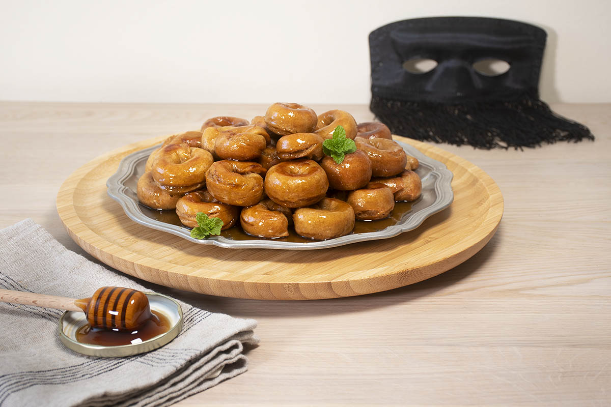

# Rosquillas en Miel

*Honduras's cornbread cookies in honey syrup: small ring-shaped cornmeal-and-cheese biscuits baked till crisp, dunked while still warm into a hot honey-and-cinnamon syrup, then arranged on a plate to soak up the syrup. The iconic Honduran Sunday-afternoon dessert with strong coffee.*

**Serves:** 6 (makes about 24 rosquillas)

**Prep Time:** 40 minutes

**Cook Time:** 30 minutes

## Overview
Rosquillas en miel ("ring biscuits in honey") is one of Honduras's most beloved traditional desserts and a Sunday afternoon classic: small ring-shaped biscuits made from a corn-flour-and-cheese dough (masa harina, grated hard cheese, butter, sugar and eggs), baked till crisp, then dunked while warm into a hot syrup of honey (or panela), cinnamon, cloves and water and arranged on a platter to absorb the syrup. The biscuits soak up the warm syrup and develop a soft sweet interior while keeping a slightly chewy outside; the cheese gives a slightly savoury depth that balances the sweetness. Sits between cookies and dessert, eaten with strong sweet Honduran coffee. The cheese is traditionally queso seco (a hard dry crumbly Honduran cheese); aged feta, parmesan or pecorino substitute. Use proper masa harina (the dried corn flour for tortillas); cornmeal or polenta have the wrong texture. Both biscuits and syrup must be warm at dunking; cold biscuits don't absorb properly.

## Ingredients

### Rosquilla dough
- 300 g masa harina (or fine corn flour for tortillas)
- 100 g plain flour
- 150 g unsalted butter (softened)
- 80 g caster sugar
- 150 g queso seco or aged feta (finely grated)
- 2 large eggs
- 2 tablespoons whole milk (more if needed)
- 1 teaspoon baking powder
- 1 teaspoon vanilla extract
- ½ teaspoon ground cinnamon
- Pinch of fine sea salt

### Honey syrup
- 300 g pure honey (or panela/raw cane sugar dissolved in water; or use 250 g honey + 50 g brown sugar)
- 200 ml water
- 1 cinnamon stick (5 cm)
- 4 whole cloves
- Zest of 1 lemon
- ¼ teaspoon ground nutmeg
- 1 tablespoon fresh lemon juice

### To finish
- Ground cinnamon for dusting
- Toasted chopped almonds (optional)
- Grated lemon zest (optional)

## Method

### Stage 1 - Make the dough
1. Preheat the oven to 180°C (350°F).
2. Line 2 large baking sheets with parchment paper.
3. In a wide bowl, cream the softened butter and sugar with an electric mixer or wooden spoon till pale and fluffy (3-4 minutes).
4. Add the eggs one at a time, beating well after each.
5. Add the vanilla.
6. In a separate bowl, whisk together the masa harina, plain flour, baking powder, cinnamon and salt.
7. Add the dry ingredients to the wet in 3 batches, mixing gently.
8. Add the grated cheese; mix till the dough comes together.
9. Add the milk gradually if needed; the dough should be soft but holdable (you should be able to shape it without it sticking too much to your hands).

### Stage 2 - Shape the rosquillas
1. Take a small piece of dough (about 25 g; the size of a walnut).
2. Roll into a small cylinder about 10 cm long and 1.5 cm thick.
3. Form into a ring by pressing the ends together gently.
4. Place on the prepared baking sheet.
5. Repeat with the remaining dough; you should have about 24 rosquillas.
6. Leave 2 cm between each ring on the baking sheet.

### Stage 3 - Bake
1. Bake at 180°C for 20-25 minutes till the rosquillas are deep golden and crisp on the bottom.
2. They should be properly cooked (firm to the touch when pressed); not pale or under-done.
3. Transfer to a wire rack to cool slightly (keep them warm for the syrup soak).

### Stage 4 - Make the honey syrup
1. While the rosquillas bake, combine the honey, water, cinnamon stick, cloves, lemon zest and nutmeg in a saucepan.
2. Bring to a low simmer over medium heat.
3. Cook 8-10 minutes till the syrup reduces slightly and thickens to a glossy consistency.
4. Stir in the lemon juice.
5. Take off the heat; let the syrup cool slightly (it should still be warm when you dunk the rosquillas, but not boiling-hot).

### Stage 5 - Dunk the rosquillas
1. Strain the syrup through a fine sieve to remove the cinnamon stick and cloves (or leave them in for visual; some recipes do).
2. Working one at a time, dunk each warm rosquilla into the warm syrup for 5-10 seconds; turn to coat both sides.
3. Lift out with a slotted spoon; let excess syrup drip off briefly.
4. Place on a serving platter.
5. Repeat with all the rosquillas.

### Stage 6 - Finish
1. Pour any remaining syrup over the arranged rosquillas; the syrup will pool around them and continue to be absorbed.
2. Dust with ground cinnamon.
3. Scatter chopped toasted almonds and lemon zest (if using).
4. Let stand for 10 minutes at room temperature so the rosquillas absorb the syrup fully.

### Stage 7 - Serve
1. Serve at room temperature or slightly warm.
2. With strong sweet Honduran coffee.
3. Spoon any pooled syrup over individual portions.

## Notes
- **Queso seco gives the proper savoury depth:** the cheese is what makes Honduran rosquillas distinct from generic sweet biscuits. The slight saltiness balances the sweet syrup. Aged feta works as a substitute.
- **Masa harina, not cornmeal:** masa harina is the dried corn flour used for tortillas; it has a finer texture than cornmeal/polenta. The result is different.
- **Dunk while warm:** the biscuits must be warm when they hit the syrup for proper absorption. Cold biscuits don't soak up the syrup.
- **Don't let the syrup boil down too much:** the syrup should still be pourable when you dunk; over-reduced syrup is too thick and sticks rather than soaks.
- **Rest before serving:** the 10-minute rest after assembling lets the syrup fully penetrate the biscuits. Don't rush; let them properly soak.

## Variations
- **Panela syrup version:** swap the honey for 250 g of panela (raw cane sugar; or use dark brown sugar) dissolved in 250 ml of water; cook to a syrup. Gives a deeper molasses-like flavour common in rural Honduras.
- **Larger rosquillas:** make 12 larger rings (50 g each); bake 25-30 minutes; gives a heartier version that's properly Honduran market-style.
- **Spiced rosquillas:** add ¼ teaspoon of ground allspice and 1 tablespoon of grated orange zest to the dough; gives a more aromatic version.
- **Plain rosquillas (without syrup):** serve the baked rosquillas plain, dusted with caster sugar; eat as a savoury-sweet biscuit with coffee. Common Honduran morning snack.

## Serving
- On a serving platter with the syrup pooling around. With strong sweet Honduran coffee (the proper Honduran way: dark roast, slightly bitter, sweet); or with hot chocolate; or with cold milk for children. After a Sunday lunch, at afternoon tea, or as dessert at a family gathering.

## Storage
- Keeps at room temperature in a sealed container 3 days; the syrup keeps the biscuits soft.
- Refrigerated 1 week; bring to room temperature before serving (the syrup goes thick when cold).
- Freezes 2 months (without the syrup); freeze just the baked rosquillas; thaw and dunk in fresh syrup before serving.
- The syrup keeps refrigerated 2 weeks in a jar; gently rewarm before using.
- Don't microwave; the texture suffers.
