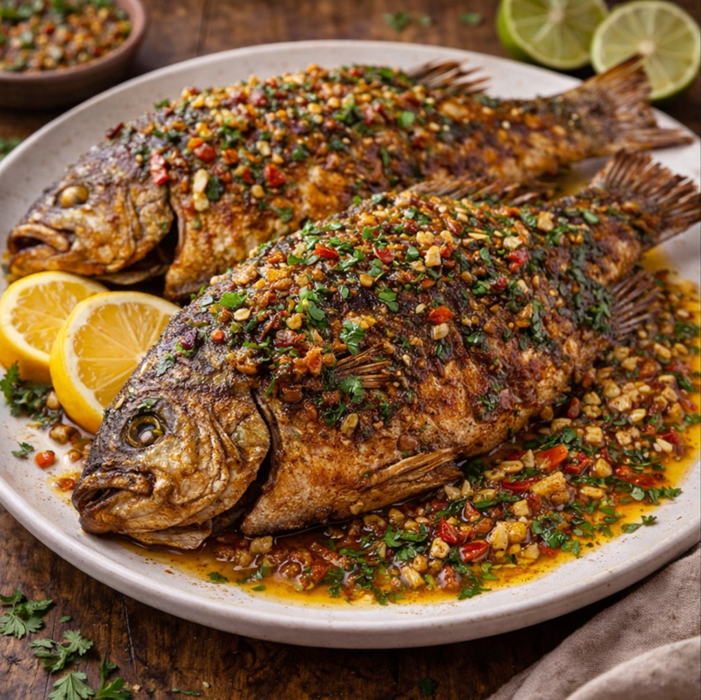

# Pescado Frito (Honduran-Garifuna Style)

*Honduras's whole fried fish: a whole white-fleshed fish (snapper, mojarra or robalo) scored, marinated in citrus, garlic and herbs, dredged in seasoned flour and deep-fried whole till the skin is crisp and the flesh stays moist. Served with tajadas (fried plantains), arroz con coco (coconut rice), encurtido (Honduran pickled vegetables) and lime wedges, alongside Salva Vida beer. The Caribbean coast Garifuna-Honduran fishing-village classic.*

**Serves:** 4

**Prep Time:** 25 minutes (plus 30 minutes marination)

**Cook Time:** 18 minutes

## Overview
Pescado frito is Honduras's beloved Caribbean coast whole fried fish, particular to the Garifuna communities of La Ceiba, Tela, Trujillo and Cayos Cochinos (and shared with the wider Garifuna diaspora in Belize, Guatemala, Nicaragua): a whole white-fleshed fish (the canonical Caribbean choices are red snapper, mojarra/tilapia, robalo/sea bass, or pargo blanco) is scored crosswise on both sides to help even cooking, marinated briefly in lime juice, garlic, cumin, oregano and salt, dredged generously in seasoned flour, and deep-fried whole in vegetable oil till the skin is deeply crisp, the cuts have opened to reveal the moist white flesh underneath, and the fish is just cooked through. Served on a wooden platter with the canonical Garifuna accompaniments: tajadas (fried green or ripe plantains; see existing tajadas recipe), arroz con coco (rice cooked in coconut milk, lightly Garifuna-style), encurtido (pickled vegetables similar to giardiniera, with carrot, onion, jalapeño and cauliflower in vinegar), lime wedges, hot sauce, and bread or tortillas. Three details define proper Honduran-Garifuna pescado frito. First, score the fish properly. Three deep crosswise cuts on each side (going down to the bone) let the heat penetrate evenly and the marinade and salt reach inside the flesh. Skipping the score gives unevenly cooked fish that's burned outside and raw inside. Second, the oil must be very hot (180°C / 360°F). Lower temperature gives soggy oily fish; higher gives burnt skin. The fish should sizzle aggressively when it hits the oil. Third, fry on one side first, then turn once. Don't flip back and forth; cook 7-8 minutes on one side till deeply golden, then flip and cook 6-7 minutes on the other. Constant flipping gives uneven cooking and the skin can tear.

## Ingredients

### Fish
- 2 whole white-fleshed fish (about 600-700 g each; red snapper, mojarra, tilapia, sea bass or pargo; gutted, scaled, head on or off)

### Marinade
- 100 ml fresh lime juice (about 4 limes)
- 6 garlic cloves (crushed)
- 2 tablespoons olive oil
- 1 tablespoon ground cumin
- 1 teaspoon dried oregano
- 1 teaspoon ground coriander
- 1 teaspoon paprika
- 1 ½ teaspoons fine sea salt
- 1 teaspoon ground black pepper
- 1 tablespoon Worcestershire sauce

### Dredge
- 200 g plain flour
- 50 g cornflour (or cornstarch)
- 1 ½ teaspoons fine sea salt
- 1 teaspoon ground black pepper
- 1 teaspoon paprika
- 1 teaspoon garlic powder
- ½ teaspoon ground cumin

### Frying
- Vegetable oil for deep-frying (about 1.5 litres; or enough for 5 cm depth in a wide deep pan)

### To serve
- Tajadas (fried plantains; see existing tajadas recipe)
- Arroz con coco or arroz blanco
- Encurtido (pickled vegetables; or shop-bought giardiniera)
- Lime wedges
- Hot sauce (Honduran salsa picante)
- Avocado slices
- Fresh coriander
- Corn tortillas or hot bread

## Method

### Stage 1 - Prepare the fish
1. Rinse the fish under cold running water; pat dry inside and out with kitchen paper.
2. Score each side of the fish with 3 deep crosswise cuts; go down to the bone.
3. Place in a wide shallow dish.

### Stage 2 - Marinate
1. Combine the lime juice, crushed garlic, olive oil, cumin, oregano, coriander, paprika, salt, pepper and Worcestershire sauce in a small bowl.
2. Whisk to a smooth marinade.
3. Pour over the fish; rub the marinade into the scores and the cavity of the fish.
4. Let stand at room temperature 30 minutes (the time the lime juice has to work; longer and the lime cures the fish).

### Stage 3 - Prepare the dredge
1. In a wide flat dish, whisk together the flour, cornflour, salt, pepper, paprika, garlic powder and cumin.

### Stage 4 - Heat the oil
1. Pour vegetable oil into a deep heavy frying pan or wok to a depth of 5 cm.
2. Heat over medium-high heat till 180°C (360°F).
3. Test with a small piece of bread: it should sizzle immediately and brown in 90 seconds.

### Stage 5 - Dredge the fish
1. Lift each fish out of the marinade; let excess drip off.
2. Press into the seasoned flour, coating thoroughly on both sides and inside the cavity.
3. Shake off the excess.

### Stage 6 - Fry the fish (one at a time)
1. Carefully lower one fish into the hot oil (slide it in from a low angle to prevent splashing; the head should go in first).
2. The fish should sizzle aggressively.
3. Don't move the fish for the first 4-5 minutes; let the skin sear and crisp.
4. After 7-8 minutes, the underside should be deeply golden. Use 2 spatulas to carefully turn the fish over.
5. Fry the second side 6-7 minutes till also golden.
6. The fish is done when the flesh through the cuts is white and flakes easily with a fork; the eyes should be opaque.
7. Lift the fish out using 2 spatulas; drain briefly on kitchen paper or a wire rack.
8. Fry the second fish the same way.

### Stage 7 - Serve immediately
1. Place each fish on a wooden platter or warm plate.
2. Surround with tajadas, rice, encurtido, lime wedges, avocado slices and fresh coriander.
3. Provide hot sauce in a small bowl.
4. Eat with hands; pick the flesh from the bones with a fork; the crisp skin is the best part.
5. Squeeze lime over each portion.

## Notes
- **Score the fish:** three deep cuts on each side are essential for even cooking. The cuts let the heat reach the centre and the marinade penetrate.
- **Hot oil, 180°C:** the oil must be properly hot. Cool oil gives soggy fish; too hot gives burnt skin before the flesh cooks. Use a thermometer or the bread test.
- **Flip once:** don't flip the fish back and forth. Cook 7-8 minutes on one side, then turn carefully and cook 6-7 minutes on the second side.
- **Two spatulas for flipping:** the whole fish is fragile when hot. Use two spatulas (or one large spatula and a long tongs) to flip carefully without breaking.
- **The skin is the best part:** the crisp deeply-fried skin is the canonical highlight of Garifuna pescado frito. Eat it; don't skip.

## Variations
**Tilapia (mojarra) version:** the everyday Honduran fish is mojarra (tilapia); use 4 smaller fish (300 g each) instead of 2 larger; reduce cooking to 5 minutes per side.
**Coconut-fried fish:** add 50 g of grated coconut to the dredge; gives a Caribbean tropical flavour that's particularly Garifuna.
**Spicy version:** add 1 tablespoon of cayenne pepper to the dredge; serve with extra hot sauce. Common Honduran style.
**Snapper grilled instead of fried:** for a healthier option, grill the marinated fish over charcoal instead of frying; the texture is different but the flavour profile is similar.

## Serving
On a wooden platter at the centre of the table, the fish whole, surrounded by all the sides. Each diner takes their portion; the Honduran way is to use a fork to pick the flesh from the bones, build a small tortilla-and-fish-and-pickle bite, and eat with hands. Drink: cold Salva Vida or Imperial beer (Honduras's locals), fresh agua de coco (coconut water), or fresh lemonade.

## Storage
- Best eaten fresh and hot; the crisp skin loses its texture as it cools.
- The cooked fish keeps refrigerated 2 days; reheat in a hot oven (180°C / 350°F) for 8-10 minutes to crisp the skin again.
- Don't microwave; the fish goes off-texture.
- The marinated raw fish keeps refrigerated 4 hours before frying; longer and the lime cures the flesh.
- Don't freeze cooked fried fish; the texture suffers completely.
