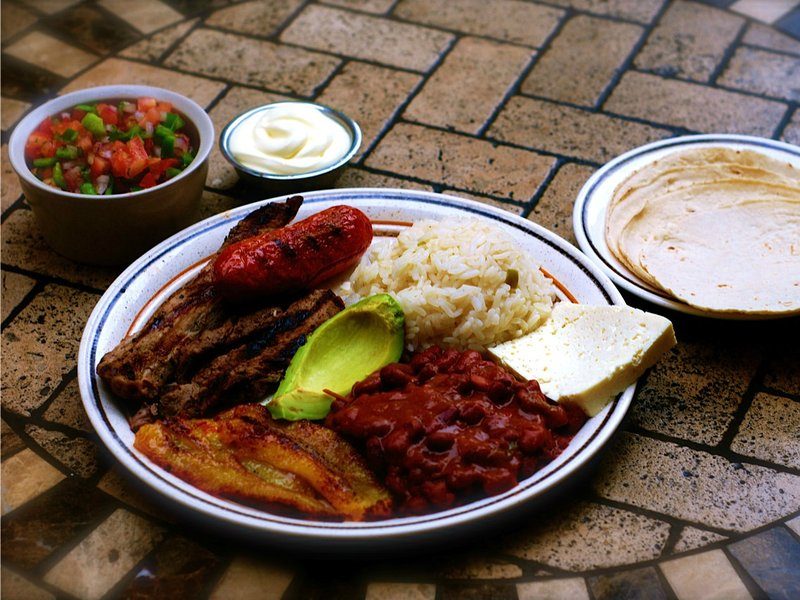

# Plato Típico Hondureño

*Honduras' national lunch plate: grilled beef with refried beans, white rice, fried plantain, mantequilla, avocado and a soft tortilla on the side.*

**Serves:** 4

**Prep Time:** 30 minutes (assumes refried beans on hand)

**Cook Time:** 30 minutes

## Overview
Steak (a thin cut like skirt or sirloin) is marinated briefly with sour orange, garlic and cumin, then grilled or seared hard. Plantain is sliced and fried until deep gold. Rice is cooked white. Refried beans are warmed through; mantequilla is whisked smooth; avocado is sliced; tortillas are warmed. Everything goes on a wide plate together.

## Ingredients

### Steak
- 600 g flank, skirt (or sirloin steak, cut into thin pieces)
- 1 orange (or sour orange/naranja agria, juice)
- 1 lime (juice)
- 4 garlic cloves (crushed)
- 1 teaspoon ground cumin
- 1 teaspoon salt
- 1 teaspoon ground black pepper
- 2 tablespoons vegetable oil

### To plate
- 2 ripe plantains (peeled, sliced 1 cm thick on the bias)
- 200 ml vegetable oil for frying
- 300 g white rice (cooked)
- 400 g refried beans (warmed)
- 250 ml mantequilla (Honduran sour cream - or crème fraîche thinned with milk)
- 2 ripe avocados (sliced)
- 8 flour (or corn tortillas, warmed)
- Salt for finishing
- Pickled cabbage (curtido) or a small chimol salsa, on the side

## Method

### Stage 1 - Marinate the steak
1. Whisk the orange juice, lime juice, garlic, cumin, salt and pepper in a wide dish.
1. Lay the steak in the marinade; turn to coat; refrigerate 20-30 minutes.

### Stage 2 - Fry the plantain
1. Heat 5 mm of oil in a frying pan over medium-high heat.
1. Fry the plantain slices 2-3 minutes per side until deep gold and tender.
1. Drain on kitchen paper; sprinkle with salt.

### Stage 3 - Grill the steak
1. Heat a heavy frying pan or griddle to very hot.
1. Pat the steak dry; brush off excess garlic (it burns).
1. Sear the steak 90 seconds per side for medium-rare on a thin cut; longer if your cut is thicker.
1. Rest 3 minutes; slice across the grain.

### Stage 4 - Plate
1. On each warmed plate, mound rice, refried beans, the fried plantain, sliced steak and avocado, with a generous spoonful of mantequilla over the beans.
1. Place 2 warm tortillas alongside.
1. Serve curtido or chimol on the side.

## Notes
- **Marinating time:** 20-30 minutes is right; longer and the acid starts to cook the meat (chewy texture).
- **Mantequilla:** Honduran mantequilla is a fermented sour cream, thicker and more sour than American sour cream. Crème fraîche is the closest UK substitute; thin with a splash of buttermilk for the right tang.
- **Components matter:** None of the elements are difficult; the dish is about assembly. Cook the rice and beans ahead; only the steak and plantain are à la minute.

## Storage
- Components keep separately 3 days. Don't pre-plate.
- Tortillas: warm fresh.
