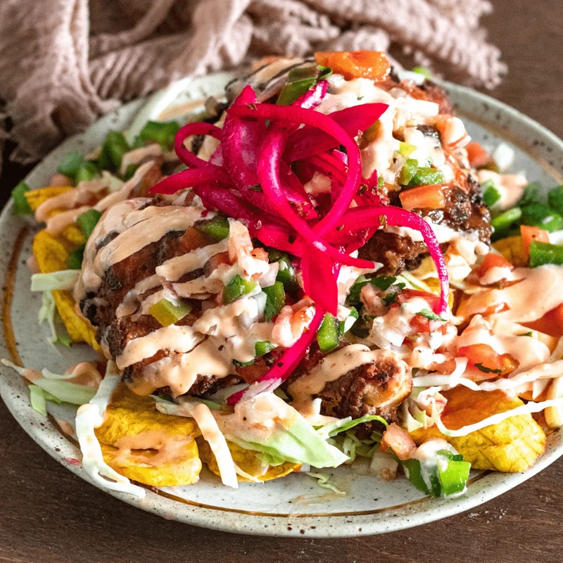

# Pollo Con Tajadas

*A Honduran street plate: fried chicken on a bed of fried plantain, topped with cabbage curtido, chimol relish and a drizzle of sour cream. With lime.*

**Serves:** 4

**Prep Time:** 25 minutes (plus 1 hour marinating)

**Cook Time:** 30 minutes

## Overview
Bone-in chicken pieces marinate in lime, garlic, achiote and cumin, then are floured and fried until deep gold and crisp-skinned. Ripe (or green) plantains slice into long tajadas and fry until soft and sweet. A quick curtido of cabbage, onion and vinegar provides crunch; a chunky chimol of tomato, onion and cilantro provides freshness. Plate, top, drizzle, serve.

## Ingredients

### Chicken
- 8 bone-in chicken thighs and drumsticks (or 1.2 kg cut chicken pieces)
- 2 limes (juice)
- 6 garlic cloves (crushed)
- 1 teaspoon ground annatto (achiote)
- 1 teaspoon ground cumin
- 1 teaspoon dried oregano
- 1 ½ teaspoons salt
- 1 teaspoon ground black pepper
- 4 tablespoons plain flour
- 500 ml vegetable oil (for shallow frying)

### Tajadas
- 3 ripe (yellow with black spots) or green plantains (peeled, sliced lengthways into 5 mm slices)
- Vegetable oil for frying (reuse from chicken)
- Salt

### Curtido (cabbage relish)
- 200 g white cabbage (finely shredded)
- 1 carrot (small, grated)
- 1 red onion (small, very thinly sliced)
- 3 tablespoons white vinegar
- ½ teaspoon salt
- ½ teaspoon dried oregano

### Chimol
- 3 ripe tomatoes (finely diced)
- 1 white onion (small, finely diced)
- 3 tablespoons fresh cilantro (chopped)
- 1 lime (juice)
- ½ teaspoon salt

### To finish
- 200 ml sour cream (or mantequilla)
- 2 limes (cut into wedges)

## Method

### Stage 1 - Marinate the chicken
1. Mix lime juice, garlic, achiote, cumin, oregano, salt and pepper in a bowl.
1. Add the chicken; turn to coat; refrigerate at least 1 hour.

### Stage 2 - Curtido
1. Combine cabbage, carrot, onion, vinegar, salt and oregano in a bowl; toss; let sit 30 minutes.

### Stage 3 - Chimol
1. Mix tomato, onion, cilantro, lime juice and salt. Set aside.

### Stage 4 - Fry the chicken
1. Pat the marinated chicken dry; dust lightly with flour.
1. Heat the oil to 175°C in a wide deep pan.
1. Fry in batches 7-9 minutes per side, until deep gold and the juices run clear (internal 75°C).
1. Drain on a rack.

### Stage 5 - Fry the tajadas
1. Lower the oil to 170°C. (If too dark, strain off and start fresh.)
1. Fry the plantain slices 2-3 minutes per side until deep gold and soft (for ripe) or crisp (for green).
1. Drain; salt lightly.

### Stage 6 - Plate
1. Arrange tajadas on each plate. Top with chicken pieces.
1. Spoon over the curtido and a generous spoonful of chimol.
1. Drizzle with sour cream; add a lime wedge.

## Notes
- **Achiote / annatto:** Sold ground or as whole seeds in Latin American shops. If using whole, infuse 1 teaspoon in 2 tablespoons hot oil 30 seconds, then strain. Paprika is the easy substitute.
- **Ripe or green plantain?** Both are eaten with this dish. Ripe (yellow-black) gives sweet, soft tajadas; green gives starchy, crisp ones. Most plates serve ripe.
- **Mantequilla swap:** Honduran mantequilla is fermented; UK sour cream or crème fraîche thinned with buttermilk gets close.

## Storage
- Best eaten same day. Cooked chicken keeps 2 days refrigerated; re-crisp at 200°C.
- Curtido keeps 5 days; gets better. Chimol best within 24 hours.
