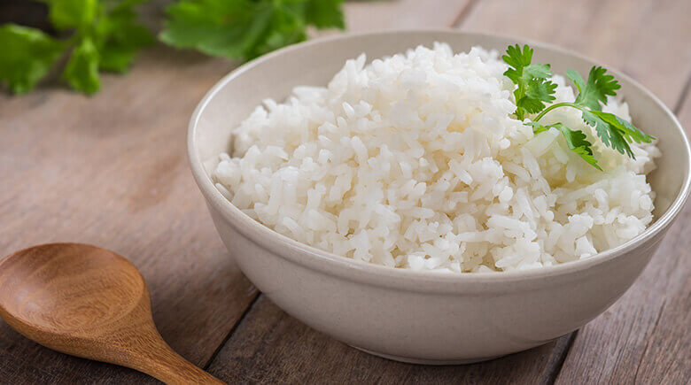

# Arroz Blanco Hondureño

*Honduras' plain white rice: long-grain toasted in oil with onion and garlic, then cooked absorption-style. Fluffy and separate, the supporting plate.*

**Serves:** 4

**Prep Time:** 5 minutes

**Cook Time:** 25 minutes

## Overview
Long-grain rice is toasted briefly in oil with onion, garlic and sometimes a small piece of bell pepper. Hot water and salt go in; the pot is covered tightly and the rice cooks undisturbed for 18 minutes. Five minutes' rest off the heat finishes the steaming. The grains stay separate.

## Ingredients

- 300 g long-grain rice (parboiled or Carolina)
- 2 tablespoons vegetable oil
- 1 onion (small, very finely chopped)
- 2 garlic cloves (crushed)
- 1 small piece green bell pepper (very finely chopped, optional)
- 1 teaspoon salt
- 550 ml hot water

## Method

### Stage 1 - Rinse
1. Rinse the rice in a sieve under cold water until the water runs almost clear. Drain well.

### Stage 2 - Toast
1. Heat the oil in a heavy pot over medium heat.
1. Soften the onion (and pepper if using) 4-5 minutes.
1. Add the garlic; cook 30 seconds.
1. Add the rice; toast 2 minutes, stirring, until coated and translucent at the edges.

### Stage 3 - Cook
1. Pour in the hot water; add salt.
1. Bring to a boil; stir once; reduce to the lowest heat.
1. Cover tightly; cook 18 minutes undisturbed.

### Stage 4 - Rest
1. Remove from heat (lid on); rest 5 minutes.
1. Fluff with a fork.

### Stage 5 - Serve
1. Plate alongside beans, meat and plantain.

## Notes
- **Toast briefly:** 2 minutes is right - the rice should take on a slight gloss, not colour. Longer and it goes too nutty for the role.
- **Hot water:** Not cold. Cold water shocks the toasted grains and the rice cooks unevenly.
- **No peeking:** The 18-minute cook is sacred; the steam does the work. Lifting the lid bleeds it away.

## Storage
- Refrigerate 3 days. Reheat covered with a splash of water in the microwave or over low heat.
