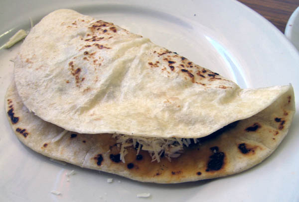

# Baleadas

*Honduras' national snack: a thick soft flour tortilla folded around refried beans, a slick of mantequilla and a sprinkle of crumbled cheese.*

**Serves:** 4 (8 baleadas)

**Prep Time:** 25 minutes (plus 30 minutes resting)

**Cook Time:** 30 minutes

## Overview
Soft flour tortillas, thicker than Mexican ones, are griddled until lightly blistered. While still warm, they're spread with hot refried beans, drizzled with mantequilla, sprinkled with salty crumbled cheese, then folded in half. Eaten in hand. Add-ons are layered before the fold. Done in 20 seconds at the stand.

## Ingredients

### Tortilla dough
- 400 g plain flour
- 1 teaspoon salt
- 1 teaspoon baking powder
- 4 tablespoons vegetable oil (or melted lard)
- 220 ml warm water

### Fillings
- 300 g [Refried Beans](../../mexican/side-dishes/refried-beans.md) (warmed)
- 150 g mantequilla, sour cream (or crème fraîche)
- 150 g queso fresco, feta (or cotija cheese, crumbled)

### Optional add-ons (con todo)
- 4 eggs (scrambled)
- 1 avocado (sliced)
- 200 g cooked chorizo, shredded chicken (or shredded beef)

## Method

### Stage 1 - Dough
1. Whisk flour, salt and baking powder in a bowl.
1. Drizzle in the oil; rub through the flour.
1. Pour in the warm water; mix to a soft, slightly tacky dough.
1. Knead 4 minutes until smooth. Cover; rest 30 minutes.

### Stage 2 - Shape
1. Divide the dough into 8 equal balls.
1. Flatten each into a disc. Roll out to about 18 cm wide and 3 mm thick - thicker than a Mexican tortilla.

### Stage 3 - Cook
1. Heat a dry heavy pan or comal over medium-high.
1. Cook each tortilla 60-90 seconds per side - light blisters and pale gold patches.
1. Stack as you go, wrapped in a clean tea towel to stay soft.

### Stage 4 - Fill and fold (per baleada)
1. Spread 2 tablespoons of warm refried beans across half of the tortilla.
1. Drizzle 1 tablespoon of mantequilla over the beans.
1. Crumble over 1 tablespoon of cheese.
1. Add any optional fillings.
1. Fold the tortilla in half. Eat in hand.

## Notes
- **Tortillas are thicker than Mexican:** Don't roll them too thin. They should fold without cracking, with a bit of chew.
- **Mantequilla:** The Honduran fermented sour cream is unique - sour, thick, slightly funky. Crème fraîche thinned with buttermilk approximates it; sour cream works at a pinch.
- **Make ahead:** Cook tortillas an hour ahead and wrap in the towel; reheat individually on the comal for 10 seconds before filling.

## Storage
- Cooked tortillas keep wrapped at room temperature 4 hours, or refrigerate 2 days; reheat before filling.
- Assembled baleadas: eat immediately.
