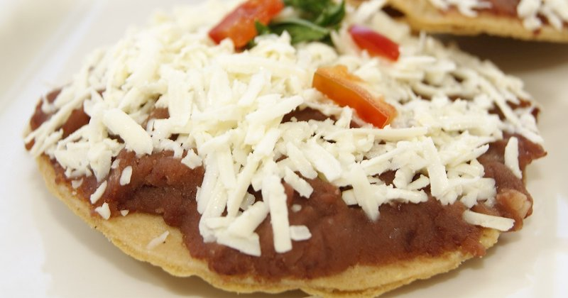

# Catrachitas

*Crisp corn-tortilla rounds topped with hot refried beans and a generous sprinkle of crumbled cheese - the Honduran answer to a tostada and the most common bar snack across the country. Eaten warm, picked up by the edges, washed down with a cold Salva Vida beer. Add a spoonful of chimol or sliced avocado for a slightly fuller plate.*

**Serves:** 4 as a snack (12 catrachitas)

**Prep Time:** 10 minutes

**Cook Time:** 15 minutes

## Overview
Small corn tortillas are shallow-fried until golden and crisp. While still hot, they're spread with warm refried beans and topped with crumbled queso fresco. A drizzle of chimol salsa is the standard finish; mantequilla and a slice of avocado are easy luxuries.

## Ingredients

- 12 small corn tortillas (10-12 cm diameter)
- 300 ml vegetable oil for shallow frying
- 200 g warm refried beans
- 150 g queso fresco, cotija or feta (crumbled)
- 100 ml chimol (tomato-onion-cilantro relish) or salsa picante (optional)
- 1 avocado (sliced, optional)
- Salt

## Method

### Stage 1 - Fry the tortillas
1. Heat 5 mm of oil in a wide frying pan to 180°C.
1. Fry 3-4 tortillas at a time, 30 seconds per side, until crisp and pale gold.
1. Drain on kitchen paper; sprinkle with salt.

### Stage 2 - Top
1. Spread 1 tablespoon of warm refried beans across each fried tortilla.
1. Crumble over 1 tablespoon of cheese.

### Stage 3 - Finish
1. Spoon over a teaspoon of chimol or salsa if using.
1. Top with a thin slice of avocado for the fuller version.

### Stage 4 - Serve
1. Eat warm, picked up by the edge. They go soggy if they sit - assemble close to serving.

## Notes
- **Tortilla thickness:** Standard corn tortillas (not the thick, fresh kind). They need to crisp through.
- **Hot beans, hot tortilla:** Warm beans on hot tortillas; cold beans turn the crisp shell pale and sad fast.
- **Heat option:** Add a single thin slice of jalapeño or a few drops of hot sauce per tostada for those who want it.

## Storage
- Cooked tortillas (no toppings) keep in a sealed container 3 days; re-crisp in a hot oven.
- Assembled catrachitas: eat immediately.
