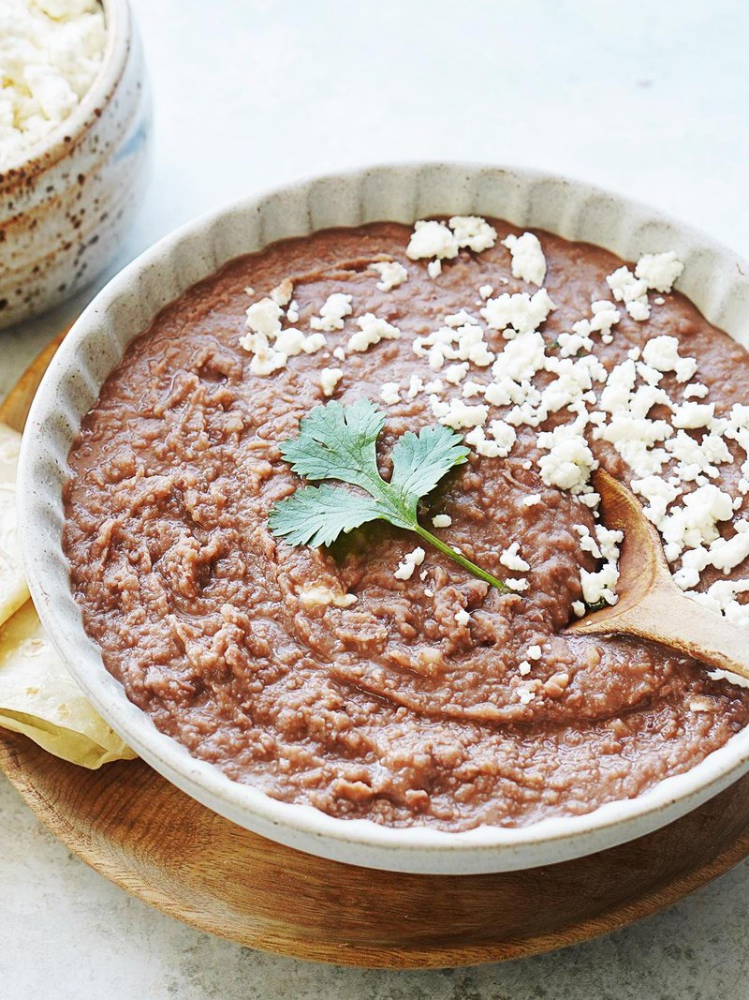

# Frijoles Fritos

*Honduran refried beans: small red beans simmered with onion till soft, then mashed and fried hard with more onion till thick, glossy and dark. The plato cornerstone.*

**Serves:** 6 (cup measure)

**Prep Time:** 10 minutes (plus 8 hours soaking)

**Cook Time:** 1 hour 45 minutes (or 25 minutes pressure-cooked)

## Overview
Frijoles fritos are the Honduran refried red beans that anchor nearly every Honduran plate, twice-cooked beans that go on tortillas, in baleadas, beside steak, on toast. Dried red beans soak overnight, simmer with onion, garlic and bay until tender, then mash (smooth or chunky, depending on the cook) and fry in oil with a fresh chopped onion. The fry stage darkens them, thickens them and concentrates the flavour. They keep a week in the fridge; better the next day; spreadable, scoopable, eternal.

## Ingredients

- 400 g dried small red beans (rojos / habichuelas, or pinto, but red is traditional)
- 1 onion (large, ½ left whole, ½ finely chopped)
- 4 garlic cloves (2 whole, 2 crushed)
- 2 bay leaves
- 1 teaspoon salt (added after the beans soften)
- 4 tablespoons vegetable oil (or pork lard)
- ½ teaspoon ground cumin

## Method

### Stage 1 - Soak
1. Rinse the beans; cover with cold water by 5 cm; soak overnight (or use the quick method: cover with boiling water, leave 1 hour).
1. Drain.

### Stage 2 - Simmer
1. Place the beans in a heavy pot. Cover with fresh cold water by 5 cm.
1. Add the whole onion half, the 2 whole garlic cloves and the bay.
1. Bring to a boil; reduce to a low simmer; cover.
1. Cook 1 hour 15 minutes (or longer) until the beans crush easily between thumb and finger.
1. Stir in the salt; cook 5 minutes more.
1. Drain, reserving 200 ml of the cooking liquor. Fish out the bay and the whole aromatics.

### Stage 3 - Mash
1. Mash the beans roughly (a potato masher for chunky; a blender for smooth, like restaurant style). Add 100 ml of the reserved liquor to keep them workable.

### Stage 4 - Fry
1. Heat the oil in a wide pan over medium heat.
1. Soften the chopped onion 5 minutes.
1. Add the crushed garlic and cumin; cook 30 seconds.
1. Tip in the mashed beans; stir hard.
1. Fry 12-15 minutes, stirring often (the beans want to stick), adding more reserved liquor as needed.
1. They're done when they pull cleanly from the pan in a glossy, almost paste-like mass.

### Stage 5 - Serve
1. Eat hot. They thicken further as they cool; loosen with hot water when reheating.

## Notes
- **Pressure cooker:** Cuts the simmer to 25 minutes (15 high pressure + natural release). Same flavour, much faster.
- **Salt timing:** Adding salt at the start hardens the bean skins. Wait until they're soft.
- **Fat matters:** Pork lard gives the richest, most traditional result; vegetable oil is the everyday default. Don't skimp - they need fat to fry, not steam.

## Storage
- Refrigerate 1 week. Loosen with hot water when reheating.
- Freeze 3 months; thaw overnight, reheat over low heat with a splash of water.
