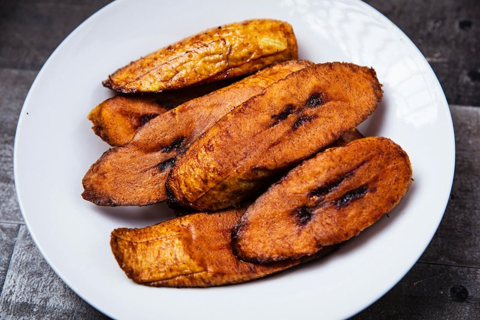

# Tajadas

*Long, thin fried plantain slices - the universal Honduran side. Ripe ones turn sweet and soft; green ones turn crisp and salty. Served under pollo con tajadas, alongside refried beans on the plato típico, packed into baleadas or piled into a bowl as their own snack.*

**Serves:** 4 as a side

**Prep Time:** 5 minutes

**Cook Time:** 15 minutes

## Overview
The plantains are peeled and cut lengthways into 5 mm slices, then fried in a shallow pool of vegetable oil until deep gold. Ripe (yellow with black spots) plantains caramelise sweet and turn soft; green plantains stay starchy and crisp. Each works, depending on what's on the plate.

## Ingredients

- 3 plantains (peeled - see Notes; sliced lengthways into 5 mm strips)
- 200 ml vegetable oil (for shallow frying)
- Salt

## Method

### Stage 1 - Heat the oil
1. Pour 5 mm of oil into a wide frying pan.
1. Heat to 170°C (a slice of plantain should bubble vigorously without colouring instantly).

### Stage 2 - Fry
1. Lay the plantain slices in a single layer (cook in two batches).
1. Ripe: 2-3 minutes per side until deep gold and soft.
1. Green: 3-4 minutes per side until pale gold and crisp.
1. Don't overcrowd; the slices need room.

### Stage 3 - Drain
1. Lift onto kitchen paper; sprinkle lightly with salt while hot.

### Stage 4 - Serve
1. Eat immediately. Tajadas stiffen as they cool.

## Notes
- **Peeling plantain:** Top and tail, then score the skin lengthways in 3 places (don't cut into the flesh); peel each strip away. Ripe peels off easily; green needs a paring knife.
- **Ripe vs green:** Yellow plantain skin with black spots = ripe (sweet, soft). All green skin = green (starchy, crisp). Yellow with no spots = transitional - decide which side you want and adjust.
- **Salt timing:** Salt sticks while the tajadas are hot from the fryer; doesn't stick once they cool.

## Storage
- Eat fresh. Don't refrigerate. If you must, re-crisp at 200°C for 5 minutes.
