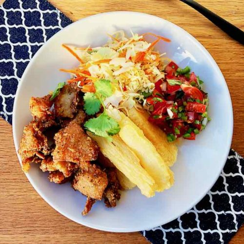

# Yuca Con Chicharrón

*Boiled cassava (yuca) topped with crisp pork chicharrón, served with a sharp cabbage curtido and a wedge of lime. A casual lunch, a beer snack and a holiday plate all at once. The yuca is starchy and gentle; the chicharrón is rich and salty; the curtido cuts everything. Eaten with the hands or a fork.*

**Serves:** 4

**Prep Time:** 15 minutes

**Cook Time:** 1 hour 15 minutes

## Overview
Yuca con chicharrón is the Honduran fair-day snack, the dish that turns up at every Sunday market and roadside stall, slow-rendered pork belly piled on top of boiled cassava with a sharp slaw to cut the richness. Pork belly cooks slow with its own fat (rendered chicharrón); cassava boils in salted water until tender, then drains; both go on the same plate. The chicharrón breaks into bite-sized pieces over the yuca. A simple curtido of cabbage, carrot and vinegar lifts the plate. Eat with your fingers, in the sun.

## Ingredients

### Chicharrón
- 800 g pork belly (skin on, cut into 3 cm cubes)
- 2 tablespoons water
- 1 teaspoon salt
- 1 teaspoon ground black pepper

### Yuca
- 1 kg yuca (peeled, cut into 6-8 cm pieces)
- 1 teaspoon salt

### Curtido
- 200 g white cabbage (finely shredded)
- 1 carrot (grated)
- 1 red onion (small, very thinly sliced)
- 3 tablespoons white vinegar
- ½ teaspoon salt
- ½ teaspoon dried oregano

### To serve
- 2 limes (cut into wedges)
- A dish of salsa picante (small, or chimol)

## Method

### Stage 1 - Curtido
1. Combine cabbage, carrot, onion, vinegar, salt and oregano in a bowl; toss; let sit at least 30 minutes.

### Stage 2 - Chicharrón
1. Place the pork belly in a wide heavy pan with the 2 tablespoons of water; season with salt and pepper.
1. Cover; cook over medium-low 25 minutes - the water evaporates and the pork begins to render.
1. Uncover; raise the heat; continue cooking 35-40 minutes, stirring occasionally, until the pork is deeply crisp and golden in its own fat.
1. Lift out with a slotted spoon onto kitchen paper.

### Stage 3 - Yuca
1. While the chicharrón cooks, place the yuca pieces in a wide pot with salted water to cover.
1. Bring to a boil; cook 20-25 minutes until a knife slides through.
1. Drain; remove the central fibrous core from each piece if present.

### Stage 4 - Plate
1. Mound yuca on a wide plate.
1. Top with broken pieces of chicharrón.
1. Spoon curtido alongside.
1. Add lime wedges and a small dish of hot sauce.

### Stage 5 - Eat
1. Tear chicharrón into bite-sized pieces with fork or fingers; pile onto yuca; top with curtido. Squeeze over lime.

## Notes
- **Peel the yuca carefully:** The skin is tough; score lengthways with a knife and peel each strip off. Remove the central fibre after boiling - it's woody.
- **Render slowly:** The water-then-fat method (a Mexican / Central American technique) is foolproof. The pork releases its own fat as the water evaporates; it then fries crisp without needing extra oil.
- **Frozen yuca:** Sold in most large supermarkets in the freezer aisle. Cooks the same; no peeling.

## Storage
- Chicharrón refrigerates 3 days; re-crisp in a hot oven 8 minutes. 
- Yuca refrigerates 2 days; reheat in salted boiling water 4 minutes.
- Curtido keeps 1 week.
