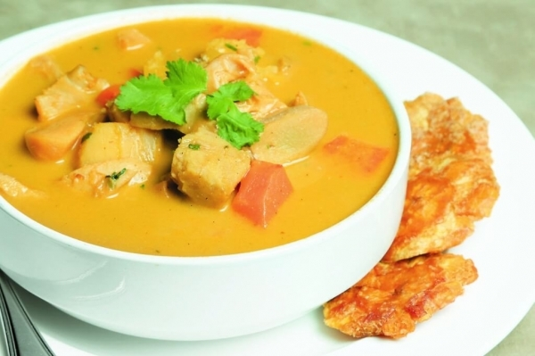

# Sopa de Caracol

*Honduras' Garifuna coastal soup: conch and yuca slow-cooked in coconut milk with green plantain, sweet pepper and cilantro. Rich, sweet and marine.*

**Serves:** 4

**Prep Time:** 20 minutes (plus tenderising the conch)

**Cook Time:** 45 minutes

## Overview
Conch is tenderised by pounding (or by long cooking, whichever is at hand), then briefly simmered. Aromatics (onion, garlic, sweet pepper, achiote or paprika) fry in butter; coconut milk, water, yuca (cassava) and green plantain go in; the conch returns at the end so it stays tender. Cilantro, lime, salt.

## Ingredients

- 500 g conch meat (tenderised by pounding to 5 mm; or use 500 g raw shrimp / 500 g firm white fish if conch is unavailable)
- 2 tablespoons butter
- 1 large onion (chopped)
- 1 green bell pepper (chopped)
- 1 red bell pepper (chopped)
- 4 garlic cloves (crushed)
- 1 teaspoon ground annatto (achiote) or paprika
- 1 teaspoon dried oregano
- 1 (400 ml) tin coconut milk
- 500 ml water or fish stock
- 1 large green (unripe) plantain (peeled, sliced 1 cm thick)
- 400 g yuca / cassava (peeled, cut into 3 cm chunks)
- 2 medium carrots (sliced 1 cm thick)
- ¼ teaspoon ground black pepper
- 1 teaspoon salt (to taste)
- Juice of 1 lime
- 3 tablespoons fresh cilantro (chopped)

## Method

### Stage 1 - Tenderise the conch
1. If your conch isn't pre-tenderised: place between sheets of cling film and pound with a meat mallet to 5 mm thick. Slice into bite-sized strips.

### Stage 2 - Build the base
1. Melt the butter in a wide heavy pot over medium heat.
1. Soften the onion and peppers 8 minutes until soft and gold.
1. Add garlic, achiote (or paprika) and oregano; cook 1 minute.

### Stage 3 - Coconut and vegetables
1. Pour in the coconut milk and water (or stock); bring to a simmer.
1. Add the yuca and carrot; cover; simmer 20 minutes until just tender.
1. Add the green plantain; simmer a further 10 minutes.

### Stage 4 - Conch
1. Add the conch strips; simmer just 3-5 minutes - it cooks through fast and overcooks to rubber.
1. (If using shrimp: simmer 3 minutes. If using fish: 4-5 minutes.)
1. Stir in lime juice; season with salt and pepper.
1. Scatter cilantro.

### Stage 5 - Serve
1. Ladle into wide deep bowls. Eat with a wedge of corn tortilla and an extra lime wedge.

## Notes
- **Conch availability:** Fresh conch is hard to find outside the Caribbean. Frozen conch is sold in some Caribbean and Asian food stores. Substitutes that keep the spirit of the dish: large shrimp, lobster or firm white fish.
- **Cook the conch briefly:** Whether fresh or tenderised, conch turns from tender to rubbery in seconds. Add at the very end.
- **Achiote (annatto):** Gives the soup its golden-red colour and a slightly earthy note. Paprika is a fine substitute; smoked paprika adds depth.

## Storage
- Refrigerate 2 days. Reheat gently - boiling rubberises the conch.
- Don't freeze - the coconut milk splits and the yuca turns grainy.
