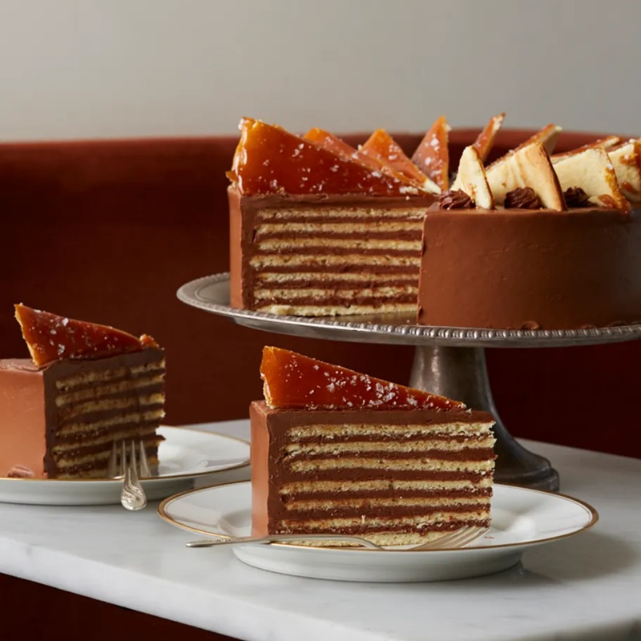

# Dobos Torte

*Invented by József Dobos in 1884 Budapest: five thin sponge layers stacked with chocolate buttercream, the top a single sponge glazed with shattering caramel, the sides masked with toasted hazelnuts. The original showpiece of Hungarian patisserie. Difficulty: high. Reward: high.*

**Serves:** 12

**Prep Time:** 1 ½ hours (across stages)

**Cook Time:** 35 minutes (plus 4 hours chilling)

## Overview
Dobos torte is the Hungarian patisserie showpiece: six paper-thin sponge discs - five stacked with chocolate buttercream and one crowning the top glazed in hard caramel - invented by József Dobos in Budapest in 1884 and still the gold standard of Central European cake-craft. You bake six thin sponge discs separately at high heat for six to eight minutes each. Five of them layer with a French-style chocolate buttercream made from a hot sugar syrup whipped into yolks then enriched with butter and melted dark chocolate. The sixth disc gets glazed with hard caramel while still warm, marked into twelve wedges before it sets, and crowns the cake. Sides mask with more buttercream and dust with toasted chopped hazelnuts. Eat in thin slices with strong coffee.

## Ingredients

### Sponge layers (makes 6 discs of 22 cm)
- 6 eggs (large, separated, at room temperature)
- 150 g caster sugar
- 1 teaspoon vanilla extract
- 150 g plain flour
- 25 g unsalted butter (melted and cooled)
- A pinch of salt

### Chocolate buttercream
- 4 egg yolks (large)
- 200 g caster sugar
- 80 ml water
- 350 g unsalted butter (very soft)
- 200 g dark chocolate, 60-70% (melted and cooled to lukewarm)
- 2 tablespoons cocoa powder, sifted
- 1 teaspoon vanilla extract
- A pinch of salt

### Caramel top
- 200 g caster sugar
- 2 tablespoons water
- ½ teaspoon lemon juice
- A little neutral oil, for the knife

### Sides
- 100 g hazelnuts (toasted, skinned, finely chopped)

## Method

### Stage 1 - Sponge layers
1. Heat the oven to 200°C (180°C fan). Draw a 22 cm circle on each of 6 sheets of parchment; you can reuse 2-3 trays.
2. Whisk the yolks with 75 g of the sugar and the vanilla until pale and ribbon-thick, 3-4 minutes.
3. In a clean bowl, whip the whites with the salt to soft peaks. Add the remaining 75 g sugar in three additions, whipping to stiff, glossy peaks.
4. Fold one third of the whites into the yolk mixture to lighten. Sift over half the flour; fold gently. Add another third of whites, the rest of the flour, then the last of the whites and the melted butter. Fold just until uniform.
5. Spread 4-5 tablespoons of batter into each parchment circle in a thin, even layer (about 3 mm).
6. Bake one disc at a time, 6-8 minutes, until pale golden and springy. Slide off the parchment onto a rack and peel the parchment immediately while warm; if you let them cool on it, they tear. Repeat with the rest of the batter.

### Stage 2 - Chocolate buttercream
1. Combine the 200 g sugar and 80 ml water in a small pan. Heat to 118°C (soft-ball stage; a thermometer is essential).
2. While the syrup heats, whisk the yolks in a stand mixer on medium until pale.
3. With the mixer running, pour the hot syrup down the side of the bowl in a thin steady stream onto the yolks (not on the whisk). Increase to high; whip 5-7 minutes until cool, pale and thick (pâte à bombe).
4. Reduce to medium; add the soft butter one tablespoon at a time, beating until each is incorporated. It may curdle then come together. If stubborn, warm the bowl briefly over a steaming pan for 10 seconds and rewhip.
5. Fold in the cooled melted chocolate, cocoa, vanilla and salt. Beat until smooth and glossy.

### Stage 3 - Stack
1. Choose the most even disc for the top; set aside.
2. Place one disc on a serving plate or cake board. Spread with 3-4 tablespoons of buttercream in an even layer.
3. Stack a second disc; press gently. Buttercream. Repeat for 5 stacked discs, finishing with a layer of buttercream on top of the fifth.
4. Mask the sides with remaining buttercream (reserve about 4 tablespoons in a piping bag for finishing). Smooth.
5. Press the chopped toasted hazelnuts against the sides. Chill 30 minutes while you make the caramel top.

### Stage 4 - Caramel top
1. Oil a long thin knife and a sheet of parchment lightly with neutral oil.
2. Place the reserved sixth sponge on the oiled parchment.
3. In a clean small pan, combine 200 g sugar, 2 tablespoons water and the lemon juice. Heat over medium without stirring until the sugar dissolves, then continue until the caramel turns a deep amber.
4. Immediately pour the caramel over the sponge in a thin, even layer, tipping the parchment to coat the surface fully. Work fast.
5. While still soft (about 30 seconds), use the oiled knife to mark 12 even wedges, pressing through to the sponge. Don't fully cut: just score so each wedge breaks cleanly later.
6. Let the caramel set fully, 5-10 minutes.

### Stage 5 - Crown and finish
1. Once set, slide the caramel-topped disc onto the cake.
2. Pipe small rosettes of reserved buttercream around the outer edge of the cake where the caramel disc meets the sides.
3. Chill at least 4 hours, ideally overnight, before slicing along the pre-marked caramel wedges.

## Notes
- **Six thin discs:** The signature of a Dobos. Layers should be only a few millimetres thick. Bake in batches; don't try to cut one thick sponge.
- **Buttercream technique:** This is the German-style "pâte à bombe" buttercream; smoother and stabler than American buttercream. The 118°C syrup is non-negotiable. Without a thermometer, look for the syrup forming a soft ball when a drop hits cold water.
- **Caramel timing:** You have about 30 seconds of working time once the caramel hits the sponge. Have the knife oiled and ready, and mark wedges immediately.
- **Slice along the wedges:** The cake is sliced through the pre-marked caramel lines; cutting elsewhere shatters the top.
- **Make ahead:** The whole cake holds 3 days refrigerated; the caramel softens slightly after 24 hours but the cake itself is at its best on day 2.

## Serving
Serve cold from the fridge, sliced along the caramel wedge lines, with strong black coffee.

## Storage
- 3 days refrigerated, covered.
- Don't freeze: the caramel goes sticky.
