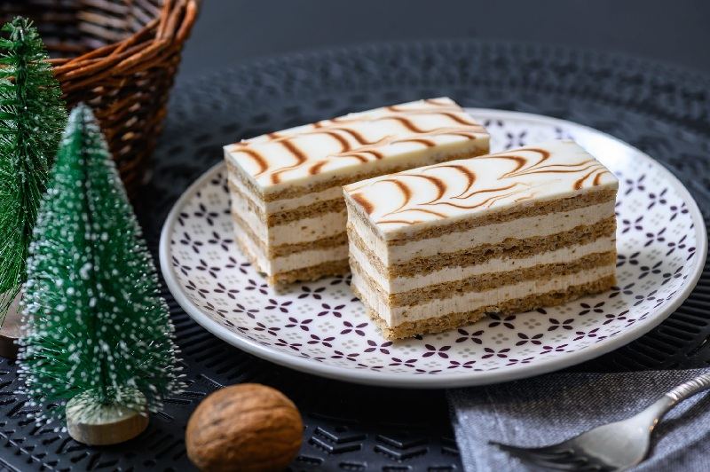

# Eszterházy Torte

*Hungary's aristocrat cake: five almond meringue discs sandwiched with cognac French buttercream, topped with white fondant and a chocolate spider-web.*

**Serves:** 12

**Prep Time:** 1 ½ hours (across stages)

**Cook Time:** 30 minutes (plus 4 hours chilling)

## Overview
Five thin discs of almond-meringue (a French dacquoise) bake low and slow. They sandwich with a cognac and vanilla French-style buttercream (a pâte à bombe enriched with butter). The top is sealed with a thin layer of buttercream then iced with white fondant; melted dark chocolate is piped in concentric circles into the wet fondant and pulled into a spider-web with a skewer. Sides masked with toasted flaked almonds.

## Ingredients

### Almond meringue layers (5 discs of 22 cm)
- 6 egg whites (large)
- A pinch of salt
- 200 g caster sugar
- 200 g ground almonds
- 30 g plain flour
- 1 teaspoon vanilla extract

### Cognac buttercream
- 4 egg yolks (large)
- 200 g caster sugar
- 80 ml water
- 350 g unsalted butter (very soft)
- 3 tablespoons cognac (or brandy)
- 1 teaspoon vanilla extract
- 50 g ground almonds (lightly toasted)

### Fondant top and chocolate web
- 300 g white fondant icing (rolled fondant softened with warm water, or 250 g icing sugar + 2 tablespoons water + 1 tablespoon glucose syrup + 1 teaspoon lemon juice for a poured fondant)
- 50 g dark chocolate, 60-70% (melted)
- 1 teaspoon neutral oil

### Sides
- 100 g flaked almonds (lightly toasted)

## Method

### Stage 1 - Almond meringue discs
1. Heat the oven to 160°C (140°C fan). Draw five 22 cm circles on parchment sheets.
2. Whip the egg whites with the salt to soft peaks. Rain in the sugar in three additions to stiff, glossy peaks (a French meringue).
3. Sift the flour into the ground almonds; fold gently into the meringue along with the vanilla. Work quickly to keep volume.
4. Divide between the five circles, spreading to the lines in an even 5 mm layer.
5. Bake two trays at a time, 25-30 minutes, until pale golden and dry to the touch. The discs should peel from the parchment cleanly.
6. Cool on the parchment, then peel off carefully. They're fragile; handle flat.

### Stage 2 - Cognac buttercream
1. Combine 200 g sugar and 80 ml water in a small pan. Heat to 118°C (soft-ball stage; use a thermometer).
2. Whip the yolks in a stand mixer on medium until pale.
3. Pour the hot syrup down the side of the bowl in a thin stream. Whip on high 5-7 minutes until cool and ribbon-thick.
4. On medium, add the soft butter a tablespoon at a time. The mixture may split before coming back together; persevere.
5. Beat in the cognac, vanilla and toasted ground almonds.

### Stage 3 - Stack
1. Choose the flattest disc for the top; set aside.
2. Place one disc on a cake board. Spread with 3-4 tablespoons of buttercream.
3. Stack a second disc; press gently. Buttercream. Repeat for 4 stacked discs.
4. Lay the reserved fifth disc on top. Spread a thin layer of buttercream over the very top (this is the bed for the fondant).
5. Mask the sides with remaining buttercream; smooth.
6. Press toasted flaked almonds against the sides.
7. Chill 30 minutes to firm the top.

### Stage 4 - Fondant and web
1. Warm the fondant gently in a heatproof bowl over barely simmering water until just pourable, about 35°C. Don't overheat: above 40°C and it loses its shine.
2. If using a homemade poured fondant: warm gently to 35°C, stirring smooth.
3. Stir the melted dark chocolate with the teaspoon of oil; transfer to a small piping bag or a small ziplock with a tiny corner snipped.
4. Pour the warm fondant over the centre of the chilled cake; tilt to spread to the edges in a smooth coat. Work fast.
5. Immediately pipe the chocolate in five concentric circles on top of the wet fondant.
6. Take a skewer or thin knife. Starting at the centre, drag the tip outward through the chocolate circles to the edge in a straight line. Wipe the skewer. Now drag from the edge inward to the centre, halfway between the first line. Continue alternating in and out to make 8-16 segments. This is the classic Eszterházy spider-web.
7. Let the fondant set, 30 minutes, before chilling.

### Stage 5 - Rest
1. Chill the finished cake at least 4 hours, ideally overnight. The buttercream and meringues soften slightly into each other.
2. Bring to cool room temperature for 20 minutes before slicing.

## Notes
- **Almond meringue, not sponge:** This is what distinguishes Eszterházy from Dobos. The discs are crisp out of the oven but become soft and chewy after assembly.
- **Cognac is the signature:** A good brandy or rum will work, but cognac (Hennessy, Martell, Rémy) gives the proper character. Non-alcohol: omit and add 1 teaspoon almond extract.
- **Fondant temperature:** Above 40°C and it loses its shine and goes dull. A thermometer makes life easier here.
- **Spider-web speed:** Once the fondant is on, you have about 60 seconds before it sets. Pipe the chocolate circles fast and drag the skewer immediately.
- **Make ahead:** Whole cake holds 3 days refrigerated; the fondant stays glossy.

## Serving
Slice with a hot dry knife (wipe between cuts) for clean fondant edges. Serve at cool room temperature with strong black coffee.

## Storage
- 3 days refrigerated, covered loosely so the fondant doesn't sweat.
- Don't freeze: the fondant cracks.
